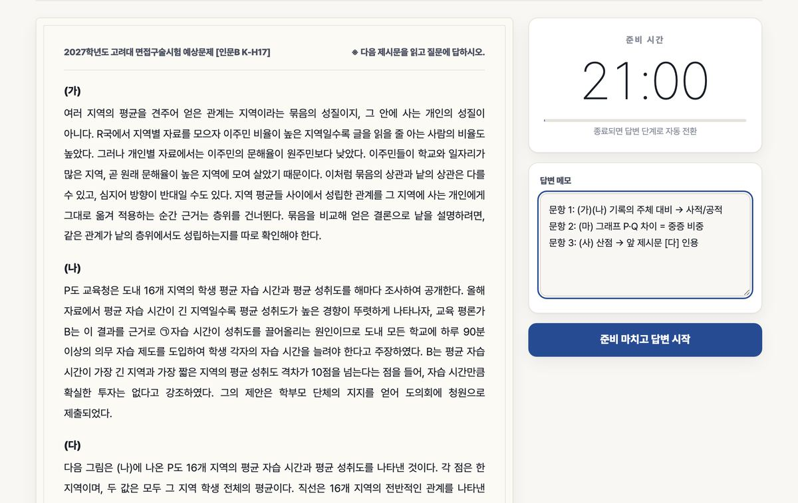

# 8축 코드 교차검토 r2 (2026-09-13, hyunhak 구매물 활용 UX) — r1 지적 반영 재판정

r1 에서 당신(gpt-6-astra)이 낸 지적과 조치:
- H1 생성기 미반영 → `_tools/program_studio_v2.html`(programs/studio.html 원본) 과 `_tools/build_lectures.py`(lectures.html 목록 면만) 에 반영, `bash _tools/build_all.sh` 전체 재실행으로 산출이 원본과 같음을 확인 (v2_check 70면 fails 0, link_check fails 0).
- H2 체험 버튼 → `if(o.trial && !o.studio.some(live))` 유료권 살아 있으면 숨김.
- H3 window.open 반환값 → 데스크톱은 클릭 시점에 `window.open('','_blank')` 로 빈 창을 먼저 확보(opener=null), 토큰 뒤 `w.location.replace`. 못 열면 `location.assign`. 휴대폰(pointer:coarse)은 항상 같은 탭. 실측(Playwright Pixel 7 에뮬 + 1280 데스크톱): 휴대폰 5면 같은 탭 이동, 데스크톱 5면 새 창 최종 URL 확인.
- H4 studio.html #trialGo → `HH.studioGo(this)` 로 통일.
- H5 스튜디오 앱 마이페이지 링크 → `show()` 에서 inSession 이면 숨김 (chip-history 와 같은 규칙).
- (추가, design-critic 9렌즈 34/45 RELEASE_OK 뒤 P1 반영) 카드 foot 에서 응시 버튼을 첫 자리 유일 채움 버튼으로, 나머지 채움 버튼은 ghost 로 강등 / 보유 배지 색 朱印→먹 / 블록 둘째 항목부터 ghost 버튼, 4건째부터 
 접기 / 비회원 1줄을 띠로 / 안내문 축약 / "까지" 붙여쓰기 / 자료실·인강 목록 마운트를 main 첫 자리로 통일.
- M1 만료 lecture/guide → 행동 목록·slugs 에서 제외. M2 flex 16em → 모바일 `flex:0 0 auto`. M3 download+file_download 같은 slug → 한 줄(열람 버튼 + PDF 내려받기 링크). M4 `me()` 진행 중 Promise 공유 (실측: 비회원 면 401 요청 3→1). L1 ENT_ID_RE 제거.

요청: (1) r1 지적이 실제로 닫혔는지 각 1줄 판정 (닫힘/미흡+이유) (2) 이번 diff 가 새로 연 결함이 있으면 [축][real|nit] 파일:위치 — 문제 — 수정안 (3) 마지막 줄 "VERDICT: GO|NO-GO" + 근거 1줄. 한국어, 35줄 상한. 사이트 원격 배포는 소유자 수동이며 이 검토 범위 밖.

## assets/owned.js 전문 (현재, critic 반영 후)
// 내가 산 것 (owned) — 구매한 회원이 판매 면 위에서 바로 다음 행동을 고른다.
// Why (2026-09-13 학생 피드백): 스튜디오 탭이 판매 면(programs/studio.html)으로 열리고, 그 면은 회원이 무엇을 샀는지 모른다.
//   산 단위 카드에 "구매하러 가기" 가 다시 보여 "또 사라는 건가" 로 읽혔고, 응시 진입은 MY 의 "응시하러 가기" 하나뿐이라 못 찾았다.
// 원천 = HH.me().entitlements (/api/auth/me 한 방, 읽기만). 응시 진입 = POST /api/studio/token (my.html .sgo 와 같은 계약).
// 마운트 = 

. 카드 = article[data-r3-unit] (판매 면, 앱 면 공용).
(function(){
  if(!window.HH) return;
  var esc=HH.esc;
  var ENT_ID_RE=/^ent[A-Za-z0-9_]{1,80}$/;
  // 단위 코드 → 표시 이름. app.js UNITS(판매 5종) 밖의 9/14 개시 단위도 권리가 오면 이름을 붙인다
  var UNIT_LABEL={'korea-hum':'고려대 계열적합 인문','korea-sci':'고려대 계열적합 자연','yonsei-hum':'연세대 활동우수 인문통합','yonsei-sci':'연세대 활동우수 자연','yonsei-intl':'연세대 국제형','korea-eq-hum':'고려대 고른기회 인문','korea-eq-sci':'고려대 고른기회 자연','yonsei-mirae':'연세대 미래캠퍼스'};
  var BD_TITLE={'guide-all-view':'2027 서류기반면접 가이드북 전권 열람권','guide-all-pdf':'2027 서류기반면접 가이드북 전권 PDF 소장판'};
  var KIND={studio_passage:'지문 낱권 이용권',studio_school:'단위 전권 이용권'};

  // set_id → 단위 코드. app.js SET_ID_RE 와 같은 접두 어휘 (korea_2027_h, korea_gorun_2027_s, yonsei_intl_2027_i ...)
  function unitOfSet(id){
    id=String(id||'');
    if(/^korea_gorun_2027_h/.test(id)) return 'korea-eq-hum';
    if(/^korea_gorun_2027_s/.test(id)) return 'korea-eq-sci';
    if(/^korea_2027_h/.test(id)) return 'korea-hum';
    if(/^korea_2027_s/.test(id)) return 'korea-sci';
    if(/^yonsei_intl_2027_/.test(id)) return 'yonsei-intl';
    if(/^yonsei_2027_h/.test(id)) return 'yonsei-hum';
    if(/^yonsei_2027_s/.test(id)) return 'yonsei-sci';
    return '';
  }
  // 권리 행 → 단위 코드. 전권은 meta.unit_code 또는 sku pass-<unit> (서버 pay.js entSetRe 와 같은 순서), 낱권은 결속 세트로 역산
  function unitOfEnt(e){
    var m=e._meta||{}, u=String(m.unit_code||'');
    if(!u && /^pass-/.test(String(m.sku||''))) u=String(m.sku).slice(5);
    if(!u && m.set_id) u=unitOfSet(m.set_id);
    return UNIT_LABEL[u]?u:'';
  }
  function slugOf(meta){ return (meta.slug)||String(meta.file_key||'').replace(/^library\//,'').replace(/\.pdf$/,''); }
  function live(e){ return !!e._live; }
  function day(s){ return String(s||'').slice(0,10); }

  var _owned=null;
  async function owned(force){
    if(_owned && !force) return _owned;
    var st=await HH.me(force);
    var o={member:st.member||null, error:st.error||null, trial:!!st.trial_available, studio:[], lecture:[], guide:{singles:[],bundles:{}}, units:{}, sets:{}, slugs:{}, any:false};
    if(!o.member){ _owned=o; return o; }
    var now=Date.now();
    (st.entitlements||[]).forEach(function(e){
      var meta={}; try{ meta=JSON.parse(e.meta||'{}'); }catch(err){}
      if(!meta||typeof meta!=='object') meta={};
      e._meta=meta;
      e._expired=!!(e.expires_at && Date.parse(e.expires_at)<=now);
      // 만료된 권리는 서버가 거절한다 (lecture.js, reader.js). 행동 목록과 보유 표시에서 뺀다 (astra r1 M1)
      if(e.kind==='lecture'){ if(!e._expired) o.lecture.push(e); return; }
      if(e.kind==='studio_school'||e.kind==='studio_passage'){
        e._unit=unitOfEnt(e);
        e._set=HH.okSetId(meta.set_id)?String(meta.set_id):'';
        // 서버 trial.js 가 여는 권리 = 미만료 + (전권 또는 잔여 > 0). 같은 기준으로만 "응시하러 가기" 를 단다
        e._live=!e._expired && (e.kind==='studio_school' || e.uses_left==null || HH.intIn(e.uses_left,0,9999,0)>0);
        o.studio.push(e);
        if(e._unit){ var u=o.units[e._unit]=o.units[e._unit]||{school:[],passage:[]}; u[e.kind==='studio_school'?'school':'passage'].push(e); }
        if(e._set) o.sets[e._set]=e;
        return;
      }
      if(e.kind==='download'||e.kind==='file_download'){
        if(e._expired) return;
        e._slug=slugOf(meta);
        if(meta.bundle){ var g=o.guide.bundles[meta.bundle]=o.guide.bundles[meta.bundle]||{view:[],file:[]}; g[e.kind==='file_download'?'file':'view'].push(e); }
        else o.guide.singles.push(e);
        if(e._slug) o.slugs[e._slug]=e;
      }
    });
    o.any=!!(o.studio.length||o.lecture.length||o.guide.singles.length||Object.keys(o.guide.bundles).length);
    _owned=o; return o;
  }

  // 스튜디오 진입. 휴대폰(coarse pointer)은 같은 탭으로 간다: fetch 뒤의 window.open 은 iOS Safari 가 팝업으로 막고,
  // 학생은 대부분 휴대폰이다. 데스크톱은 새 탭 (이용권 면을 뒤에 남긴다)
  async function studioGo(el){
    var sid=(el&&el.dataset.setId)||'', eid=(el&&el.dataset.ent)||'', body={};
    if(HH.okSetId(sid)) body.set_id=sid;
    if(ENT_ID_RE.test(eid)) body.entitlement_id=eid;
    var opt=Object.keys(body).length?{method:'POST',body:JSON.stringify(body)}:{method:'POST'};
    var coarse=!!(window.matchMedia&&window.matchMedia('(pointer:coarse)').matches);
    // 데스크톱은 클릭 시점(사용자 제스처 안)에 빈 창을 먼저 연다. fetch 뒤에 열면 Safari 가 팝업으로 막고,
    // 'noopener' 는 성공해도 null 을 돌려줘 차단을 가릴 수 없다. 창을 못 열면 같은 탭으로 간다
    var w=null; if(!coarse){ try{ w=window.open('','_blank'); }catch(e){ w=null; } if(w){ try{ w.opener=null; }catch(e){} } }
    var t0=el&&el.textContent; if(el){ el.disabled=true; el.setAttribute('aria-busy','true'); }
    try{
      var r=await HH.api('/api/studio/token',opt);
      if(!r||!/^https:\/\//.test(String(r.url||''))) throw new Error('스튜디오 주소를 받지 못했습니다');
      if(w && !w.closed){ w.location.replace(r.url); return; }
      location.assign(r.url);
    }catch(e){ if(w && !w.closed){ try{ w.close(); }catch(err){} } alert((e&&e.message)||'이용권을 확인하지 못했습니다'); }
    finally{ if(el){ el.disabled=false; el.removeAttribute('aria-busy'); if(t0!=null) el.textContent=t0; } }
  }
  function bind(root){
    (root||document).querySelectorAll('[data-owned-go]:not([data-owned-bound])').forEach(function(b){
      b.dataset.ownedBound='1';
      b.addEventListener('click',function(ev){ ev.preventDefault(); studioGo(b); });
    });
  }

  function studioTitle(e){
    if(e._meta.title) return String(e._meta.title);
    var u=UNIT_LABEL[e._unit];
    return u ? u+(e.kind==='studio_school'?' 전권 이용권':' 지문 낱권') : (KIND[e.kind]||e.kind);
  }
  function goBtn(e, cls){
    return '<button type="button" class="'+(cls||'btn sm')+'" data-owned-go'
      +(e._set&&e.kind==='studio_passage'?' data-set-id="'+esc(e._set)+'"':'')
      +(e.id?' data-ent="'+esc(e.id)+'"':'')+'>응시하러 가기</button>';
  }
  function items(o, pre){
    var out=[];
    o.studio.filter(live).forEach(function(e){
      var st=[];
      if(e.kind==='studio_passage'&&e.uses_left!=null) st.push('잔여 응시 '+HH.intIn(e.uses_left,0,9999,0)+'회');
      if(e.expires_at) st.push(day(e.expires_at)+'까지');
      out.push({nm:esc(studioTitle(e)), st:st.join(', '), op:goBtn(e)});
    });
    if(o.lecture.length) out.push({nm:'풀이법 해설 인강', st:'공개된 편부터 시청, 이어보기', op:'<a class="btn sm" href="'+pre+'classroom.html">인강 보기</a>'});
    Object.keys(o.guide.bundles).forEach(function(sku){
      var g=o.guide.bundles[sku], n=g.file.length||g.view.length;
      out.push({nm:esc(BD_TITLE[sku]||'가이드북 전권 이용권'), st:n+'권, 보안 뷰어 열람', op:'<a class="btn sm" href="'+pre+'library.html">자료실에서 열람</a>'});
    });
    // 낱권 PDF 소장판은 열람(download)과 파일(file_download) 두 행으로 온다. 같은 slug 는 한 줄, 버튼은 열람 하나 + 내려받기 링크
    var bySlug={}, order=[];
    o.guide.singles.forEach(function(e){ var k=e._slug||e.id; if(!bySlug[k]){ bySlug[k]={view:null,file:null,title:e._meta.title||e._slug}; order.push(k); } bySlug[k][e.kind==='file_download'?'file':'view']=e; });
    order.forEach(function(k){
      var g=bySlug[k], view=g.view||g.file;
      var op=g.view
        ? '<a class="btn sm" href="'+pre+'reader.html?slug='+encodeURIComponent(view._slug)+'">열람하기</a>'+(g.file?'<a class="tlink" href="'+pre+'my.html">PDF 내려받기</a>':'')
        : '<a class="btn sm" href="'+pre+'my.html">MY에서 내려받기</a>';
      out.push({nm:esc(g.title), st:g.file?'보안 뷰어 열람, PDF 소장판':'보안 뷰어 열람', op:op});
    });
    if(o.trial && !o.studio.some(live)) out.push({nm:'스튜디오 무료 체험', st:'신규 회원 무료 응시 1회', op:'<button type="button" class="btn ghost sm" data-owned-go>체험 응시</button>'});
    return out;
  }

  async function mount(el){
    var pre=el.dataset.ownedPrefix||'', guest=el.dataset.ownedGuest||'line';
    var o=await owned();
    if(!o.member){
      if(guest==='none'||o.error){ el.hidden=true; return; }
      var here=location.pathname.replace(/^\/+/,'')||'index.html';
      el.innerHTML='
이미 구매하셨나요? <a class="tlink" href="'+pre+'login.html?next='+encodeURIComponent(here)+'">로그인</a>하면 산 것과 응시 버튼이 여기에 보입니다.
';
      el.hidden=false; return;
    }
    var list=items(o,pre);
    if(!list.length){ el.hidden=true; return; }
    // 첫 항목만 채움 버튼, 둘째부터는 괘선 버튼 (무게 차등, critic P1). 4건째부터는 접는다 (400 에서 첫 화면을 다 먹지 않게, critic P2)
    var SHOW=3;
    function row(i,idx){ var op=idx?i.op.replace(/class="btn sm"/g,'class="btn ghost sm"'):i.op; return '<li>

'+i.nm+'
'+(i.st?'
'+esc(i.st)+'
':'')+'

'+op+'
</li>'; }
    var head=list.slice(0,SHOW).map(row).join(''), rest=list.slice(SHOW).map(function(i,k){ return row(i,k+SHOW); }).join('');
    el.innerHTML='<section class="owned" aria-labelledby="ownedT">
<h2 id="ownedT">내가 산 것</h2><a class="tlink" href="'+pre+'my.html">MY에서 전체 보기</a>
'
      +'<ul class="owned-list">'+head+'</ul>'
      +(rest?'

나머지 '+(list.length-SHOW)+'개 펼치기
<ul class="owned-list">'+rest+'</ul>
':'')
      +(o.studio.some(live)?'
응시 순서는 응시하러 가기, 세트 고르기, 면접 시작입니다. 점수와 첨삭은 MY 응시 기록에서 봅니다.
':'')
      +'</section>';
    el.hidden=false;
    bind(el);
  }

  // 단위 카드: 산 단위는 "구매하러 가기" 나 "담기" 대신 "응시하러 가기" 를, 배지는 "판매 중" 대신 보유 상태를 보인다.
  // 낱권만 보유한 단위는 나머지 지문을 더 살 수 있으니 구매 경로를 남긴다. 만료된 권리만 있는 단위는 그대로 둔다 (다시 사야 한다)
  function applyUnits(root){
    var o=_owned; if(!o||!o.member) return;
    (root||document).querySelectorAll('article[data-r3-unit]:not([data-owned-applied])').forEach(function(card){
      var u=o.units[card.dataset.r3Unit]; if(!u) return;
      var school=u.school.filter(live)[0], passages=u.passage.filter(live);
      if(!school && !passages.length) return;
      card.dataset.ownedApplied='1';
      var badge=card.querySelector('.r3-unit-badge');
      if(badge){ badge.textContent=school?('보유 중'+(school.expires_at?', '+day(school.expires_at)+'까지':'')):('지문 '+passages.length+'편 보유'); badge.classList.add('own'); }
      var foot=card.querySelector('.foot'); if(!foot) return;
      var buy=foot.querySelector('[data-r3-unit-buy],[data-r3-unit-cart]');
      // 판매 면 카드는 "출제 유형과 풀이법 보기" 가 채움 버튼이다. 산 단위에서는 응시가 1차 행동이므로 나머지 채움 버튼을 괘선으로 낮춘다
      foot.querySelectorAll('.btn:not(.ghost)').forEach(function(x){ x.classList.add('ghost'); });
      var tmp=document.createElement('div'); tmp.innerHTML=goBtn(school||passages[0]); var go=tmp.firstChild;
      if(school && buy) buy.remove();
      foot.insertBefore(go, foot.firstChild);   // 응시가 1차 행동: foot 첫 자리, 채움 버튼은 이것 하나 (critic P1)
    });
    bind(root);
  }
  // 자료실 목록: 산 권은 "구매" 링크 대신 "보유 중" 을 보인다 (열람하기 버튼은 그대로)
  function applyLibrary(){
    var o=_owned; if(!o||!o.member) return;
    document.querySelectorAll('.liblist .lf').forEach(function(li){
      var b=li.querySelector('.dl[data-slug]'); if(!b) return;
      if(!o.slugs[b.dataset.slug]) return;
      li.classList.add('own');
      var a=li.querySelector('.meta .m a');
      if(a){ var s=document.createElement('span'); s.className='own-tag'; s.textContent='보유 중'; a.replaceWith(s); }
      b.classList.remove('ghost');
    });
  }
  // 면 머리의 체험 링크(studio.html #trialGo): 산 회원에게 "체험 응시" 라고 쓰면 무료 상품으로 읽힌다. 상태에 맞는 이름만 바꾼다 (핸들러는 면의 것)
  function applyEntry(){
    var o=_owned; if(!o) return;
    document.querySelectorAll('[data-owned-entry]').forEach(function(el){
      if(!o.member){ el.textContent='가입하고 체험 응시 1회'; return; }
      if(o.studio.some(live)){ el.textContent='응시하러 가기'; return; }
      if(!o.trial) el.hidden=true;
    });
  }

  document.addEventListener('DOMContentLoaded', function(){
    var mounts=document.querySelectorAll('[data-owned]');
    owned().then(function(){
      mounts.forEach(function(el){ mount(el); });
      applyUnits(); applyLibrary(); applyEntry();
    }).catch(function(){ mounts.forEach(function(el){ el.hidden=true; }); });
  });
  HH.owned=owned; HH.studioGo=studioGo; HH.ownedApplyUnits=applyUnits; HH.ownedBind=bind;
})();

## hyunhak-site diff (생성 산출 html 은 studio·my·index·library 만)
diff --git a/_tools/build_lectures.py b/_tools/build_lectures.py
index 2b5d4d3..a6e0c0b 100644
--- a/_tools/build_lectures.py
+++ b/_tools/build_lectures.py
@@ -245,7 +245,8 @@ def list_page(cs):
                 if l["id"] not in _seen:
                     _seen.add(l["id"]); total_sec += (l["duration_sec"] or 0)
     total_n = len(_seen)
-    body = f'''<section class="phead">
+    body = f'''

+<section class="phead">
   

    

     <nav class="crumb rv" aria-label="위치"><a href="index.html">현학적 연구소</a>/인강</nav>
@@ -302,7 +303,8 @@ def list_page(cs):
   if (window.LEC) LEC.paintSummaries(document);
 })();
 </script>'''
-    return HEAD.format(title="풀이법 인강, 현학적 연구소", p="", css=CSS_LIST, cls="lec2 lecp") + body + TAIL.format(p="", snap=SNAP.replace("-", ""), script=script)
+    # 내가 산 것 블록 (assets/owned.js, 2026-09-13): 목록 면에만. 인강실은 자체 보유 판정을 가진다
+    return HEAD.format(title="풀이법 인강, 현학적 연구소", p="", css=CSS_LIST, cls="lec2 lecp") + body + TAIL.format(p="", snap=SNAP.replace("-", ""), script='\n'+script)
 
 
 # ---------------- 인강실 ----------------
diff --git a/_tools/program_studio_v2.html b/_tools/program_studio_v2.html
index c044c6e..36d3d83 100644
--- a/_tools/program_studio_v2.html
+++ b/_tools/program_studio_v2.html
@@ -47,6 +47,7 @@
 

 <!--v2:shell-->
 <main id="main" class="wrap r2-detail r3-detail">
+

 

<h1>__C_studio_h1__</h1>
__C_studio_lead__

<section class="r2-buy r3-buy" id="buy" data-product-buy="studio" data-added="__C_added__" data-failed="__C_cart_failed__" data-failed-storage="__C_cart_failed_storage__" data-lecture-title="__C_common_lecture__"><h2>__C_studio_buy_title__</h2><label class="r2-select" for="studio-unit">__C_choose_unit__<select id="studio-unit"><option value="korea-hum">__C_korea_hum__</option><option value="korea-sci">__C_korea_sci__</option><option value="yonsei-hum">__C_yonsei_hum__</option><option value="yonsei-sci">__C_yonsei_sci__</option><option value="yonsei-intl">__C_yonsei_intl__</option></select></label><fieldset><legend>__C_choose_product__</legend><label class="r2-price-row"><input type="radio" name="product" value="single">__C_single_passage__<b data-list-price="33000">__C_price_33000__</b></label><label class="r2-price-row"><input type="radio" name="product" value="pass" checked>__C_unit_pass__<b data-list-price="495000">__C_price_495000__</b></label><label class="r2-price-row"><input type="radio" name="product" value="lecture">__C_common_lecture__<b data-list-price="220000">__C_price_220000__</b></label></fieldset>
<button type="button" class="btn" data-primary data-cart-sku="" data-cart-title="" data-cart-price="0" disabled>__C_add__</button>

<a class="tlink" href="../cart.html" data-cart-link hidden>__C_cart__</a>
<a class="tlink" href="../studio.html">__C_r3_trial_link__</a><a class="tlink" href="../terms.html">__C_terms_link__</a>
</section><figure class="r3-hero-visual"></figure><dl class="r3-metrics" aria-label="__C_r3_metrics__">
<dt>__C_r3_studio_metric_label_0__</dt><dd>__C_r3_studio_metric_0__</dd>

<dt>__C_r3_studio_metric_label_1__</dt><dd>__C_r3_studio_metric_1__</dd>

<dt>__C_r3_studio_metric_label_2__</dt><dd>__C_r3_studio_metric_2__</dd>

<dt>__C_r3_studio_metric_label_3__</dt><dd>__C_r3_studio_metric_3__</dd>

<dt>__C_r3_studio_metric_label_4__</dt><dd>__C_r3_studio_metric_4__</dd>

<dt>__C_r3_studio_metric_label_5__</dt><dd>__C_r3_studio_metric_5__</dd>
</dl>
<section class="r2-section r3-section" id="receive"><h2>__C_r3_receive__</h2>
<table class="r3-table"><caption>__C_r3_studio_receipt__</caption><tbody><tr><th scope="row">__C_r3_passages_label__</th><td>__C_r3_150_authored__</td></tr>
 <tr><th scope="row">__C_choose_unit__</th><td>__C_r3_five_units__</td></tr>
 <tr><th scope="row">__C_r3_attempt_label__</th><td>__C_r3_five_attempts__</td></tr>
@@ -77,6 +78,7 @@
 

 <!--v2:fix-->
 
+
 
 
 </body>
diff --git a/assets/app.js b/assets/app.js
index 93eb8cb..0a7c0cd 100644
--- a/assets/app.js
+++ b/assets/app.js
@@ -108,11 +108,16 @@
   function trackAdd(line) { track("add_to_cart", { currency: "KRW", value: line.price * (line.qty || 1), items: [lineItem(line)] }); }
   function cartTotal() { return cart().reduce((s, x) => s + x.price * x.qty, 0); }
 
-  let _me = null;
+  let _me = null, _meP = null;
   async function me(force) {
     if (_me !== null && !force) return _me;
-    try { _me = (await api("/api/auth/me")); } catch (e) { _me = { member: null, error: (e && e.status === 401) ? null : ((e && e.status) || "network") }; }   // 401 = 비회원. 그 밖(네트워크, 5xx, 403)은 error 에 남겨 호출자가 가른다
-    return _me;
+    if (_meP && !force) return _meP;   // 헤더, owned, 면 스크립트가 같은 틱에 부르면 요청 1건을 나눠 쓴다 (astra r1 M4)
+    _meP = (async () => {
+      try { _me = (await api("/api/auth/me")); } catch (e) { _me = { member: null, error: (e && e.status === 401) ? null : ((e && e.status) || "network") }; }   // 401 = 비회원. 그 밖(네트워크, 5xx, 403)은 error 에 남겨 호출자가 가른다
+      finally { _meP = null; }
+      return _me;
+    })();
+    return _meP;
   }
 
   // ── 간편 로그인 (구글, 카카오, 네이버) ──
diff --git a/assets/base.css b/assets/base.css
index 9e3f55c..3eddfcd 100644
--- a/assets/base.css
+++ b/assets/base.css
@@ -1489,3 +1489,28 @@ html.ppop-open{overflow:hidden}
   :where(body.v2) .r3-hero .r2-intro h1{font-size:var(--t-h2)}
   :where(body.v2) .r2-section.r3-section>h2{font-size:var(--t-h3)}
 }  /* 900 이하 위계: 면 제목 t-h2 > 절 제목 t-h3 (critic 수리 5) */
+
+/* ── 내가 산 것 (assets/owned.js, 2026-09-13) — 구매한 회원이 판매 면 위에서 다음 행동을 고른다. 괘선과 종이색만 쓴다 (그림자 0, 곡률 토큰) ── */
+:where(body.v2) .owned{margin:var(--s4) 0 var(--s5);padding:var(--s4);background:var(--card);border-radius:var(--r-md);box-shadow:inset 0 0 0 1px var(--hairs)}
+:where(body.v2) .owned-h{display:flex;align-items:baseline;justify-content:space-between;gap:var(--s3);flex-wrap:wrap;margin-bottom:var(--s2)}
+:where(body.v2) .owned-h h2{margin:0;font-size:var(--t-h4);font-weight:var(--w-head);letter-spacing:-0.01em;line-height:1.3}
+:where(body.v2) .owned-list{list-style:none;margin:0;padding:0}
+:where(body.v2) .owned-list li{display:flex;align-items:center;justify-content:space-between;gap:var(--s3);flex-wrap:wrap;padding:var(--s3) 0;border-top:var(--rule-ui)}
+:where(body.v2) .owned-list li>div:first-child{min-width:0;flex:1 1 16em}
+:where(body.v2) .owned-list .nm{margin:0;font-size:var(--t-base);font-weight:700;line-height:1.3;letter-spacing:-0.01em;word-break:keep-all;overflow-wrap:break-word}
+:where(body.v2) .owned-list .st{margin:var(--s1) 0 0;font-size:var(--t-sm);color:var(--gray);line-height:var(--lh-ui)}
+:where(body.v2) .owned-list .ops{display:flex;gap:var(--s2);align-items:center;flex-wrap:wrap}
+:where(body.v2) .owned-note,:where(body.v2) .owned-guest{margin:var(--s3) 0 0;font-size:var(--t-sm);color:var(--gray);line-height:var(--lh-body);word-break:keep-all}
+:where(body.v2) .owned-guest{margin:var(--s3) 0;padding:var(--s2) var(--s3);background:var(--card);box-shadow:inset 0 0 0 1px var(--hairs);border-left:2px solid var(--ink)}
+:where(body.v2) .r3-unit-badge.own{color:var(--ink);border-color:var(--ink);font-weight:600}   /* 朱印은 가격과 인장에만. 보유 배지는 먹 */
+:where(body.v2) .liblist .lf.own .own-tag{color:var(--ink);font-weight:600}
+:where(body.v2) .owned-h .tlink{color:var(--gray);font-weight:500;text-decoration-color:var(--hairs)}
+:where(body.v2) .owned-more{margin-top:var(--s2)}
+:where(body.v2) .owned-more summary{cursor:pointer;min-height:var(--tap);display:flex;align-items:center;font-size:var(--t-sm);font-weight:600;color:var(--body)}
+:where(body.v2) .owned-more .owned-list li:first-child{border-top:0}
+@media (max-width:640px){
+  :where(body.v2) .owned{padding:var(--s3)}
+  :where(body.v2) .owned-list li{align-items:stretch;flex-direction:column;gap:var(--s2)}
+  :where(body.v2) .owned-list li>div:first-child{flex:0 0 auto}   /* 세로 배치에서 flex-basis 16em 이 높이로 붙지 않게 */
+  :where(body.v2) .owned-list li:first-child .ops .btn{width:100%}
+}
diff --git a/index.html b/index.html
index ba7b20c..295d3f8 100644
--- a/index.html
+++ b/index.html
@@ -88,7 +88,8 @@
 <aside class="promo r2-promo" data-promo="prm_2609_30" data-promo-until="2026-09-30T23:59:59+09:00" aria-label="할인 행사 안내">

9월 30일까지 전 상품을 정가에서 30% 할인합니다.

</aside>
 
 
-<main id="main" class="wrap r2-home-content"><section class="r2-hero" id="products"><h1>대학마다 다른 면접을 그 대학의 요강과 기출로 준비합니다.</h1>
31개 대학 서류기반 면접과 연세대, 고려대 제시문 면접을 그 대학 기준으로 준비합니다.
<a class="tlink" href="#find" data-copy="r3_find_link">대학 찾기</a>
<article class="r2-card" data-product="guidebook">
학종 서류기반 면접 준비생과 학부모
<h2>서류기반 면접 가이드북</h2>

31개 대학의 면접 질문과 준비 전략입니다.

내 생기부에서 나올 질문을 그 대학 기준으로 뽑습니다.

수록 질문 <b>3,934개</b>

권당<b data-list-price="33000">33,000원</b>

31권 전권 열람권<b data-list-price="511500">511,500원</b>

<a class="btn" href="programs/guidebook.html#buy">구매</a><a class="tlink" href="programs/guidebook.html">자세히</a>
</article><article class="r2-card" data-product="studio">
연세대와 고려대 제시문 면접 준비생
<h2>제시문 면접 스튜디오</h2>

기출 제시문 150세트로 촬영 응시합니다.

지문마다 5회 응시합니다.

고사장과 같은 규격으로 응시하고 첨삭 세 단을 받습니다.

응시 단위 전권<b data-list-price="495000">495,000원</b>

지문 1편<b data-list-price="33000">33,000원</b>

<a class="btn" href="programs/studio.html#buy">구매</a><a class="tlink" href="programs/studio.html">자세히</a>

<a class="tlink" href="interview.html#exam">전형별 출제 유형과 풀이법</a>
</article>
</section><section class="r2-section" id="why"><dl class="r2-trust" id="trust">
<dt><a href="programs/guidebook.html#samples">질문 3,934개</a></dt><dd>대학 공개 자료와 면접 후기에서 골랐습니다.</dd>

<dt><a href="terms.html">이용 전 청약철회</a></dt><dd>이용 전 청약철회 조건은 이용약관 제6조에 따릅니다.</dd>

<dt><a href="programs/guidebook.html">보안 리더 열람</a></dt><dd>기기 제한 없이 열람하며 권당 3회 인쇄합니다.</dd>

<dt>만든 사람</dt><dd>입시 컨설턴트 한 사람이 31권과 150세트를 같은 기준으로 편집합니다.</dd>
</dl></section><section class="r2-section" id="find"><h2>대학별로 찾기</h2>
지원 대학의 가이드북을 찾습니다.

<form role="search" onsubmit="return false"><label for="q2">대학 이름</label>
<input id="q2" type="search" autocomplete="off" aria-describedby="q2h"><button type="submit" aria-label="대학 찾기">→</button>

대학 이름으로 검색합니다. 가나다 순입니다.
</form>

<button role="tab" aria-selected="true" data-f="all">전체 31</button><button role="tab" aria-selected="false" data-f="sale">가이드북 판매 중 31</button>

<a class="tlink" href="guidebook/index.html">31개 대학 전체 보기</a>

</section><section class="r2-section" id="flow"><h2>스튜디오 응시 절차</h2>
지문 1편에 5회까지 응시합니다.
<ol class="r2-steps"><li><h3>지문 선택</h3>
응시할 단위와 지문을 선택합니다.
</li><li><h3>실전형 응시</h3>
실제 고사장 규격으로 문항을 나누지 않고 응시합니다.
</li><li><h3>첨삭 세 단</h3>
전사, 오독과 비약 진단, 구술체 재구성을 제공합니다.
</li><li><h3>연습형 재응시</h3>
막힌 자리만 끊어 다시 응시합니다.
</li></ol><a class="tlink" href="programs/studio.html">스튜디오 상세 소개</a><aside class="rwid rwid--gwak" id="rankWidget" data-rank-widget hidden aria-label="면접 스튜디오 응시 현황">
+<main id="main" class="wrap r2-home-content">
+

<section class="r2-hero" id="products"><h1>대학마다 다른 면접을 그 대학의 요강과 기출로 준비합니다.</h1>
31개 대학 서류기반 면접과 연세대, 고려대 제시문 면접을 그 대학 기준으로 준비합니다.
<a class="tlink" href="#find" data-copy="r3_find_link">대학 찾기</a>
<article class="r2-card" data-product="guidebook">
학종 서류기반 면접 준비생과 학부모
<h2>서류기반 면접 가이드북</h2>

31개 대학의 면접 질문과 준비 전략입니다.

내 생기부에서 나올 질문을 그 대학 기준으로 뽑습니다.

수록 질문 <b>3,934개</b>

권당<b data-list-price="33000">33,000원</b>

31권 전권 열람권<b data-list-price="511500">511,500원</b>

<a class="btn" href="programs/guidebook.html#buy">구매</a><a class="tlink" href="programs/guidebook.html">자세히</a>
</article><article class="r2-card" data-product="studio">
연세대와 고려대 제시문 면접 준비생
<h2>제시문 면접 스튜디오</h2>

기출 제시문 150세트로 촬영 응시합니다.

지문마다 5회 응시합니다.

고사장과 같은 규격으로 응시하고 첨삭 세 단을 받습니다.

응시 단위 전권<b data-list-price="495000">495,000원</b>

지문 1편<b data-list-price="33000">33,000원</b>

<a class="btn" href="programs/studio.html#buy">구매</a><a class="tlink" href="programs/studio.html">자세히</a>

<a class="tlink" href="interview.html#exam">전형별 출제 유형과 풀이법</a>
</article>
</section><section class="r2-section" id="why"><dl class="r2-trust" id="trust">
<dt><a href="programs/guidebook.html#samples">질문 3,934개</a></dt><dd>대학 공개 자료와 면접 후기에서 골랐습니다.</dd>

<dt><a href="terms.html">이용 전 청약철회</a></dt><dd>이용 전 청약철회 조건은 이용약관 제6조에 따릅니다.</dd>

<dt><a href="programs/guidebook.html">보안 리더 열람</a></dt><dd>기기 제한 없이 열람하며 권당 3회 인쇄합니다.</dd>

<dt>만든 사람</dt><dd>입시 컨설턴트 한 사람이 31권과 150세트를 같은 기준으로 편집합니다.</dd>
</dl></section><section class="r2-section" id="find"><h2>대학별로 찾기</h2>
지원 대학의 가이드북을 찾습니다.

<form role="search" onsubmit="return false"><label for="q2">대학 이름</label>
<input id="q2" type="search" autocomplete="off" aria-describedby="q2h"><button type="submit" aria-label="대학 찾기">→</button>

대학 이름으로 검색합니다. 가나다 순입니다.
</form>

<button role="tab" aria-selected="true" data-f="all">전체 31</button><button role="tab" aria-selected="false" data-f="sale">가이드북 판매 중 31</button>

<a class="tlink" href="guidebook/index.html">31개 대학 전체 보기</a>

</section><section class="r2-section" id="flow"><h2>스튜디오 응시 절차</h2>
지문 1편에 5회까지 응시합니다.
<ol class="r2-steps"><li><h3>지문 선택</h3>
응시할 단위와 지문을 선택합니다.
</li><li><h3>실전형 응시</h3>
실제 고사장 규격으로 문항을 나누지 않고 응시합니다.
</li><li><h3>첨삭 세 단</h3>
전사, 오독과 비약 진단, 구술체 재구성을 제공합니다.
</li><li><h3>연습형 재응시</h3>
막힌 자리만 끊어 다시 응시합니다.
</li></ol><a class="tlink" href="programs/studio.html">스튜디오 상세 소개</a><aside class="rwid rwid--gwak" id="rankWidget" data-rank-widget hidden aria-label="면접 스튜디오 응시 현황">
         
응시 현황

         

           
연세대 인문+통합<b data-rank-takers>-</b>명1위 <b>-</b>점

@@ -174,6 +175,7 @@
 <nav class="fix" aria-label="모바일 바로가기"><a class="on" aria-current="page" href="index.html"><svg viewBox="0 0 24 24" fill="none" stroke="currentColor" stroke-width="1.8" aria-hidden="true"><path d="M4 11.2 12 4.4l8 6.8M6.4 9.8V20h11.2V9.8"/></svg>홈</a><a href="programs/guidebook.html"><svg viewBox="0 0 24 24" fill="none" stroke="currentColor" stroke-width="1.8" aria-hidden="true"><rect x="5" y="4" width="14" height="16"/><path d="M8.6 4v16M12 8.4h4M12 11.8h4"/></svg>가이드북</a><a href="programs/studio.html"><svg viewBox="0 0 24 24" fill="none" stroke="currentColor" stroke-width="1.8" aria-hidden="true"><rect x="3" y="6" width="12" height="12" rx="2"/><path d="m15 10 6-3v10l-6-3z"/></svg>스튜디오</a><a href="ranking.html"><svg viewBox="0 0 24 24" fill="none" stroke="currentColor" stroke-width="1.8" aria-hidden="true"><path d="M4 20V12h5v8M9 20V5h6v15M15 20v-10h5v10M3 20h18"/></svg>랭킹실</a><a href="my.html"><svg viewBox="0 0 24 24" fill="none" stroke="currentColor" stroke-width="1.8" aria-hidden="true"><circle cx="12" cy="8.4" r="3.4"/><path d="M4.8 20c1.6-4 4.2-5.6 7.2-5.6s5.6 1.6 7.2 5.6"/></svg>MY</a></nav>
 
 
+
 
 
+
 
+
 
 
+
 
 

## interview-studio diff
diff --git a/web/index.html b/web/index.html
index 2a1193f..3202c6a 100644
--- a/web/index.html
+++ b/web/index.html
@@ -323,6 +323,7 @@
     
     

       <button class="chip" id="chip-history" title="내 응시 기록" style="display:none">내 기록</button>
+      <a class="chip" id="chip-my" href="https://hyunhak.com/my.html" style="display:none;text-decoration:none" title="hyunhak.com 마이페이지, 이용권과 응시 기록">마이페이지</a>
       <button class="chip" id="chip-rank" title="연습 랭킹">랭킹</button>
       <button class="chip" id="chip-speed" data-on="false" title="타이머 배속 (검증용)">데모 배속 ×20</button>
       <button id="btn-exit">연습 종료</button>
@@ -334,7 +335,7 @@
       

         
2026 수시 구술면접

         <h1>오늘 연습할 면접 세트를 고르세요</h1>
-        
실제 고사장과 같은 시간 규칙으로 진행됩니다. 준비 시간에 제시문을 읽고, 답변 시간에 소리 내어 답하면 자동 채점과 피드백 리포트가 만들어집니다.

+        
실제 고사장과 같은 시간 규칙으로 진행됩니다. 준비 시간에 제시문을 읽고, 답변 시간에 소리 내어 답하면 자동 채점과 피드백 리포트가 만들어집니다. 세트 카드를 누르면 시작 화면이 열리고, 거기서 면접 시작을 누르면 준비 시간 뒤 답변 녹화가 시작됩니다.

       

       

세트를 불러오는 중입니다.

     </section>
@@ -610,6 +611,7 @@ function show(id){
   $("#btn-exit").style.display = inSession ? "block" : "none";
   $("#chip-rank").style.display = inSession ? "none" : "inline-flex";
   $("#chip-history").style.display = (inSession || !bridgeBound) ? "none" : "inline-flex";
+  $("#chip-my").style.display = (inSession || !bridgeBound) ? "none" : "inline-flex";   // 응시 중 이탈 = 미제출 답변 소실
   $("#bar-phase").style.display = inSession ? "inline" : "none";
   window.scrollTo({top:0});
 }
@@ -1638,6 +1640,7 @@ async function loadMe(){
       bridgeBound = true; bridgeScope = String(me.scope || "");
       if(me.nick){ bridgeNick = me.nick; if(!$("#alias").value) $("#alias").value = bridgeNick; }
       $("#chip-history").style.display = "inline-flex";
+      $("#chip-my").style.display = "inline-flex";   // hyunhak.com 에서 온 회원은 돌아갈 길이 필요하다 (2026-09-13 학생 피드백)
       if(bridgeScope === "history"){
         // 기록 열람 입장: 세트 목록은 두되 새 응시는 hyunhak.com 마이페이지에서만 시작한다
         $("#setgrid").insertAdjacentHTML("beforebegin", '
기록 열람 입장입니다. 새 응시는 hyunhak.com 마이페이지의 응시하러 가기로 시작합니다.
');
