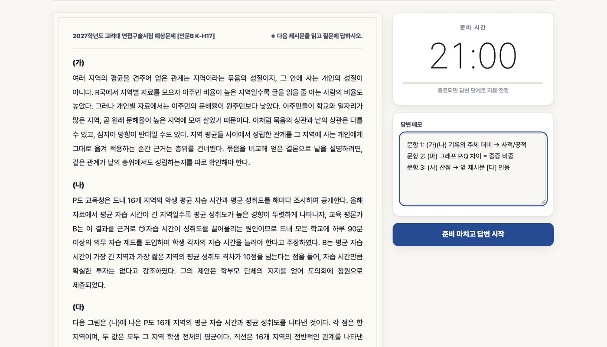
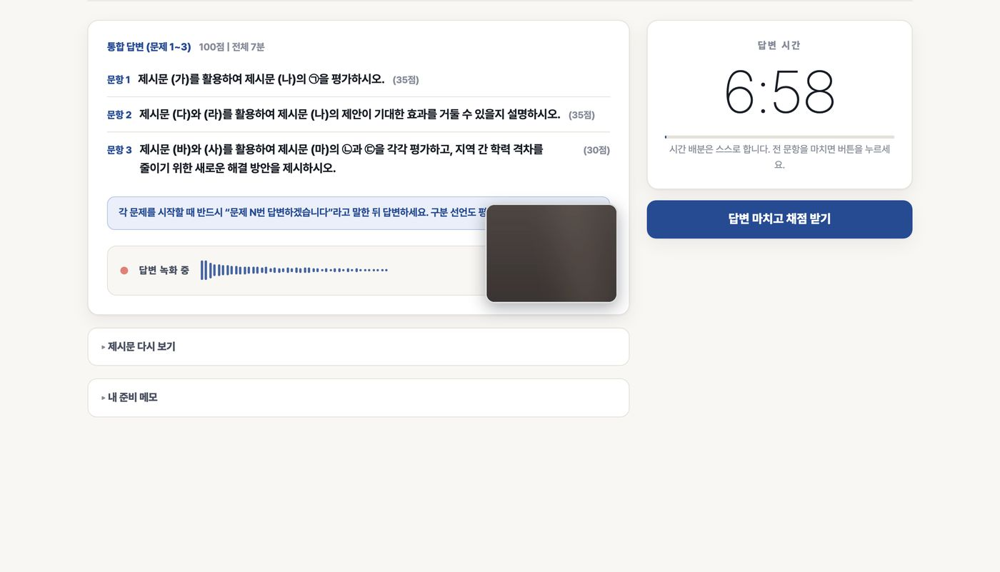
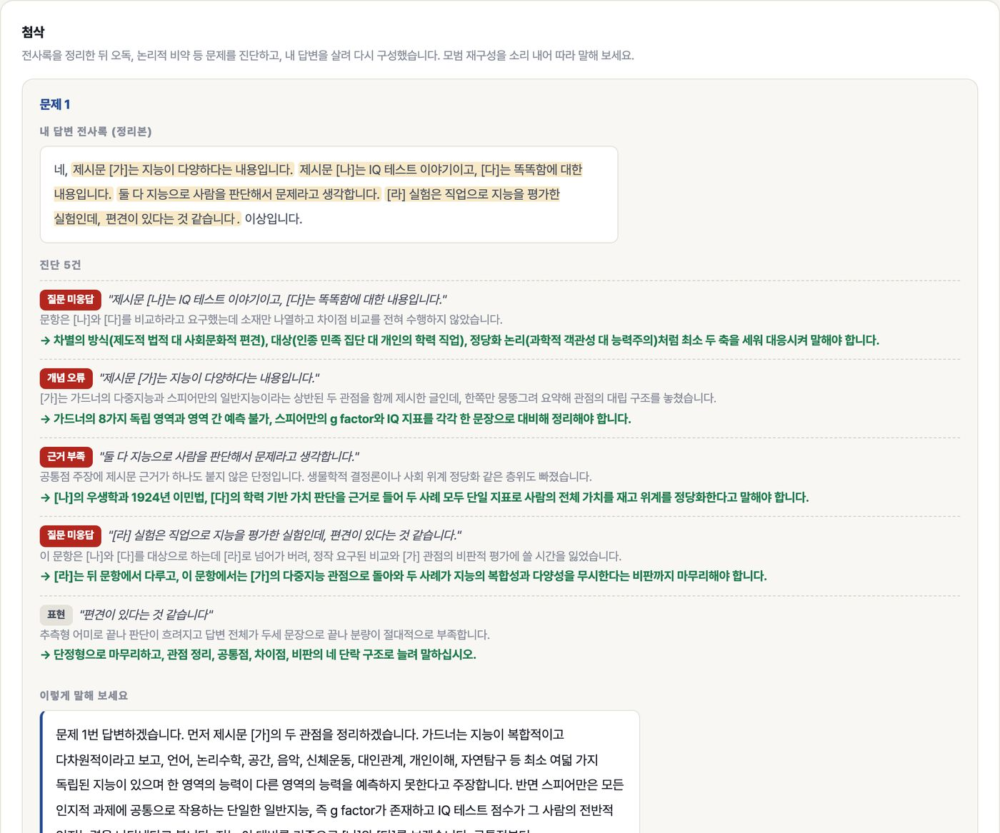
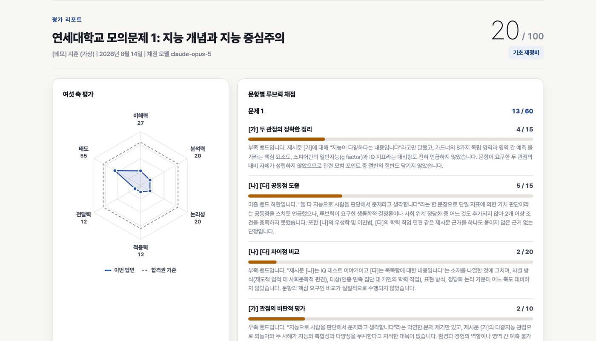
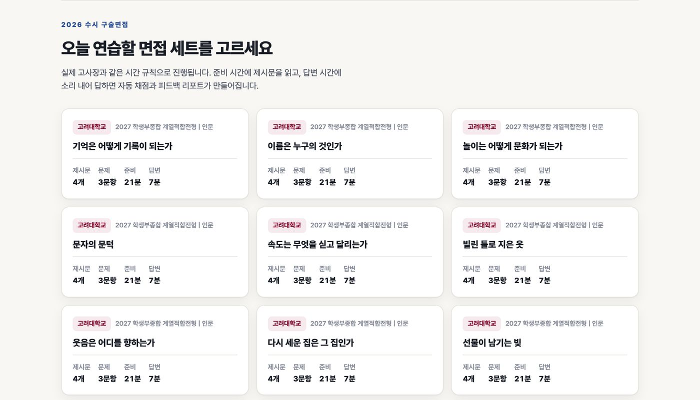
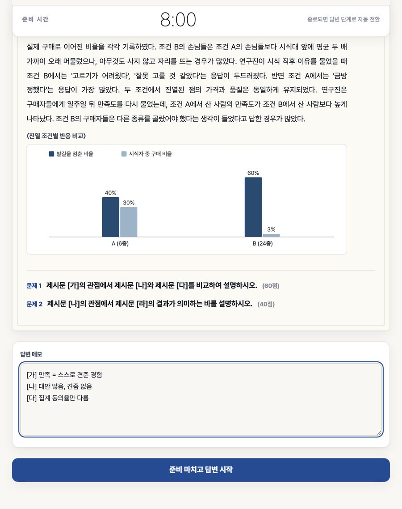

# 8축 코드 교차검토 발주 s2 r1 (2026-09-14, hyunhak 구매물 활용 UX + 버그 스윕 수리)

당신은 코드의 외부 리뷰어입니다. 내부 팀(구현 8군 + 렌더 하네스 + 반박 3인 스윕)과 독립적으로 보고 놓친 결함을 찾으세요.

## 컨텍스트
- 유료 회원(학생)이 자료실 기출 체험판(열람용 PDF)을 응시 문제로 오해해 녹화를 못 했다. 수리 = 첫 사용 안내(my.html data-first-guide, 앱 firstUseNote), 자료실/기출 체험판 "읽는 자료" 구분 문안, 응시 절차 재서술, 만료·소진 권리 카드 비활성, 환불 item_ids 정수화(P0), .hgo 기록 열람을 HH.studioGo(data-view=history) 경유, owned.js 자기링크 제거·체험판 권리 접기·세트 표 보유 표시(HH.ownedApplySetTable), 앱: 녹음 시작 실패 처리·POST 중 이동 잠금·history 입장 fail-closed(api.py)·데모 배속 칩 회원 숨김·타이머 wall-clock·리포트 fetch ok 검사 등.
- 실측: 사이트 build_all 전 게이트 PASS, Playwright 68면 넘침 0·오류 0, interview-studio pytest 505 GREEN.
- 서버(hyunhak-api Worker)는 이번에 안 바꿈. 사이트 JS 가 읽는 /api/auth/me entitlements(kind, meta JSON, uses_left, expires_at), /api/studio/attempts, /api/studio/token(body set_id|entitlement_id|view) 계약은 기존 그대로.

## 검토 8축
1 정확성(edge case) 2 보안(XSS·injection·secrets) 3 성능 4 동시성(race·중복 클릭·gen 가드) 5 에러 처리(경계) 6 가독성·명명 7 테스트 가능성 8 의존성

## 출력 포맷 (한국어, 40줄 상한)
SEVERITY_SUMMARY: critical=<n> high=<n> medium=<n> low=<n>
CRITICAL: - <파일:위치> — 문제 — 수정안
HIGH: ...
MEDIUM: ...
LOW: ...
RECOMMENDATION: BLOCK_MERGE / REQUEST_CHANGES / APPROVE_WITH_NITS / APPROVE
마지막 줄: VERDICT: GO|NO-GO 와 근거 1줄

## diff 1 — hyunhak-site (정적 사이트 + assets/*.js)
diff --git a/_tools/build_lectures.py b/_tools/build_lectures.py
index a6e0c0b..58cf367 100644
--- a/_tools/build_lectures.py
+++ b/_tools/build_lectures.py
@@ -199,7 +199,7 @@ CSS_LIST = CSS_COMMON + '''
 .lecp .cr[hidden]{display:none}
 .lecp .cr .kn{font-family:var(--mono);font-size:var(--t-xs);letter-spacing:var(--tr-label);color:var(--gray)}
 .lecp .cr h2{font-size:var(--t-h4);margin-top:4px}
-.lecp .cr h2 a{display:inline-block;padding:3px 0}
+.lecp .cr h2 a{display:inline-flex;align-items:center;min-height:var(--tap);padding:3px 0}
 .lecp .cr h2 a:hover{text-decoration:underline;text-underline-offset:4px;text-decoration-color:var(--hair)}
 .lecp .cr .sub{font-size:var(--t-sm);color:var(--gray);margin-top:4px}
 .lecp .cr .comp{font-size:var(--t-sm);color:var(--body);display:grid;gap:4px}
@@ -252,7 +252,7 @@ def list_page(cs):
     <nav class="crumb rv" aria-label="위치"><a href="index.html">현학적 연구소</a>/인강</nav>
     인강
     <h1 class="rv">풀이법 인강</h1>
-    
연세대, 고려대 제시문 면접의 풀이 절차를 강의로 잇습니다. 공통 풀이 4편, 단위 강의, 지문마다 한 편인 세트 해설, 2026 기출 해설 1편. 단위 전권 이용권에 포함되고 구매일부터 3개월 시청합니다.

+    
연세대, 고려대 제시문 면접의 풀이 절차를 강의로 잇습니다. 공통 풀이 4편, 단위 강의, 지문마다 한 편인 세트 해설, 2026 기출 해설 1편. 단위 전권 이용권에 포함되고 지급일부터 3개월 시청합니다.

     <!-- aeo-slot -->
     
<a class="btn" href="#ot">인강 OT 와 맛보기 →</a><a class="btn ghost" href="classroom.html">인강실</a>

    

@@ -260,7 +260,7 @@ def list_page(cs):
     
<b>{len(cs)}</b>강좌. 단위 5, 공통 1

     
<b>{total_n}</b>편 구성, {E(SNAP)} 기준

     
<b>{round(total_sec / 3600)}</b>시간, 세트 해설 포함

-    
<b>3</b>개월 시청, 구매일부터

+    
<b>3</b>개월 시청, 지급일부터

    

   

 </section>
@@ -276,7 +276,7 @@ def list_page(cs):
   

<h2 class="t">인강 OT 와 맛보기</h2>
사기 전에 순서와 말하는 속도를 확인합니다. 맛보기는 로그인 없이, OT 영상은 로그인 뒤 무료로 봅니다.

   

    
인강 OT<h3>이 인강을 어떤 순서로 듣나</h3>
5분 안내 강의입니다. 회원이면 이용권이 없어도 인강실에서 무료로 봅니다.

-    <ol class="steps4"><li>공통 풀이 4편을 먼저 다 듣습니다. 두 시간이 안 됩니다.</li><li>내 단위의 단위 강의를 응시 전에 듣습니다.</li><li>응시합니다. 첫 응시는 실전형 한 번, 첨삭을 받습니다.</li><li>그 지문의 세트 해설을 듣고 다시 응시합니다. 지문마다 반복이 30세트 사이클입니다.</li></ol>
+    <ol class="steps4"><li>공통 풀이 4편을 먼저 다 듣습니다. 두 시간이 안 됩니다.</li><li>내 단위의 단위 강의를 응시 전에 듣습니다.</li><li>응시합니다. 마이페이지 이용권의 응시하러 가기로 스튜디오 앱이 열리고, 제시문과 문제는 앱이 냅니다. 첫 응시는 실전형 한 번, 첨삭을 받습니다.</li><li>그 지문의 세트 해설을 듣고 다시 응시합니다. 지문마다 반복이 30세트 사이클입니다.</li></ol>
     {order_svg()}
     
<a class="tlink" href="classroom.html">인강실에서 OT 보기 →</a><a class="tlink" href="assets/docs/lecture_ot_script.pdf">OT 대본 PDF →</a>

    
<video controls preload="none" poster="assets/video/sample_common.jpg" playsinline><source src="assets/video/sample_common.mp4" type="video/mp4"><track kind="captions" srclang="ko" label="한국어" default src="assets/video/sample_common.vtt"></video>
맛보기공통 풀이 2편 개수 계약 발췌, {smp_len("common")}. 강좌마다 맛보기가 한 편씩 있습니다.

@@ -289,7 +289,7 @@ def list_page(cs):
   

<h2 class="t">자주 묻는 것</h2>

   

   

인강만 따로 살 수 있나요

공통 풀이 인강 4편은 220,000원에 따로 삽니다. 단위 강의와 세트 해설은 지문 낱권이나 단위 전권에 붙어 오고, 인강만 파는 상품은 없습니다.

-  

시청 기간은 얼마인가요

구매일부터 3개월입니다. 응시 이용 기간도 구매일부터 3개월입니다. 기간 안에 공개되는 편은 추가 비용 없이 봅니다.

+  

시청 기간은 얼마인가요

지급일부터 3개월입니다. 응시 이용 기간은 구매일부터 3개월입니다. 기간 안에 공개되는 편은 추가 비용 없이 봅니다.

   

어디서 보나요

로그인한 뒤 인강실에서 봅니다. 배속 0.75배에서 2배, 목차 점프, 책갈피가 되고 시청 위치는 계정에 저장됩니다. 동시 재생은 세 기기까지입니다.

   

공개 편수는 어디서 확인하나요

강좌 상세와 인강실에 열람 시점 기준으로 적힙니다. 준비 중인 편은 공개되는 대로 순차 업로드됩니다.

   

@@ -303,7 +303,7 @@ def list_page(cs):
   if (window.LEC) LEC.paintSummaries(document);
 })();
 </script>'''
-    # 내가 산 것 블록 (assets/owned.js, 2026-09-13): 목록 면에만. 인강실은 자체 보유 판정을 가진다
+    # 내가 산 것 블록 (assets/owned.js, 2026-09-13): 목록 면과 인강실(2026-09-13 s2 (d))에 둔다
     return HEAD.format(title="풀이법 인강, 현학적 연구소", p="", css=CSS_LIST, cls="lec2 lecp") + body + TAIL.format(p="", snap=SNAP.replace("-", ""), script='\n'+script)
 
 
@@ -332,7 +332,8 @@ CSS_ROOM = CSS_COMMON + '''
 
 
 def room_page():
-    body = f'''<section class="phead tight">
+    body = f'''

+<section class="phead tight">
   

    

     <nav class="crumb" aria-label="위치"><a href="index.html">현학적 연구소</a>/<a href="lectures.html">인강</a>/인강실</nav>
@@ -349,7 +350,7 @@ def room_page():
    
로그인 필요<h2>인강실은 로그인한 뒤 열립니다</h2>
산 이용권의 강의와 마지막으로 본 자리를 여기에서 엽니다. 계정이 없으면 먼저 가입하고, 강의를 아직 고르는 중이면 강좌 목록을 보세요.

<a class="btn" href="login.html?next=classroom.html">로그인 →</a><a class="btn ghost" href="join.html">가입</a><a class="btn ghost" href="lectures.html">강좌 목록</a>

    

     
<video controls preload="none" poster="assets/video/sample_common.jpg" playsinline><source src="assets/video/sample_common.mp4" type="video/mp4"><track kind="captions" srclang="ko" label="한국어" default src="assets/video/sample_common.vtt"></video>
맛보기공통 풀이 2편 개수 계약 발췌, {smp_len("common")}

-    
인강 OT<h2>이 인강을 어떤 순서로 듣나</h2>
공통 풀이 4편을 먼저, 단위 강의는 응시 전에, 세트 해설은 응시한 지문부터. 5분 안내 영상은 로그인하면 회원 무료 0강으로 목록 맨 위에 있습니다.
{order_svg()}
<a class="tlink" href="assets/docs/lecture_ot_script.pdf">OT 대본 PDF →</a>

+    
인강 OT<h2>이 인강을 어떤 순서로 듣나</h2>
공통 풀이 4편을 먼저, 단위 강의는 응시 전에, 세트 해설은 응시한 지문부터. 5분 안내 영상은 로그인하면 회원 무료 0강으로 목록 맨 위에 있습니다. 응시 시작은 마이페이지 이용권의 응시하러 가기입니다.
{order_svg()}
<a class="tlink" href="assets/docs/lecture_ot_script.pdf">OT 대본 PDF →</a>

    

   

   

@@ -357,16 +358,16 @@ def room_page():
    

    

<h2 class="t">최근 시청</h2>
마지막으로 본 자리부터 다시 엽니다.

    

불러오는 중입니다.

-   

<h2>목차표와 OT 대본</h2>
강좌별 강의 목차표와 OT 대본은 자료실에 있습니다.

<a class="btn" href="library.html#lecdocs">인강 자료 →</a><a class="btn ghost" href="lectures.html">강좌 목록</a>

+   

<h2>목차표와 OT 대본</h2>
강좌별 강의 목차표와 OT 대본은 자료실에 있습니다. 인강 OT 영상은 회원 무료 0강이라 전체 목록 맨 위에서 이용권 없이 봅니다. 자료실 자료는 읽는 자료이고 응시와 별개입니다.

<a class="btn" href="library.html#lecdocs">인강 자료 →</a><a class="btn ghost" href="lectures.html">강좌 목록</a>

   

   

-   
보유 이용권 없음<h2>아직 들어온 강의가 없습니다</h2>
단위 전권이나 지문 낱권을 사면 그 강의가 여기에 섭니다. 공통 풀이 인강은 따로 살 수 있습니다.

<a class="btn" href="lectures.html">강좌 목록 →</a><a class="btn ghost" href="studio.html#plans">이용권 세 가지</a>

+   
보유 이용권 없음<h2>아직 들어온 강의가 없습니다</h2>
단위 전권이나 지문 낱권을 사면 그 강의가 여기에 섭니다. 공통 풀이 인강은 따로 살 수 있습니다. 인강 OT 영상은 회원 무료 0강이라 이용권이 없어도 전체 목록 맨 위에서 봅니다.

<a class="btn" href="lectures.html">강좌 목록 →</a><a class="btn ghost" href="lecture.html">전체 목록</a><a class="btn ghost" href="studio.html#plans">이용권 세 가지</a>

   

   

상태 미상<h2>강의 목록을 지금 불러올 수 없습니다</h2>
잠시 후 다시 열어 주세요. 권리가 사라진 것이 아닙니다.

  

 
'''
     script = ''
-    return HEAD.format(title="인강실, 현학적 연구소", p="", css=CSS_ROOM, cls="lec2 lecr") + body + TAIL.format(p="", snap=SNAP.replace("-", ""), script=script)
+    return HEAD.format(title="인강실, 현학적 연구소", p="", css=CSS_ROOM, cls="lec2 lecr") + body + TAIL.format(p="", snap=SNAP.replace("-", ""), script='\n'+script)
 
 
 # ---------------- 강좌 상세 ----------------
@@ -430,7 +431,7 @@ def detail_page(c, cs):
 

 
지문 낱권 {c["single"]:,}원에는 그 세트 해설 1편이 붙습니다. 공통 풀이 4편만 들으려면 <a href="common.html">220,000원</a>.

'''
     else:
-        buy = f'''

공통 풀이 이용권

{c["price"]:,}원<small>인강만, 구매일부터 3개월</small>

+        buy = f'''

공통 풀이 이용권

{c["price"]:,}원<small>인강만, 지급일부터 3개월</small>

 <ul class="inc"><li>내용공통 풀이 4편</li><li>시청인강실, 배속과 책갈피</li><li>단위 전권이미 포함</li></ul>
 
<button type="button" class="btn" data-cart-sku="lecture-common" data-cart-title="공통 풀이 인강" data-cart-price="220000">담기 →</button>

 

@@ -460,7 +461,7 @@ def detail_page(c, cs):
  

   
{"공통 풀이" if is_common else "풀이법 인강"}<h1>{E(label)}</h1>{guide}
{meta}

{E(INTRO[code][0].split(". ")[0])}.
{buy}

   

<video controls preload="none" poster="../assets/video/sample_{code}.jpg" playsinline><source src="../assets/video/sample_{code}.mp4" type="video/mp4"><track kind="captions" srclang="ko" label="한국어" default src="../assets/video/sample_{code}.vtt"></video>
맛보기{E(smp_cap)}, {smp_len(code)}. 로그인 없이 봅니다.

-   
인강 OT<h2>이 인강을 어떤 순서로 듣나</h2>
공통 풀이 4편을 먼저, 단위 강의는 응시 전에, 세트 해설은 응시한 지문부터. 5분 안내 영상은 로그인 뒤 인강실에서 무료로 봅니다.
{order_svg()}
<a class="tlink" href="../classroom.html">인강실에서 OT 보기 →</a><a class="tlink" href="../assets/docs/lecture_ot_script.pdf">OT 대본 PDF →</a>

+   
인강 OT<h2>이 인강을 어떤 순서로 듣나</h2>
공통 풀이 4편을 먼저, 단위 강의는 응시 전에, 세트 해설은 응시한 지문부터. 5분 안내 영상은 로그인 뒤 인강실에서 무료로 봅니다. 응시 시작은 마이페이지 이용권의 응시하러 가기입니다.
{order_svg()}
<a class="tlink" href="../classroom.html">인강실에서 OT 보기 →</a><a class="tlink" href="../assets/docs/lecture_ot_script.pdf">OT 대본 PDF →</a>

  

  <!-- aeo-slot -->
 

@@ -470,7 +471,7 @@ def detail_page(c, cs):
  <section class="page" id="intro"><h2 class="t">{"절차 네 문장" if is_common else E(c["spec"]) + "을 절차로 만든다"}</h2>
{intro}
{("
" + tracks + "
") if tracks else ""}</section>
  <section class="page" id="faq"><h2 class="t">자주 묻는 것</h2>

   

인강만 따로 살 수 있나요

공통 풀이 인강 4편은 220,000원에 따로 삽니다. 단위 강의와 세트 해설은 지문 낱권이나 단위 전권에 붙어 오고, 인강만 파는 상품은 없습니다.

-  

시청 기간은 얼마인가요

구매일부터 3개월입니다. 응시 이용 기간도 구매일부터 3개월입니다. 기간 안에 공개되는 편은 추가 비용 없이 봅니다.

+  

시청 기간은 얼마인가요

지급일부터 3개월입니다. 응시 이용 기간은 구매일부터 3개월입니다. 기간 안에 공개되는 편은 추가 비용 없이 봅니다.

   

어디서 보나요

로그인한 뒤 인강실에서 봅니다. 배속 0.75배에서 2배, 목차 점프, 책갈피가 되고 시청 위치는 계정에 저장됩니다. 동시 재생은 세 기기까지입니다.

  

  
다른 강좌
{others}

</section>
diff --git a/_tools/r2_copy.json b/_tools/r2_copy.json
index 32a2a0a..08b5491 100644
--- a/_tools/r2_copy.json
+++ b/_tools/r2_copy.json
@@ -8,7 +8,7 @@
   "guide_card_2": ["내 생기부에서 나올 질문을 그 대학 기준으로 뽑습니다.", "G4"],
   "studio_audience": ["연세대와 고려대 제시문 면접 준비생", "S1"],
   "studio_name": ["제시문 면접 스튜디오", "S1"],
-  "studio_card_1": ["기출 제시문 150세트로 촬영 응시합니다.", "S1 S2"],
+  "studio_card_1": ["기출 규격 제시문 150세트로 촬영 응시합니다.", "S1 S2"],
   "studio_card_2": ["지문마다 5회 응시합니다.", "S3a"],
   "studio_card_3": ["고사장과 같은 규격으로 응시하고 첨삭 세 단을 받습니다.", "S1 S4"],
   "per_book": ["권당", "G1"],
@@ -41,15 +41,15 @@
   "sale": ["가이드북 판매 중", "G1"],
   "all_books": ["31개 대학 전체 보기", "G1"],
   "flow_title": ["스튜디오 응시 절차", "S4"],
-  "flow_lead": ["지문 1편에 5회까지 응시합니다.", "S3a S4"],
+  "flow_lead": ["이용권의 응시하러 가기로 스튜디오 앱이 열리고, 지문 1편에 5회까지 응시합니다.", "S3a S4"],
   "flow_1_title": ["지문 선택", "S4"],
-  "flow_1": ["응시할 단위와 지문을 선택합니다.", "S4"],
+  "flow_1": ["앱 안의 세트 카드에서 고릅니다. 제시문과 문제는 준비 화면에 나오므로 따로 풀어 올 자료가 없습니다.", "S4"],
   "flow_2_title": ["실전형 응시", "S4"],
-  "flow_2": ["실제 고사장 규격으로 문항을 나누지 않고 응시합니다.", "S4"],
+  "flow_2": ["실제 고사장 규격으로 문항을 나누지 않고 응시합니다. 답변은 그 화면에서 녹음과 녹화가 됩니다.", "S4"],
   "flow_3_title": ["첨삭 세 단", "S4"],
-  "flow_3": ["전사, 오독과 비약 진단, 구술체 재구성을 제공합니다.", "S4"],
+  "flow_3": ["채점 뒤 리포트에 전사, 오독과 비약 진단, 구술체 재구성을 제공합니다.", "S4"],
   "flow_4_title": ["연습형 재응시", "S4"],
-  "flow_4": ["막힌 자리만 끊어 다시 응시합니다.", "S4"],
+  "flow_4": ["막힌 자리만 끊어 다시 응시합니다. 해설 강의는 마이페이지 내 강의에서 봅니다.", "S4"],
   "studio_link": ["스튜디오 상세 소개", "S1 S4"],
   "maker_bio": ["현학자는 입시 컨설턴트 13년차이며 고려대학교 영어교육과를 졸업했습니다.", "A1 A3"],
   "maker_work": ["가이드북 31권과 스튜디오 150세트를 한 사람이 편집합니다.", "A1"],
@@ -93,7 +93,7 @@
   "maker_short": ["현학자가 가이드북 31권과 스튜디오 150세트를 같은 기준으로 편집합니다.", "A1"],
   "return_buy": ["구매할 상품 고르기", "C1"],
   "studio_h1": ["연세대, 고려대 제시문 면접을 실전 규격으로 연습합니다", "S1"],
-  "studio_room_lead": ["기출 제시문 150세트, 지문마다 5회 응시, 세 단 첨삭입니다.", "S2 S3a S4"],
+  "studio_room_lead": ["기출 규격 제시문 150세트, 지문마다 5회 응시, 세 단 첨삭입니다.", "S2 S3a S4"],
   "studio_lead": ["실전 규격으로 촬영 응시하고 첨삭 세 단을 받습니다.", "S1 S4"],
   "studio_buy_title": ["스튜디오 이용권 구매", "S3 C1"],
   "choose_unit": ["응시 단위 고르기", "S2"],
@@ -128,6 +128,12 @@
   "school_link": ["스쿨 플랜 안내", "S11"],
   "faq_trial_q": ["구매 전 체험", "S8"],
   "faq_lecture_q": ["해설 강의 공개 일정", "S7"],
+  "faq_start_q": ["이용권을 샀는데 어디서 시작하나요", "S4"],
+  "faq_start_a": ["마이페이지 이용권의 응시하러 가기, 또는 이 면 상단 내가 산 것의 응시하러 가기. 스튜디오 앱이 열리면 세트 카드를 누르고 면접 시작을 누릅니다.", "S4"],
+  "faq_readonly_q": ["자료실 기출 체험판과 응시 문제가 같은가요", "G9 S2"],
+  "faq_readonly_a": ["다릅니다. 기출 체험판은 2026학년도 기출을 읽는 자료이고, 응시 문제는 앱이 세트마다 준비 화면에 냅니다. 자료실에서 미리 풀어 올 것은 없습니다.", "G9 S2"],
+  "faq_record_q": ["녹화는 어디서 하나요", "S1 S5"],
+  "faq_record_a": ["스튜디오 앱의 답변 화면에서 말하면 그 자리에서 녹음과 녹화가 됩니다. 따로 찍어 올리는 절차가 없습니다.", "S1 S5"],
   "catalog_lead": ["학종 서류기반 면접 가이드북 31권을 가나다 순으로 찾습니다. 결제 후 보안 리더에서 열람합니다.", "G1 G7"],
   "detail_intro": ["상세 소개 보기", "G4 S4"],
   "support": ["고객센터", "C4"],
diff --git a/_tools/r2_faq.py b/_tools/r2_faq.py
index 801567a..7eeb654 100644
--- a/_tools/r2_faq.py
+++ b/_tools/r2_faq.py
@@ -18,7 +18,10 @@ PAGE_KEYS = {
                             ("faq_refund_q", "r3_studio_refund"),
                             ("r3_faq_teacher_q", "r3_faq_teacher_a"),
                             ("r3_faq_rank_q", "r3_faq_rank_a"),
-                            ("r3_faq_video_q", "r3_own_video")],
+                            ("r3_faq_video_q", "r3_own_video"),
+                            ("faq_start_q", "faq_start_a"),
+                            ("faq_readonly_q", "faq_readonly_a"),
+                            ("faq_record_q", "faq_record_a")],
 }
 
 
diff --git a/_tools/shot_owned.mjs b/_tools/shot_owned.mjs
index 3660cb3..4daa7ec 100644
--- a/_tools/shot_owned.mjs
+++ b/_tools/shot_owned.mjs
@@ -1,11 +1,23 @@
-// "내가 산 것" (assets/owned.js) 실렌더 증거 (2026-09-13). 로컬 서버 :8811 필요 (hostname localhost → app.js 가 :8799 API 를 본다).
+// "내가 산 것" (assets/owned.js) + 구매물 활용 UX s2 문안 실렌더 증거 (2026-09-13). 로컬 서버 :8811 필요 (hostname localhost → app.js 가 :8799 API 를 본다).
 //   python3 -m http.server 8811 --bind 127.0.0.1  후  node _tools/shot_owned.mjs <out_dir>
-// API 를 route 로 스텁: 회원(전권 1, 낱권 1, 만료 전권 1, 인강 1, 가이드북 1) 과 비회원(401) 두 상태 × 400/1280 폭.
+// API 를 route 로 스텁. 상태 4종 × 400/1280 폭:
+//   owner      = 회원(전권 1, 낱권 1, 만료 전권 1, 인강 1, 가이드북 1), 응시 0건, 첫 사용 안내가 보여야 한다
+//   owner_done = 같은 회원, 채점 완료 응시 1건 + lecture 권리, 안내 숨김, 응시 기록 행에 해설 강의 링크 1
+//   trial      = 회원, trial_available true, entitlements []
+//   guest      = 비회원(401)
+// 스튜디오 앱(interview-studio/web)은 본 스크립트가 :8812 로 정적 서빙하고 /api/* 는 route 로 스텁한다 (별도 기동 불요).
+// 리포트 = _docs/owned_ux_render_report_s2_20260913.json, 스크린샷 = <out_dir>.
 import { chromium, devices } from '/Users/gregory/Workspace/iruri_6mo_thumb/node_modules/playwright/index.mjs';
 import fs from 'node:fs';
+import http from 'node:http';
+import path from 'node:path';
 const [out] = process.argv.slice(2); fs.mkdirSync(out, { recursive: true });
+const SITE = path.resolve(path.dirname(new URL(import.meta.url).pathname), '..');
+const STUDIO = '/Users/gregory/Workspace/interview-studio';
+const REPORT = path.join(SITE, '_docs', 'owned_ux_render_report_s2_20260913.json');
 const EXP = '2026-12-13T14:59:59Z';
-const OWNER = { member: { id: 'm_stub', email: 'stub@hyunhak.com', name: '검수용', marketing_opt_in: true }, trial_available: false,
+const MEMBER = { id: 'm_stub', email: 'stub@hyunhak.com', name: '검수용', marketing_opt_in: true };
+const OWNER = { member: MEMBER, trial_available: false,
   entitlements: [
     { id: 'ent_school_yh', kind: 'studio_school', meta: JSON.stringify({ sku: 'pass-yonsei-hum', unit_code: 'yonsei-hum', title: '연세대 활동우수 인문통합 전권 이용권' }), expires_at: EXP },
     { id: 'ent_pass_kh', kind: 'studio_passage', meta: JSON.stringify({ set_id: 'korea_2027_h03', title: '고려대 계열적합 인문 3번 지문 낱권' }), uses_left: 4, expires_at: EXP },
@@ -13,14 +25,30 @@ const OWNER = { member: { id: 'm_stub', email: 'stub@hyunhak.com', name: '검수
     { id: 'ent_lec', kind: 'lecture', meta: JSON.stringify({ unit_code: 'yonsei-hum' }), expires_at: EXP },
     { id: 'ent_g1', kind: 'download', meta: JSON.stringify({ slug: 'guide-gachon', title: '가천대학교 2027 면접가이드북' }) },
   ] };
+const TRIAL = { member: MEMBER, trial_available: true, entitlements: [] };
+const ME = { owner: OWNER, owner_done: OWNER, trial: TRIAL };   // guest = 401
+// 기출 체험판 카탈로그 10건 (pastexam.js 가 읽는 slug, title, pages). 문제지 2면 + 해설지 4면 × 5 = 30면
+const CATALOG = [['yonsei-hum', '2026 연세대 활동우수 인문통합 기출'], ['yonsei-sci', '2026 연세대 활동우수 자연 기출'], ['yonsei-intl', '2026 연세대 국제형 기출'],
+  ['korea-hum-am', '2026 고려대 계열적합 인문 오전 기출'], ['korea-sci-pm', '2026 고려대 계열적합 자연 오후 기출']]
+  .flatMap(([s, t]) => [{ slug: s + '-exam', title: t + ' 문제지', pages: 2 }, { slug: s + '-key', title: t + ' 해설지', pages: 4 }]);
+// 채점 완료 응시 1건. my.html(L490~545) 이 읽는 필드 = set_id, created_at, total_score, total_points, finalized_at, answer_mode, kind, ref/attempt_id.
+// 스펙 표기(id, status, finalized, max_score) 도 함께 실어 두 면이 다 읽게 한다
+const DONE_AT = '2026-09-10T03:12:00Z';
+const ATTEMPT_DONE = { id: 'att_stub_1', attempt_id: 'att_stub_1', ref: 'att_stub_1', set_id: 'yonsei_2027_h03', kind: 'studio_school', answer_mode: 'combined',
+  status: 'done', finalized: true, finalized_at: DONE_AT, total_score: 31, total_points: 40, max_score: 40, created_at: DONE_AT };
 const STUB = {
   '/api/config': { oauth: {} }, '/api/orders': { orders: [] }, '/api/lectures': { lectures: [] }, '/api/lectures/public': { lectures: [] },
   '/api/lectures/summary': { ready: 4, total: 30, as_of: '2026-09-13' }, '/api/studio/attempts': { attempts: [], usage: [], set_uses: 5, retention_days: 90 },
   '/api/studio/sets/downloads/me': { downloads: [] }, '/api/reader/downloads/me': { downloads: [] }, '/api/products': { products: [] },
-  '/api/studio/token': { url: 'https://studio.hyunhak.com/?hh=stub', scope: 'studio_school' } };
-const PAGES = ['index.html', 'studio.html', 'programs/studio.html', 'library.html', 'lectures.html', 'my.html'];
+  '/api/studio/token': { url: 'https://studio.hyunhak.com/?hh=stub', scope: 'studio_school' },
+  '/api/trial/reader/catalog': { catalog: CATALOG, hours: 48 }, '/api/trial/reader': { status: 'none', hours: 48 } };
+const STUB_BY_STATE = { owner_done: {
+  '/api/studio/attempts': { attempts: [ATTEMPT_DONE], usage: [{ entitlement_id: 'ent_school_yh', set_id: 'yonsei_2027_h03', n: 1 }], set_uses: 5, retention_days: 90 },
+  '/api/trial/reader': { status: 'active', expires_at: new Date(Date.now() + 40 * 3600e3).toISOString(), hours: 48, catalog: CATALOG } } };
+const stubFor = (state, p) => { const s = STUB_BY_STATE[state] || {}; return p in s ? s[p] : (STUB[p] || {}); };
+const PAGES = ['index.html', 'studio.html', 'programs/studio.html', 'library.html', 'lectures.html', 'my.html', 'pastexam.html', 'classroom.html'];
 const b = await chromium.launch(); const report = {};
-for (const state of ['owner', 'guest']) for (const w of [400, 1280]) {
+for (const state of ['owner', 'owner_done', 'trial', 'guest']) for (const w of [400, 1280]) {
   const ctx = await b.newContext(w === 400 ? { ...devices['Pixel 7'], viewport: { width: 400, height: 860 } } : { viewport: { width: 1280, height: 900 } });
   const tokenCalls = [];
   for (const host of ['http://localhost:8799/**', 'https://api.hyunhak.com/**']) await ctx.route(host, (route) => {
@@ -28,10 +56,10 @@ for (const state of ['owner', 'guest']) for (const w of [400, 1280]) {
     const cors = { 'access-control-allow-origin': req.headers()['origin'] || 'http://localhost:8811', 'access-control-allow-credentials': 'true',
       'access-control-allow-methods': 'GET,POST,PATCH,OPTIONS', 'access-control-allow-headers': 'content-type' };
     if (req.method() === 'OPTIONS') return route.fulfill({ status: 204, headers: cors });
-    if (p === '/api/auth/me') return state === 'owner' ? route.fulfill({ status: 200, contentType: 'application/json', headers: cors, body: JSON.stringify(OWNER) })
+    if (p === '/api/auth/me') return state !== 'guest' ? route.fulfill({ status: 200, contentType: 'application/json', headers: cors, body: JSON.stringify(ME[state]) })
       : route.fulfill({ status: 401, contentType: 'application/json', headers: cors, body: '{"error":"unauthorized"}' });
     if (p === '/api/studio/token') tokenCalls.push(req.postData());
-    return route.fulfill({ status: 200, contentType: 'application/json', headers: cors, body: JSON.stringify(STUB[p] || {}) });
+    return route.fulfill({ status: 200, contentType: 'application/json', headers: cors, body: JSON.stringify(stubFor(state, p)) });
   });
   await ctx.route('https://studio.hyunhak.com/**', (route) => route.fulfill({ status: 200, contentType: 'text/html', body: '<title>studio stub</title>stub' }));
   for (const p of PAGES) {
@@ -42,22 +70,29 @@ for (const state of ['owner', 'guest']) for (const w of [400, 1280]) {
     await pg.goto('http://localhost:8811/' + p, { waitUntil: 'networkidle' }).catch((e) => errs.push('nav ' + e));
     await pg.waitForTimeout(1200);
     const m = await pg.evaluate(() => {
-      const de = document.documentElement, q = (s) => Array.from(document.querySelectorAll(s));
+      const de = document.documentElement, q = (s) => Array.from(document.querySelectorAll(s)), tx = (el, n) => el ? el.innerText.replace(/\s+/g, ' ').trim().slice(0, n) : null;
       const ownedEl = document.querySelector('[data-owned]');
       const own = ownedEl && !ownedEl.hidden ? ownedEl.innerText.replace(/\s+/g, ' ').slice(0, 400) : null;
       const cards = q('article[data-r3-unit]').map((c) => ({ unit: c.dataset.r3Unit, applied: !!c.dataset.ownedApplied, badge: (c.querySelector('.r3-unit-badge') || {}).textContent,
         foot: Array.from(c.querySelectorAll('.foot a,.foot button')).map((x) => x.textContent.trim()) }));
-      const tg = document.getElementById('trialGo');
+      const tg = document.getElementById('trialGo'), fg = document.querySelector('[data-first-guide]');
       return { ox: de.scrollWidth - de.clientWidth, height: de.scrollHeight, coarse: matchMedia('(pointer:coarse)').matches, own, cards,
         trialGo: tg ? (tg.hidden ? '(hidden)' : tg.textContent.trim()) : null, libOwn: q('.liblist .lf.own').length,
         libOwnTag: q('.liblist .lf.own .own-tag').map((x) => x.textContent).slice(0, 3), passList: (document.getElementById('passList') || { innerText: '' }).innerText.replace(/\s+/g, ' ').slice(0, 300),
-        tapSmall: q('[data-owned-go],.owned .btn,.owned .tlink').filter((x) => { const r = x.getBoundingClientRect(); return r.height && r.height < 24; }).length };
+        tapSmall: q('[data-owned-go],.owned .btn,.owned .tlink').filter((x) => { const r = x.getBoundingClientRect(); return r.height && r.height < 24; }).length,
+        // s2 프로브: 첫 사용 안내, owned-note, 읽는 자료 문구, 체험판 상태문, 응시 기록 행의 해설 강의 링크 수, 신설 FAQ dt 수
+        guide: fg ? { hidden: fg.hidden, text: tx(fg, 600) } : null,
+        ownedNote: tx(document.querySelector('.owned-note'), 400),
+        ro: q('[data-readonly-note]').map((x) => tx(x, 300)),
+        stateText: tx(document.getElementById('stateText'), 300),
+        lecLinks: q('#stuRows a[href^="lecture.html?set="]').length,
+        faqNew: q('dt').filter((d) => d.textContent.indexOf('어디서 시작') >= 0).length };
     });
     await pg.screenshot({ path: `${out}/${key}.png`, fullPage: true });
     // 응시하러 가기 실클릭: 회원 상태에서 첫 버튼. 휴대폰(coarse) 은 같은 탭 이동, 데스크톱은 새 창.
     // ★ fullPage 스크린샷 뒤에는 Chromium 터치 에뮬레이션이 풀려 (pointer:coarse) 가 false 로 바뀐다 (2026-09-13 실측). 클릭은 새 페이지에서 한다
     let click = null;
-    if (state === 'owner') {
+    if (state !== 'guest') {
       await pg.close();
       const pg2 = await ctx.newPage(); await pg2.goto('http://localhost:8811/' + p, { waitUntil: 'networkidle' }); await pg2.waitForTimeout(800);
       const coarseAtClick = await pg2.evaluate(() => matchMedia('(pointer:coarse)').matches);
@@ -71,11 +106,60 @@ for (const state of ['owner', 'guest']) for (const w of [400, 1280]) {
       await pg2.close();
     }
     report[key] = { ...m, errs, click };
-    if (state !== 'owner') await pg.close();
+    if (state === 'guest') await pg.close();
   }
   await ctx.close();
 }
+
+// ── 스튜디오 앱 렌더 (interview-studio/web/index.html, S-6 문안): :8812 정적 서빙 + /api/* route 스텁 ──
+//   /api/me = 브리지 회원 {sub_bound:true, nick, scope}, /api/sets = sets/ 의 세트 2건(student_view 근사 = explanation 제거), /api/univs = [] (앱이 for..of 로 돈다), 그 외 {}
+const WEB = path.join(STUDIO, 'web');
+const MIME = { '.html': 'text/html; charset=utf-8', '.js': 'text/javascript', '.css': 'text/css', '.json': 'application/json', '.png': 'image/png', '.svg': 'image/svg+xml' };
+const srv = http.createServer((req, res) => {
+  let u = decodeURIComponent(new URL(req.url, 'http://127.0.0.1').pathname); if (u === '/') u = '/index.html';
+  const f = path.join(WEB, u);
+  if (!f.startsWith(WEB + path.sep) || !fs.existsSync(f) || fs.statSync(f).isDirectory()) { res.writeHead(404); return res.end('not found'); }
+  res.writeHead(200, { 'content-type': MIME[path.extname(f)] || 'application/octet-stream' }); fs.createReadStream(f).pipe(res);
+});
+await new Promise((r) => srv.listen(8812, '127.0.0.1', r));
+const APP = 'http://127.0.0.1:8812';
+const SETS = ['korea_2027_h03', 'korea_2027_h01'].map((id) => { const s = JSON.parse(fs.readFileSync(path.join(STUDIO, 'sets', id + '.json'), 'utf8')); delete s.explanation; return s; });
+for (const scope of ['', 'history']) for (const w of [400, 1280]) {
+  const ctx = await b.newContext(w === 400 ? { ...devices['Pixel 7'], viewport: { width: 400, height: 860 } } : { viewport: { width: 1280, height: 900 } });
+  await ctx.route(APP + '/api/**', (route) => {
+    const p = new URL(route.request().url()).pathname;
+    const body = p === '/api/me' ? { sub_bound: true, nick: '검수용', scope } : p === '/api/sets' ? SETS : p === '/api/univs' ? [] : {};
+    return route.fulfill({ status: 200, contentType: 'application/json', body: JSON.stringify(body) });
+  });
+  const key = `app_${scope || 'exam'}_${w}`;
+  const pg = await ctx.newPage(); const errs = [];
+  pg.on('pageerror', (e) => errs.push(String(e).slice(0, 200)));
+  pg.on('console', (m) => { if (m.type() === 'error') errs.push('console: ' + m.text().slice(0, 160)); });
+  await pg.goto(APP + '/', { waitUntil: 'networkidle' }).catch((e) => errs.push('nav ' + e));
+  await pg.waitForTimeout(1200);
+  const m = await pg.evaluate(() => {
+    const de = document.documentElement, q = (s) => Array.from(document.querySelectorAll(s)), tx = (el, n) => el ? el.innerText.replace(/\s+/g, ' ').trim().slice(0, n) : null;
+    const act = document.querySelector('.screen.active');
+    return { ox: de.scrollWidth - de.clientWidth, height: de.scrollHeight, active: act ? act.id : null, setcards: q('.setcard').length, notices: q('.notice').length,
+      firstUse: tx(document.getElementById('firstUseNote'), 600), h1: tx(document.querySelector('#scr-home h1'), 200),
+      retry: (document.getElementById('btn-retry') || { textContent: null }).textContent, exit: (document.getElementById('btn-exit') || { textContent: null }).textContent };
+  });
+  await pg.screenshot({ path: `${out}/${key}.png`, fullPage: true });
+  await pg.close();
+  // 첫 세트 카드 클릭 뒤 scr-brief 활성 여부. 클릭은 새 페이지에서 (fullPage 뒤 터치 에뮬 소실). history 입장은 홈이 가려져 카드가 안 보이면 null
+  let briefActive = null;
+  const pg2 = await ctx.newPage(); await pg2.goto(APP + '/', { waitUntil: 'networkidle' }).catch(() => {}); await pg2.waitForTimeout(800);
+  const card = await pg2.$('.setcard');
+  if (card && await card.isVisible()) { await card.click(); await pg2.waitForTimeout(400); briefActive = await pg2.evaluate(() => document.getElementById('scr-brief').classList.contains('active')); }
+  await pg2.close();
+  report[key] = { ...m, errs, briefActive };
+  await ctx.close();
+}
+srv.close();
 await b.close();
-fs.writeFileSync(`${out}/report.json`, JSON.stringify(report, null, 1));
+fs.writeFileSync(REPORT, JSON.stringify(report, null, 1));
+console.log('report', REPORT);
 for (const [k, v] of Object.entries(report)) console.log(k, JSON.stringify({ ox: v.ox, errs: v.errs, coarse: v.coarse, own: v.own && v.own.slice(0, 160), trialGo: v.trialGo, libOwn: v.libOwn, tapSmall: v.tapSmall,
-  cards: v.cards.filter((c) => c.applied).map((c) => c.unit + '|' + c.badge + '|' + c.foot.join('/')), click: v.click }));
+  guide: v.guide && { hidden: v.guide.hidden, text: v.guide.text.slice(0, 120) }, ownedNote: v.ownedNote && v.ownedNote.slice(0, 120), ro: v.ro && v.ro.length, stateText: v.stateText, lecLinks: v.lecLinks, faqNew: v.faqNew,
+  firstUse: v.firstUse && v.firstUse.slice(0, 120), h1: v.h1, retry: v.retry, briefActive: v.briefActive,
+  cards: (v.cards || []).filter((c) => c.applied).map((c) => c.unit + '|' + c.badge + '|' + c.foot.join('/')), click: v.click }));
diff --git a/assets/app.js b/assets/app.js
index 0a7c0cd..1136d03 100644
--- a/assets/app.js
+++ b/assets/app.js
@@ -113,9 +113,11 @@
     if (_me !== null && !force) return _me;
     if (_meP && !force) return _meP;   // 헤더, owned, 면 스크립트가 같은 틱에 부르면 요청 1건을 나눠 쓴다 (astra r1 M4)
     _meP = (async () => {
-      try { _me = (await api("/api/auth/me")); } catch (e) { _me = { member: null, error: (e && e.status === 401) ? null : ((e && e.status) || "network") }; }   // 401 = 비회원. 그 밖(네트워크, 5xx, 403)은 error 에 남겨 호출자가 가른다
+      let r;
+      try { r = (await api("/api/auth/me")); } catch (e) { r = { member: null, error: (e && e.status === 401) ? null : ((e && e.status) || "network") }; }   // 401 = 비회원. 그 밖(네트워크, 5xx, 403)은 error 에 남겨 호출자가 가른다
       finally { _meP = null; }
-      return _me;
+      if (!r || !r.error) _me = r;   // 실패 결과는 캐시하지 않는다 (config() 와 같은 방식). 캐시하면 일시 장애가 면 수명 내내 비회원 취급으로 굳는다
+      return r;
     })();
     return _meP;
   }
@@ -198,7 +200,8 @@
     document.querySelectorAll("[data-promo]").forEach((el) => {
       const until = el.getAttribute("data-promo-until");
       const expired = until && !Number.isNaN(Date.parse(until)) && Date.now() > Date.parse(until);
-      el.hidden = !p || expired;
+      const want = el.getAttribute("data-promo");
+      el.hidden = !p || !!expired || (!!want && p.id !== want);   // 지면에 박힌 행사 id 와 살아 있는 행사가 다르면 배너를 숨긴다 (팝업 게이트와 같은 대조)
     });
     if (!p) return;
     document.querySelectorAll("[data-list-price]").forEach((el) => {
diff --git a/assets/lecture.js b/assets/lecture.js
index 2ae3c7b..6c6bc4d 100644
--- a/assets/lecture.js
+++ b/assets/lecture.js
@@ -405,8 +405,15 @@
     v.src = streamUrl();
     v.playbackRate = S.rate;
     v.load();
-    if (at > 0) {
-      var once = function () { try { v.currentTime = at; } catch (e) {} v.removeEventListener("loadedmetadata", once); };
+    // 메타데이터가 늦게 오는 사이에 사용자가 먼저 이동하면(처음부터, 다시 보기, 책갈피) 그 조작이 이긴다.
+    // 목표값을 S.pendingSeek 에 두고 seekTo 가 지우게 한다. 리스너가 뒤늦게 이어보기 지점으로 되돌리던 문제
+    S.pendingSeek = at > 0 ? at : null;
+    if (S.pendingSeek != null) {
+      var once = function () {
+        v.removeEventListener("loadedmetadata", once);
+        var want = S.pendingSeek; S.pendingSeek = null;
+        if (want != null) { try { v.currentTime = want; } catch (e) {} }
+      };
       v.addEventListener("loadedmetadata", once);
     }
     S.lastT = at || 0;
@@ -621,6 +628,7 @@
 
   // ---------- 재생 제어 ----------
   function seekTo(t, kind, val) {
+    S.pendingSeek = null;   // 사용자 조작이 대기 중인 이어보기 복원보다 우선한다
     var from = P.v.currentTime || 0;
     t = Math.max(0, Math.min(S.dur || t, t));
     try { P.v.currentTime = t; } catch (e) {}
diff --git a/assets/lectures.js b/assets/lectures.js
index 974b996..c754e11 100644
--- a/assets/lectures.js
+++ b/assets/lectures.js
@@ -11,6 +11,13 @@
   // 2026 기출 해설 1편 = 단위 전권에 일대일 편입 (LC-4 ②, 2026-09-06). 단위 카드 안에 그 대학 계열 편 하나만 얹고 여섯 번째 단위는 만들지 않는다. hyunhak-api pay.js 와 같은 표
   var GICHUL_UNIT = "yeongo-gichul", GICHUL_OF = { "korea-hum": "korea_2026_gichul_hum_am", "korea-sci": "korea_2026_gichul_sci_pm", "yonsei-hum": "yonsei_2026_gichul_hum", "yonsei-sci": "yonsei_2026_gichul_sci", "yonsei-intl": "yonsei_2026_gichul_intl" };
   function gichulOf(l, code) { return l.unit_code === GICHUL_UNIT && l.passage_set_id === GICHUL_OF[code]; }
+  // 기출 해설 편의 unit_code 는 판매 단위가 아니라 yeongo-gichul 이라, 링크에 그대로 실으면 studio.html 이 첫 단위(고려대 인문)로 떨어뜨린다. passage_set_id 로 판매 단위를 되찾는다
+  function gichulUnit(l) { var ks = Object.keys(GICHUL_OF); for (var i = 0; i < ks.length; i++) { if (GICHUL_OF[ks[i]] === l.passage_set_id) return ks[i]; } return ""; }
+  function planHref(l) {
+    if (okUnit(l.unit_code)) return P + "studio.html?unit=" + encodeURIComponent(l.unit_code);
+    if (l.unit_code === GICHUL_UNIT) { var u = gichulUnit(l); return P + "studio.html" + (u ? "?unit=" + encodeURIComponent(u) : "#plans"); }
+    return P + "studio.html" + (l.unit_code ? "#plans" : "#lecture");
+  }
   function okUnit(v) { return UNITS.indexOf(String(v == null ? "" : v)) >= 0; }
   function esc(s) { return String(s == null ? "" : s).replace(/[&<>"']/g, function (c) { return { "&": "&amp;", "<": "&lt;", ">": "&gt;", '"': "&quot;", "'": "&#39;" }[c]; }); }
   function n0(v, hi) { var n = Number(v); if (!isFinite(n) || n < 0) return 0; n = Math.trunc(n); return hi != null && n > hi ? hi : n; }
@@ -99,7 +106,7 @@
           if (pct > 0) { if (!bar) { bar = document.createElement("span"); bar.className = "prog"; bar.setAttribute("aria-hidden", "true"); bar.innerHTML = "<i></i>"; row.children[1].appendChild(bar); } bar.firstChild.style.width = pct + "%"; }
         } else if (!sample) {
           st.push('이용권 필요');
-          a.innerHTML = '<a class="btn ghost sm" href="' + P + "studio.html" + (l.unit_code ? "?unit=" + encodeURIComponent(l.unit_code) : "#lecture") + '">이용권</a>';
+          a.innerHTML = '<a class="btn ghost sm" href="' + planHref(l) + '">이용권</a>';
         }
       } else if (!sample) {
         a.innerHTML = '이용권';
@@ -137,7 +144,7 @@
           .concat(Object.keys(owned).map(function (k) { return owned[k]; }));   // 직접 공통 권리 + 단위 전권 권리(공통 접근 포함, pay.js). 중첩 구매 시 둘 다 후보
         var commonEnt = commonCands.sort(function (a, b) { return String(b.expires_at || "9999").localeCompare(String(a.expires_at || "9999")); })[0] || null;   // 만료 없음 > 가장 늦은 만료
         var cards = [], recent = [];
-        all.forEach(function (l) { if (l.progress && l.progress.updated_at) recent.push(l); });
+        all.forEach(function (l) { if (l.entitled && l.status === "ready" && l.progress && l.progress.updated_at) recent.push(l); });   // 권리가 끝났거나 공개가 내려간 강의는 이어보기를 눌러도 403, 409 로 끝난다
         recent.sort(function (a, b) { return String(b.progress.updated_at).localeCompare(String(a.progress.updated_at)); });
         function card(code, label, ls, ent, href) {
           var ready = ls.filter(function (l) { return l.status === "ready"; });
diff --git a/assets/owned.js b/assets/owned.js
index 9c12085..288f454 100644
--- a/assets/owned.js
+++ b/assets/owned.js
@@ -34,6 +34,11 @@
   function slugOf(meta){ return (meta.slug)||String(meta.file_key||'').replace(/^library\//,'').replace(/\.pdf$/,''); }
   function live(e){ return !!e._live; }
   function day(s){ return String(s||'').slice(0,10); }
+  // 자기 면 링크 차단 (R3-NAV-01/02). 목적지 파일명이 지금 보고 있는 면과 같으면 같은 면의 목록 앵커로 바꾸고, 그런 목록이 없으면 버튼을 뺀다
+  var SELF_ANCHOR={'classroom.html':'crCards','my.html':'passList','pastexam.html':'setList'};
+  function selfFile(){ return String(location.pathname||'').split('/').pop()||'index.html'; }
+  // 마운트 지점의 접두(programs/ 하위 면은 '../'). applyUnits 처럼 mount 밖에서 링크를 만들 때 쓴다
+  function prefix(){ var el=document.querySelector('[data-owned]'); return (el&&el.dataset.ownedPrefix)||''; }
 
   var _owned=null;
   async function owned(force){
@@ -74,7 +79,11 @@
   // 스튜디오 진입. 휴대폰(coarse pointer)은 같은 탭으로 간다: fetch 뒤의 window.open 은 iOS Safari 가 팝업으로 막고,
   // 학생은 대부분 휴대폰이다. 데스크톱은 새 탭 (이용권 면을 뒤에 남긴다)
   async function studioGo(el){
-    var sid=(el&&el.dataset.setId)||'', eid=(el&&el.dataset.ent)||'', body={};
+    // 발급이 도는 동안 같은 요소의 두 번째 클릭은 버린다. <a> 는 disabled 가 없으므로 앵커도 이 표식으로 막는다 (JS-6)
+    if(el && el.dataset.ownedPending==='1') return;
+    var sid=(el&&el.dataset.setId)||'', eid=(el&&el.dataset.ent)||'', view=(el&&el.dataset.view)||'', body={};
+    // view=history 는 권리를 고르지 않는 응시 기록 열람 토큰 (my.html .hgo 와 같은 계약)
+    if(view) body.view=view;
     if(HH.okSetId(sid)) body.set_id=sid;
     if(ENT_ID_RE.test(eid)) body.entitlement_id=eid;
     var opt=Object.keys(body).length?{method:'POST',body:JSON.stringify(body)}:{method:'POST'};
@@ -82,14 +91,14 @@
     // 데스크톱은 클릭 시점(사용자 제스처 안)에 빈 창을 먼저 연다. fetch 뒤에 열면 Safari 가 팝업으로 막고,
     // 'noopener' 는 성공해도 null 을 돌려줘 차단을 가릴 수 없다. 창을 못 열면 같은 탭으로 간다
     var w=null; if(!coarse){ try{ w=window.open('','_blank'); }catch(e){ w=null; } if(w){ try{ w.opener=null; }catch(e){} } }
-    var t0=el&&el.textContent; if(el){ el.disabled=true; el.setAttribute('aria-busy','true'); }
+    var t0=el&&el.textContent; if(el){ el.dataset.ownedPending='1'; el.disabled=true; el.setAttribute('aria-busy','true'); }
     try{
       var r=await HH.api('/api/studio/token',opt);
       if(!r||!/^https:\/\//.test(String(r.url||''))) throw new Error('스튜디오 주소를 받지 못했습니다');
       if(w && !w.closed){ w.location.replace(r.url); return; }
       location.assign(r.url);
     }catch(e){ if(w && !w.closed){ try{ w.close(); }catch(err){} } alert((e&&e.message)||'이용권을 확인하지 못했습니다'); }
-    finally{ if(el){ el.disabled=false; el.removeAttribute('aria-busy'); if(t0!=null) el.textContent=t0; } }
+    finally{ if(el){ delete el.dataset.ownedPending; el.disabled=false; el.removeAttribute('aria-busy'); if(t0!=null) el.textContent=t0; } }
   }
   function bind(root){
     (root||document).querySelectorAll('[data-owned-go]:not([data-owned-bound])').forEach(function(b){
@@ -103,57 +112,82 @@
     var u=UNIT_LABEL[e._unit];
     return u ? u+(e.kind==='studio_school'?' 전권 이용권':' 지문 낱권') : (KIND[e.kind]||e.kind);
   }
-  function goBtn(e, cls){
+  // setId 를 넘기면 그 세트로 연다 (세트 표). 서버는 권리 id 와 세트를 함께 받으면 권리의 허용 세트 정규식으로 대조한다 (trial.js)
+  function goBtn(e, cls, setId){
+    var sid=setId||((e._set&&e.kind==='studio_passage')?e._set:'');
     return '<button type="button" class="'+(cls||'btn sm')+'" data-owned-go'
-      +(e._set&&e.kind==='studio_passage'?' data-set-id="'+esc(e._set)+'"':'')
+      +(sid?' data-set-id="'+esc(sid)+'"':'')
       +(e.id?' data-ent="'+esc(e.id)+'"':'')+'>응시하러 가기</button>';
   }
   function items(o, pre){
-    var out=[];
+    var out=[], here=selfFile();
+    // 목적지가 지금 보고 있는 면이면 같은 면의 목록 앵커로 내리고, 그런 목록이 없으면 버튼 자체를 뺀다
+    function lnk(file, frag, cls, label){
+      if(file===here){
+        var id=SELF_ANCHOR[file];
+        return (id&&document.getElementById(id)) ? '<a class="tlink" href="#'+id+'">아래 목록에서 보기</a>' : '';
+      }
+      return '<a class="'+cls+'" href="'+pre+file+(frag||'')+'">'+label+'</a>';
+    }
     o.studio.filter(live).forEach(function(e){
       var st=[];
       if(e.kind==='studio_passage'&&e.uses_left!=null) st.push('잔여 응시 '+HH.intIn(e.uses_left,0,9999,0)+'회');
       if(e.expires_at) st.push(day(e.expires_at)+'까지');
       out.push({nm:esc(studioTitle(e)), st:st.join(', '), op:goBtn(e)});
     });
-    if(o.lecture.length) out.push({nm:'풀이법 해설 인강', st:'공개된 편부터 시청, 이어보기', op:'<a class="btn sm" href="'+pre+'classroom.html">인강 보기</a>'});
+    if(o.lecture.length) out.push({nm:'풀이법 해설 인강', st:'해설 강의, 공개된 편부터 시청', op:lnk('classroom.html','','btn sm','인강 보기')});
     Object.keys(o.guide.bundles).forEach(function(sku){
-      var g=o.guide.bundles[sku], n=g.file.length||g.view.length;
-      out.push({nm:esc(BD_TITLE[sku]||'가이드북 전권 이용권'), st:n+'권, 보안 뷰어 열람', op:'<a class="btn sm" href="'+pre+'library.html">자료실에서 열람</a>'});
+      // 전권은 열람(download)과 파일(file_download) 두 종류가 따로 온다. 있는 쪽만 상태와 경로를 붙인다
+      var g=o.guide.bundles[sku], n=g.file.length||g.view.length, st=['읽는 자료', n+'권'], op='';
+      if(g.view.length){ st.push('보안 리더 열람'); op+=lnk('library.html','','btn sm','자료실에서 열람'); }
+      if(g.file.length){ st.push('PDF 소장판'); op+=lnk('my.html','#passList','tlink','마이페이지에서 PDF 내려받기'); }
+      out.push({nm:esc(BD_TITLE[sku]||'가이드북 전권 이용권'), st:st.join(', '), op:op});
     });
     // 낱권 PDF 소장판은 열람(download)과 파일(file_download) 두 행으로 온다. 같은 slug 는 한 줄, 버튼은 열람 하나 + 내려받기 링크
-    var bySlug={}, order=[];
-    o.guide.singles.forEach(function(e){ var k=e._slug||e.id; if(!bySlug[k]){ bySlug[k]={view:null,file:null,title:e._meta.title||e._slug}; order.push(k); } bySlug[k][e.kind==='file_download'?'file':'view']=e; });
+    // 무료 기출 체험판(meta.trial)은 서버가 제목을 주지 않아 파일 slug 가 상품명으로 보인다. 건수만 한 줄로 접는다
+    var bySlug={}, order=[], trial=0;
+    o.guide.singles.forEach(function(e){
+      if(e._meta.trial){ trial++; return; }
+      var k=e._slug||e.id;
+      if(!bySlug[k]){ bySlug[k]={view:null,file:null,title:e._meta.title||e._slug}; order.push(k); }
+      bySlug[k][e.kind==='file_download'?'file':'view']=e;
+    });
     order.forEach(function(k){
       var g=bySlug[k], view=g.view||g.file;
       var op=g.view
-        ? '<a class="btn sm" href="'+pre+'reader.html?slug='+encodeURIComponent(view._slug)+'">열람하기</a>'+(g.file?'<a class="tlink" href="'+pre+'my.html">PDF 내려받기</a>':'')
-        : '<a class="btn sm" href="'+pre+'my.html">MY에서 내려받기</a>';
-      out.push({nm:esc(g.title), st:g.file?'보안 뷰어 열람, PDF 소장판':'보안 뷰어 열람', op:op});
+        ? '<a class="btn sm" href="'+pre+'reader.html?slug='+encodeURIComponent(view._slug)+'">열람하기</a>'+(g.file?lnk('my.html','#passList','tlink','마이페이지에서 PDF 내려받기'):'')
+        : lnk('my.html','#passList','btn sm','마이페이지에서 내려받기');
+      out.push({nm:esc(g.title), st:g.file?'읽는 자료, 보안 리더 열람, PDF 소장판':'읽는 자료, 보안 리더 열람', op:op});
     });
-    if(o.trial && !o.studio.some(live)) out.push({nm:'스튜디오 무료 체험', st:'신규 회원 무료 응시 1회', op:'<button type="button" class="btn ghost sm" data-owned-go>체험 응시</button>'});
+    if(trial) out.push({nm:'2026 기출 체험판', st:'읽는 자료, '+trial+'건, 열람 중', op:lnk('pastexam.html','','btn sm','체험판 목록 보기')});
+    if(o.trial && !o.studio.some(live)) out.push({nm:'스튜디오 체험 응시', st:'신규 회원 체험 응시 1회', op:'<button type="button" class="btn ghost sm" data-owned-go>체험 응시</button>'});
     return out;
   }
 
   async function mount(el){
     var pre=el.dataset.ownedPrefix||'', guest=el.dataset.ownedGuest||'line';
     var o=await owned();
+    // 비회원 전용 안내(자료실 열람 방식 상자의 로그인 버튼 등)는 회원에게 감춘다
+    if(o.member) document.querySelectorAll('[data-owned-guest-only]').forEach(function(x){ x.hidden=true; });
     if(!o.member){
       if(guest==='none'||o.error){ el.hidden=true; return; }
-      var here=location.pathname.replace(/^\/+/,'')||'index.html';
+      // login.html safeNext 는 '/' 로 시작하는 값만 하위 경로로 받는다. programs/studio.html 이 my.html 로 새지 않게 루트 상대로 넘긴다
+      var here='/'+(location.pathname.replace(/^\/+/,'')||'index.html');
       el.innerHTML='
이미 구매하셨나요? <a class="tlink" href="'+pre+'login.html?next='+encodeURIComponent(here)+'">로그인</a>하면 산 것과 응시 버튼이 여기에 보입니다.
';
       el.hidden=false; return;
     }
     var list=items(o,pre);
     if(!list.length){ el.hidden=true; return; }
-    // 첫 항목만 채움 버튼, 둘째부터는 괘선 버튼 (무게 차등, critic P1). 4건째부터는 접는다 (400 에서 첫 화면을 다 먹지 않게, critic P2)
-    var SHOW=3;
+    // 첫 항목만 채움 버튼, 둘째부터는 괘선 버튼 (무게 차등, critic P1). 나머지는 접는다.
+    // 400 이하는 카드가 첫 화면을 다 먹어 면의 제목이 폴드 아래로 밀렸다 (실측 671px). 그 폭에서는 2건만 펴 둔다
+    var SHOW=(window.matchMedia&&window.matchMedia('(max-width:400px)').matches)?2:3;
     function row(i,idx){ var op=idx?i.op.replace(/class="btn sm"/g,'class="btn ghost sm"'):i.op; return '<li>

'+i.nm+'
'+(i.st?'
'+esc(i.st)+'
':'')+'

'+op+'
</li>'; }
     var head=list.slice(0,SHOW).map(row).join(''), rest=list.slice(SHOW).map(function(i,k){ return row(i,k+SHOW); }).join('');
-    el.innerHTML='<section class="owned" aria-labelledby="ownedT">
<h2 id="ownedT">내가 산 것</h2><a class="tlink" href="'+pre+'my.html">MY에서 전체 보기</a>
'
+    el.innerHTML='<section class="owned" aria-labelledby="ownedT">
<h2 id="ownedT">내가 산 것</h2><a class="tlink" href="'+pre+'my.html">마이페이지에서 전체 보기</a>
'
       +'<ul class="owned-list">'+head+'</ul>'
       +(rest?'

나머지 '+(list.length-SHOW)+'개 펼치기
<ul class="owned-list">'+rest+'</ul>
':'')
-      +(o.studio.some(live)?'
응시 순서는 응시하러 가기, 세트 고르기, 면접 시작입니다. 점수와 첨삭은 MY 응시 기록에서 봅니다.
':'')
+      +(o.studio.some(live)?'
응시는 응시하러 가기, 세트 선택, 면접 시작 순서이고 제시문과 문제는 준비 화면에 나오므로 따로 풀어 올 자료가 없습니다. 답변은 그 화면에서 녹음과 녹화가 됩니다. 채점 뒤 점수는 마이페이지 응시 기록에, 해설 강의는 마이페이지 내 강의에 있습니다. 자료실의 가이드북과 기출 체험판은 읽는 자료이고 응시와 별개입니다.
'
+        :(o.trial&&!o.studio.some(live))?'
체험 응시도 같은 순서입니다. 체험 응시 버튼, 세트 선택, 면접 시작. 제시문과 문제는 준비 화면에 나오므로 따로 풀어 올 자료가 없고, 답변은 그 화면에서 녹음과 녹화가 됩니다. 자료실의 가이드북과 기출 체험판은 읽는 자료이고 응시와 별개입니다.
':'')
       +'</section>';
     el.hidden=false;
     bind(el);
@@ -177,6 +211,14 @@
       var tmp=document.createElement('div'); tmp.innerHTML=goBtn(school||passages[0]); var go=tmp.firstChild;
       if(school && buy) buy.remove();
       foot.insertBefore(go, foot.firstChild);   // 응시가 1차 행동: foot 첫 자리, 채움 버튼은 이것 하나 (critic P1)
+      // 낱권을 두 편 이상 가진 단위에서 이 버튼은 첫 편만 연다. 나머지를 고를 자리를 같이 준다 (R2-04)
+      if(!school && passages.length>1){
+        var pick=document.createElement('a');
+        pick.className='tlink';
+        pick.href=prefix()+'my.html#passList';
+        pick.textContent='보유 지문 '+passages.length+'편, 마이페이지에서 고르기';
+        foot.insertBefore(pick, go.nextSibling);
+      }
     });
     bind(root);
   }
@@ -195,19 +237,46 @@
   // 면 머리의 체험 링크(studio.html #trialGo): 산 회원에게 "체험 응시" 라고 쓰면 무료 상품으로 읽힌다. 상태에 맞는 이름만 바꾼다 (핸들러는 면의 것)
   function applyEntry(){
     var o=_owned; if(!o) return;
+    // /api/auth/me 가 실패했을 때는 회원 여부를 모른다. 유료 회원을 가입 문구로 덮지 않게 손대지 않는다 (mount 의 error 가드와 같은 기준)
+    if(o.error) return;
     document.querySelectorAll('[data-owned-entry]').forEach(function(el){
       if(!o.member){ el.textContent='가입하고 체험 응시 1회'; return; }
-      if(o.studio.some(live)){ el.textContent='응시하러 가기'; return; }
+      if(o.studio.some(live)){
+        // 살아 있는 권리가 있으면 체험 발급 대신 같은 면의 내가 산 것 카드로 보낸다. 스크롤은 면의 핸들러가 이 표식으로 가른다
+        el.textContent='응시하러 가기';
+        if(el.tagName==='A') el.setAttribute('href','#ownedT');
+        el.dataset.ownedScroll='1';
+        return;
+      }
       if(!o.trial) el.hidden=true;
     });
   }
+  // 세트 표 (studio.html #setRows): 이미 가진 세트는 담기 대신 보유 표시와 응시 버튼을 보인다 (R2-03). 표를 다시 그릴 때마다 면이 부른다
+  function applySetTable(root){
+    var o=_owned; if(!o||!o.member) return;
+    var scope=root||document;
+    scope.querySelectorAll('#setRows tr[data-set]').forEach(function(tr){
+      var sid=tr.dataset.set||'';
+      if(!HH.okSetId(sid)) return;
+      var e=o.sets[sid];
+      if(e && !live(e)) e=null;   // 만료했거나 응시를 다 쓴 낱권은 다시 사야 하므로 담기를 남긴다
+      if(!e){
+        var u=unitOfSet(sid);
+        if(u && o.units[u]) e=o.units[u].school.filter(live)[0]||null;   // 단위 전권이 덮는 세트
+      }
+      if(!e) return;
+      var cell=tr.querySelector('.c-a'); if(!cell) return;
+      cell.innerHTML='보유 중'+goBtn(e,'btn ghost sm',sid);
+    });
+    bind(scope);
+  }
 
   document.addEventListener('DOMContentLoaded', function(){
     var mounts=document.querySelectorAll('[data-owned]');
     owned().then(function(){
       mounts.forEach(function(el){ mount(el); });
-      applyUnits(); applyLibrary(); applyEntry();
+      applyUnits(); applyLibrary(); applyEntry(); applySetTable();
     }).catch(function(){ mounts.forEach(function(el){ el.hidden=true; }); });
   });
-  HH.owned=owned; HH.studioGo=studioGo; HH.ownedApplyUnits=applyUnits; HH.ownedBind=bind;
+  HH.owned=owned; HH.studioGo=studioGo; HH.ownedApplyUnits=applyUnits; HH.ownedApplySetTable=applySetTable; HH.ownedBind=bind;
 })();
diff --git a/assets/pastexam.js b/assets/pastexam.js
index df4414a..639c489 100644
--- a/assets/pastexam.js
+++ b/assets/pastexam.js
@@ -43,6 +43,8 @@
       row.appendChild(meta);
       var btn = el("button", "btn ghost sm", "열람하기");
       btn.type = "button";
+      // 버튼 이름이 전부 "열람하기" 면 어느 자료인지 구분되지 않는다
+      btn.setAttribute("aria-label", d.title + " 열람하기");
       if (openable) {
         btn.addEventListener("click", function () {
           location.href = "reader.html?slug=" + encodeURIComponent(d.slug);
@@ -83,7 +85,8 @@
       stateText.textContent = "";
       stateText.appendChild(el("b", null, "열람 중"));
       stateText.appendChild(document.createTextNode(left ? ". 남은 시간 " + left + "." : "."));
-      msg("신청되었습니다. 아래 목록에서 열람하실 수 있습니다.");
+      stateText.appendChild(document.createTextNode(" 읽는 자료이며 응시와 별개입니다."));
+      msg("신청되었습니다. 아래 목록에서 열람하실 수 있습니다. 읽는 자료이며 스튜디오 응시와 별개입니다.");
       if (window.HH_TRACK) HH_TRACK("pastexam_trial_claim", { docs: catalog.length });
     } catch (e) {
       if (e.status === 401) { goLogin(); return; }
@@ -123,7 +126,15 @@
     }
 
     // 2) 로그인 상태
-    var who = await HH.me(true);
+    var who = await HH.me();
+    // 401 이 아닌 오류(네트워크, 5xx)는 비회원이라는 뜻이 아니다. 목록을 잠그는 대신
+    // reader.html 로 보내 서버가 권리를 판정하게 한다
+    if (who.error) {
+      renderList(true);
+      stateText.textContent = "상태를 지금 확인할 수 없습니다.";
+      showAction("다시 시도", function () { load(); });
+      return;
+    }
     if (!who.member) {
       renderList(false);
       stateText.textContent = "회원 로그인 후 신청하실 수 있습니다. 신청하면 " + hours + "시간 동안 열람합니다.";
@@ -149,6 +160,7 @@
       stateText.textContent = "";
       stateText.appendChild(el("b", null, "열람 중"));
       stateText.appendChild(document.createTextNode(left ? ". 남은 시간 " + left + "." : "."));
+      stateText.appendChild(document.createTextNode(" 읽는 자료이며 응시와 별개입니다."));
       renderList(true);
       hideAction();
       return;
@@ -159,7 +171,7 @@
       hideAction();
       return;
     }
-    stateText.textContent = "아직 신청하지 않으셨습니다. 신청하면 " + hours + "시간 동안 열람합니다. 계정당 한 번입니다.";
+    stateText.textContent = "아직 신청하지 않으셨습니다. 신청하면 " + hours + "시간 동안 열람합니다. 계정당 한 번입니다. 읽는 자료이며 스튜디오 응시와 별개입니다.";
     renderList(false);
     showAction(hours + "시간 체험 신청", claim);
   }
diff --git a/assets/reader.js b/assets/reader.js
index ea1f7e4..5a4183f 100644
--- a/assets/reader.js
+++ b/assets/reader.js
@@ -1,4 +1,4 @@
-/* 현학적 연구소 보안 뷰어 v2 — 페이지 타일을 캔버스에 그리며 계정 워터마크를 같은 캔버스에 합성.
+/* 현학적 연구소 보안 리더 v2 — 페이지 타일을 캔버스에 그리며 계정 워터마크를 같은 캔버스에 합성.
    원본 PDF 는 절대 받지 않는다.  가 아닌 캔버스라 워터마크는 DOM 제거로 지울 수 없다(T5/T9).
    v2 (2026-08-28, DESIGN_v2_toc_search.md + Codex r1 반영): 접히는 사이드바(목차 트리, 검색), 페이지 이동, 확대/축소,
    이어읽기, 키보드. 검색은 서버가 스니펫과 좌표만 준다 (전문 텍스트는 내려오지 않는다, T15).
@@ -179,6 +179,15 @@
         state.drawn[p] = false;
         return r.json().catch(function () { return {}; }).then(function (d) { pageDenied(r.status, d); });
       }
+      // 403 = 권리 취소나 만료(다시 요청해도 같은 결과라 terminal), 503 = 타일 준비 중(재시도 가능).
+      // 두 경우 모두 서버 본문의 error 문구를 그대로 써서 문면 원천을 서버 한 곳에 둔다 (조용히 빈 면만 남기던 문제)
+      if (r.status === 403 || r.status === 503) {
+        state.drawn[p] = false;
+        return r.json().catch(function () { return {}; }).then(function (d) {
+          if (r.status === 403) block(String((d && d.error) || "열람 권리를 확인할 수 없습니다. 마이페이지에서 이용권을 확인해 주세요."));
+          else showToast(String((d && d.error) || "페이지를 준비하고 있습니다. 잠시 후 다시 스크롤해 주세요."));
+        });
+      }
       if (!r.ok) throw new Error("page " + p + " " + r.status);
       return r.blob();
     }).then(function (blob) {
@@ -567,10 +576,12 @@
   function fail(text) {
     while (msg.firstChild) msg.removeChild(msg.firstChild);
     msg.appendChild(document.createTextNode(text));
-    var p = el("p"); p.style.cssText = "margin-top:20px;font-size:13px";
-    [["my.html", "내 자료실"], ["guidebook/index.html", "가이드북 목록"], ["index.html", "연구소 홈"]].forEach(function (x, i) {
-      if (i) p.appendChild(document.createTextNode("   "));
-      var a = el("a", null, x[1]); a.href = x[0]; p.appendChild(a);
+    // 리더에는 헤더도 하단 탭도 없어 이 링크들이 유일한 탈출구다. 손가락으로 짚을 수 있는 크기(48px)로 세우고 라벨과 목적지를 맞춘다
+    var p = el("p"); p.style.cssText = "margin-top:20px;font-size:14px;display:flex;flex-wrap:wrap;gap:10px;justify-content:center";
+    [["library.html", "자료실"], ["guidebook/index.html", "가이드북 목록"], ["my.html", "마이페이지"], ["index.html", "연구소 홈"]].forEach(function (x) {
+      var a = el("a", null, x[1]); a.href = x[0];
+      a.style.cssText = "display:inline-flex;align-items:center;justify-content:center;min-height:48px;padding:0 16px;border:1px solid currentColor;border-radius:8px;text-decoration:none";
+      p.appendChild(a);
     });
     msg.appendChild(p);
   }
@@ -598,7 +609,7 @@
       if (Array.isArray(d.size) && d.size.length === 2 && d.size[0] > 0 && d.size[1] > 0)
         document.documentElement.style.setProperty("--pgar", d.size[0] + " / " + d.size[1]);
       titleEl.textContent = d.title || "현학적 연구소";
-      document.title = (d.title || "현학적 연구소") + " — 보안 뷰어";
+      document.title = (d.title || "현학적 연구소") + " — 보안 리더";
       whoEl.textContent = state.email;
       // 인쇄 한도 0 인 자료(체험판)는 버튼 자체를 띄우지 않는다. 서버는 403 으로 막지만
       // 뷰어가 그것을 모르면 누를 때마다 실패하는 버튼이 남는다.
diff --git a/checkout.html b/checkout.html
index 1f6b42c..ffb46d3 100644
--- a/checkout.html
+++ b/checkout.html
@@ -224,7 +224,7 @@
     <li>실물 상품의 배송비는 3,000원이며 5만원 이상 주문 시 무료입니다.</li>
   </ol>
 
-  <h3>제6조 (청약철회, 취소와 환불)</h3>
+  <h3 id="약관-art6">제6조 (청약철회, 취소와 환불)</h3>
   <ol>
     <li>실물 상품은 수령 후 7일 이내, 상품이 훼손되지 않은 경우 청약철회할 수 있습니다.
     단순 변심에 따른 청약철회의 반송 비용은 3,000원이며 구매자가 부담합니다.
@@ -382,7 +382,7 @@
   <h3>4. 정보주체의 권리</h3>
   
회원은 언제든 자신의 개인정보를 열람, 정정, 삭제, 처리정지 요청할 수 있습니다.
   요청은 admin@hyunhak.com 으로 접수하며, 지체 없이 처리 결과를 알립니다.
-  회원 탈퇴는 마이페이지 또는 이메일로 요청할 수 있습니다.

+  회원 탈퇴도 같은 주소로 요청할 수 있습니다.

 
   <h3>5. 안전성 확보 조치</h3>
   <ul>
diff --git a/classroom.html b/classroom.html
index b302e97..2c8eb27 100644
--- a/classroom.html
+++ b/classroom.html
@@ -161,6 +161,7 @@
   

 </aside>
 <main id="main">
+

 <section class="phead tight">
   

    

@@ -178,7 +179,7 @@
    
로그인 필요<h2>인강실은 로그인한 뒤 열립니다</h2>
산 이용권의 강의와 마지막으로 본 자리를 여기에서 엽니다. 계정이 없으면 먼저 가입하고, 강의를 아직 고르는 중이면 강좌 목록을 보세요.

<a class="btn" href="login.html?next=classroom.html">로그인 →</a><a class="btn ghost" href="join.html">가입</a><a class="btn ghost" href="lectures.html">강좌 목록</a>

    

     
<video controls preload="none" poster="assets/video/sample_common.jpg" playsinline><source src="assets/video/sample_common.mp4" type="video/mp4"><track kind="captions" srclang="ko" label="한국어" default src="assets/video/sample_common.vtt"></video>
맛보기공통 풀이 2편 개수 계약 발췌, 1분 14초

-    
인강 OT<h2>이 인강을 어떤 순서로 듣나</h2>
공통 풀이 4편을 먼저, 단위 강의는 응시 전에, 세트 해설은 응시한 지문부터. 5분 안내 영상은 로그인하면 회원 무료 0강으로 목록 맨 위에 있습니다.
<svg class="order" viewBox="0 0 672 132" role="img" aria-label="듣는 순서. 공통 풀이 4편, 단위 강의, 응시, 세트 해설, 그리고 다시 응시. 응시와 세트 해설을 지문마다 반복한다" xmlns="http://www.w3.org/2000/svg"><g fill="none" stroke="currentColor" stroke-width="1.4" stroke-linecap="round" stroke-linejoin="round"><rect x="8" y="34" width="144" height="64" rx="4"/><text class="k" x="20" y="52">1</text><text x="20" y="72">공통 풀이</text><text class="sub" x="20" y="89">4편, 먼저 전부</text><path d="M154 66h20m-6-5 6 5-6 5" /><rect x="176" y="34" width="144" height="64" rx="4"/><text class="k" x="188" y="52">2</text><text x="188" y="72">단위 강의</text><text class="sub" x="188" y="89">내 단위만, 응시 전</text><path d="M322 66h20m-6-5 6 5-6 5" /><rect x="344" y="34" width="144" height="64" rx="4"/><text class="k" x="356" y="52">3</text><text x="356" y="72">응시</text><text class="sub" x="356" y="89">실전형 1회, 첨삭</text><path d="M490 66h20m-6-5 6 5-6 5" /><rect x="512" y="34" width="144" height="64" rx="4"/><text class="k" x="524" y="52">4</text><text x="524" y="72">세트 해설</text><text class="sub" x="524" y="89">그 지문 1편, 응시 뒤</text><path class="loop" d="M584 98v14c0 6-4 10-10 10H426c-6 0-10-4-10-10v-14m0 0-5 6m5-6 5 6" stroke-dasharray="3 4"/></g><text class="k" x="500" y="128" text-anchor="middle">다시 응시, 지문마다 반복</text></svg>
<a class="tlink" href="assets/docs/lecture_ot_script.pdf">OT 대본 PDF →</a>

+    
인강 OT<h2>이 인강을 어떤 순서로 듣나</h2>
공통 풀이 4편을 먼저, 단위 강의는 응시 전에, 세트 해설은 응시한 지문부터. 5분 안내 영상은 로그인하면 회원 무료 0강으로 목록 맨 위에 있습니다. 응시 시작은 마이페이지 이용권의 응시하러 가기입니다.
<svg class="order" viewBox="0 0 672 132" role="img" aria-label="듣는 순서. 공통 풀이 4편, 단위 강의, 응시, 세트 해설, 그리고 다시 응시. 응시와 세트 해설을 지문마다 반복한다" xmlns="http://www.w3.org/2000/svg"><g fill="none" stroke="currentColor" stroke-width="1.4" stroke-linecap="round" stroke-linejoin="round"><rect x="8" y="34" width="144" height="64" rx="4"/><text class="k" x="20" y="52">1</text><text x="20" y="72">공통 풀이</text><text class="sub" x="20" y="89">4편, 먼저 전부</text><path d="M154 66h20m-6-5 6 5-6 5" /><rect x="176" y="34" width="144" height="64" rx="4"/><text class="k" x="188" y="52">2</text><text x="188" y="72">단위 강의</text><text class="sub" x="188" y="89">내 단위만, 응시 전</text><path d="M322 66h20m-6-5 6 5-6 5" /><rect x="344" y="34" width="144" height="64" rx="4"/><text class="k" x="356" y="52">3</text><text x="356" y="72">응시</text><text class="sub" x="356" y="89">실전형 1회, 첨삭</text><path d="M490 66h20m-6-5 6 5-6 5" /><rect x="512" y="34" width="144" height="64" rx="4"/><text class="k" x="524" y="52">4</text><text x="524" y="72">세트 해설</text><text class="sub" x="524" y="89">그 지문 1편, 응시 뒤</text><path class="loop" d="M584 98v14c0 6-4 10-10 10H426c-6 0-10-4-10-10v-14m0 0-5 6m5-6 5 6" stroke-dasharray="3 4"/></g><text class="k" x="500" y="128" text-anchor="middle">다시 응시, 지문마다 반복</text></svg>
<a class="tlink" href="assets/docs/lecture_ot_script.pdf">OT 대본 PDF →</a>

    

   

   

@@ -186,10 +187,10 @@
    

    

<h2 class="t">최근 시청</h2>
마지막으로 본 자리부터 다시 엽니다.

    

불러오는 중입니다.

-   

<h2>목차표와 OT 대본</h2>
강좌별 강의 목차표와 OT 대본은 자료실에 있습니다.

<a class="btn" href="library.html#lecdocs">인강 자료 →</a><a class="btn ghost" href="lectures.html">강좌 목록</a>

+   

<h2>목차표와 OT 대본</h2>
강좌별 강의 목차표와 OT 대본은 자료실에 있습니다. 인강 OT 영상은 회원 무료 0강이라 전체 목록 맨 위에서 이용권 없이 봅니다. 자료실 자료는 읽는 자료이고 응시와 별개입니다.

<a class="btn" href="library.html#lecdocs">인강 자료 →</a><a class="btn ghost" href="lectures.html">강좌 목록</a>

   

   

-   
보유 이용권 없음<h2>아직 들어온 강의가 없습니다</h2>
단위 전권이나 지문 낱권을 사면 그 강의가 여기에 섭니다. 공통 풀이 인강은 따로 살 수 있습니다.

<a class="btn" href="lectures.html">강좌 목록 →</a><a class="btn ghost" href="studio.html#plans">이용권 세 가지</a>

+   
보유 이용권 없음<h2>아직 들어온 강의가 없습니다</h2>
단위 전권이나 지문 낱권을 사면 그 강의가 여기에 섭니다. 공통 풀이 인강은 따로 살 수 있습니다. 인강 OT 영상은 회원 무료 0강이라 이용권이 없어도 전체 목록 맨 위에서 봅니다.

<a class="btn" href="lectures.html">강좌 목록 →</a><a class="btn ghost" href="lecture.html">전체 목록</a><a class="btn ghost" href="studio.html#plans">이용권 세 가지</a>

   

   

상태 미상<h2>강의 목록을 지금 불러올 수 없습니다</h2>
잠시 후 다시 열어 주세요. 권리가 사라진 것이 아닙니다.

  

@@ -238,6 +239,7 @@
 <nav class="fix" aria-label="모바일 바로가기"><a href="index.html"><svg viewBox="0 0 24 24" fill="none" stroke="currentColor" stroke-width="1.8" aria-hidden="true"><path d="M4 11.2 12 4.4l8 6.8M6.4 9.8V20h11.2V9.8"/></svg>홈</a><a href="programs/guidebook.html"><svg viewBox="0 0 24 24" fill="none" stroke="currentColor" stroke-width="1.8" aria-hidden="true"><rect x="5" y="4" width="14" height="16"/><path d="M8.6 4v16M12 8.4h4M12 11.8h4"/></svg>가이드북</a><a href="programs/studio.html"><svg viewBox="0 0 24 24" fill="none" stroke="currentColor" stroke-width="1.8" aria-hidden="true"><rect x="3" y="6" width="12" height="12" rx="2"/><path d="m15 10 6-3v10l-6-3z"/></svg>스튜디오</a><a href="ranking.html"><svg viewBox="0 0 24 24" fill="none" stroke="currentColor" stroke-width="1.8" aria-hidden="true"><path d="M4 20V12h5v8M9 20V5h6v15M15 20v-10h5v10M3 20h18"/></svg>랭킹실</a><a href="my.html"><svg viewBox="0 0 24 24" fill="none" stroke="currentColor" stroke-width="1.8" aria-hidden="true"><circle cx="12" cy="8.4" r="3.4"/><path d="M4.8 20c1.6-4 4.2-5.6 7.2-5.6s5.6 1.6 7.2 5.6"/></svg>MY</a></nav>
 
 
+
 
 </body>
 </html>
diff --git a/faq.html b/faq.html
index 191ca76..a0becd2 100644
--- a/faq.html
+++ b/faq.html
@@ -26,7 +26,7 @@
 <meta name="twitter:title" content="자주 묻는 질문, 현학적 연구소">
 <meta name="twitter:description" content="면접 준비(서류기반 면접과 제시문 면접, 면접 기출문제와 예상문제, 면접컨설팅과 모의면접), 가이드북 열람, 스튜디오 응시와 첨삭, 가격과 환불에 대한 답. 현학적 연구소 자주 묻는 질문.">
 <meta name="twitter:image" content="https://hyunhak.com/assets/photo/og_aigen.jpg">
-
+
 <!-- seo:end -->
 <link rel="icon" href="assets/favicon_32.png">
 <link rel="preload" as="style" href="https://cdn.jsdelivr.net/gh/orioncactus/pretendard@v1.3.9/dist/web/variable/pretendardvariable-dynamic-subset.min.css" onload="this.onload=null;this.rel='stylesheet'"><noscript><link rel="stylesheet" href="https://cdn.jsdelivr.net/gh/orioncactus/pretendard@v1.3.9/dist/web/variable/pretendardvariable-dynamic-subset.min.css"></noscript>
@@ -143,7 +143,7 @@
     

응시에 무엇이 필요합니까

카메라와 마이크가 있는 브라우저. 응시 시간은 대학 규격과 같고, 전면 카메라를 끄면 음성으로 기록됩니다.

     

실전형과 연습형은 무엇이 다릅니까

실전형은 문항을 나누지 않고 한 번에 답하고 연습형은 문항마다 따로 답합니다. 한 지문에 5회까지 응시하며 막힌 문항만 연습형으로 다시 할 수 있습니다.

     

지문 낱권과 단위 전권의 차이는 무엇입니까

낱권은 지문 1편 33,000원이고 그 지문으로 5회 응시합니다. 전권은 응시 단위 1곳의 지문 30편 495,000원이며 지문마다 5회 응시, 응시 유효 기간은 구매일부터 3개월, 기간 안의 추가 지문이 포함됩니다. 세트별 풀이법 인강 30편과 공통 풀이 인강이 딸려 있고 인강 시청 기간은 3개월입니다. 낱권 33,000원 × 30편 = 990,000원이고 전권은 495,000원, 한 편에 16,500원 꼴입니다. 990,000원은 합산 금액이며 따로 파는 상품이 아닙니다. 낱권에도 그 세트 풀이법 인강 1편이 딸려 있고, 공통 풀이 인강만 따로는 220,000원입니다. 고려대는 인문과 자연 2단위, 연세대는 신촌 인문 통합, 자연, 국제 3단위입니다.

-    

첨삭은 무엇을 받습니까

회차마다 세 단이 붙습니다. 말한 그대로의 전사, 오독과 비약을 짚는 진단, 내 답변을 살려 다시 세운 구술체 재구성입니다. 리포트는 응시 직후 마이페이지에서 엽니다.

+    

첨삭은 무엇을 받습니까

회차마다 세 단이 붙습니다. 말한 그대로의 전사, 오독과 비약을 짚는 진단, 내 답변을 살려 다시 세운 구술체 재구성입니다. 리포트는 채점 뒤 스튜디오 앱에서 열리고, 점수는 마이페이지 응시 기록에, 영상과 첨삭은 스튜디오 내 기록에 90일 동안 남습니다.

     

응시 영상은 어떻게 보관됩니까

응시 음성과 영상, 전사문은 채점과 첨삭에만 쓰고 응시일로부터 90일 후 파기합니다. 본인 계정에서만 다시 볼 수 있습니다.

     

체험 응시가 있습니까

회원 가입 후 체험 응시 1회를 제공합니다. 스튜디오 페이지의 체험 응시 링크에서 시작합니다.

     <h2 id="q-lecture">인강</h2>
diff --git a/index.html b/index.html
index 295d3f8..4fd21d2 100644
--- a/index.html
+++ b/index.html
@@ -89,7 +89,7 @@
 
 
 <main id="main" class="wrap r2-home-content">
-

<section class="r2-hero" id="products"><h1>대학마다 다른 면접을 그 대학의 요강과 기출로 준비합니다.</h1>
31개 대학 서류기반 면접과 연세대, 고려대 제시문 면접을 그 대학 기준으로 준비합니다.
<a class="tlink" href="#find" data-copy="r3_find_link">대학 찾기</a>
<article class="r2-card" data-product="guidebook">
학종 서류기반 면접 준비생과 학부모
<h2>서류기반 면접 가이드북</h2>

31개 대학의 면접 질문과 준비 전략입니다.

내 생기부에서 나올 질문을 그 대학 기준으로 뽑습니다.

수록 질문 <b>3,934개</b>

권당<b data-list-price="33000">33,000원</b>

31권 전권 열람권<b data-list-price="511500">511,500원</b>

<a class="btn" href="programs/guidebook.html#buy">구매</a><a class="tlink" href="programs/guidebook.html">자세히</a>
</article><article class="r2-card" data-product="studio">
연세대와 고려대 제시문 면접 준비생
<h2>제시문 면접 스튜디오</h2>

기출 제시문 150세트로 촬영 응시합니다.

지문마다 5회 응시합니다.

고사장과 같은 규격으로 응시하고 첨삭 세 단을 받습니다.

응시 단위 전권<b data-list-price="495000">495,000원</b>

지문 1편<b data-list-price="33000">33,000원</b>

<a class="btn" href="programs/studio.html#buy">구매</a><a class="tlink" href="programs/studio.html">자세히</a>

<a class="tlink" href="interview.html#exam">전형별 출제 유형과 풀이법</a>
</article>
</section><section class="r2-section" id="why"><dl class="r2-trust" id="trust">
<dt><a href="programs/guidebook.html#samples">질문 3,934개</a></dt><dd>대학 공개 자료와 면접 후기에서 골랐습니다.</dd>

<dt><a href="terms.html">이용 전 청약철회</a></dt><dd>이용 전 청약철회 조건은 이용약관 제6조에 따릅니다.</dd>

<dt><a href="programs/guidebook.html">보안 리더 열람</a></dt><dd>기기 제한 없이 열람하며 권당 3회 인쇄합니다.</dd>

<dt>만든 사람</dt><dd>입시 컨설턴트 한 사람이 31권과 150세트를 같은 기준으로 편집합니다.</dd>
</dl></section><section class="r2-section" id="find"><h2>대학별로 찾기</h2>
지원 대학의 가이드북을 찾습니다.

<form role="search" onsubmit="return false"><label for="q2">대학 이름</label>
<input id="q2" type="search" autocomplete="off" aria-describedby="q2h"><button type="submit" aria-label="대학 찾기">→</button>

대학 이름으로 검색합니다. 가나다 순입니다.
</form>

<button role="tab" aria-selected="true" data-f="all">전체 31</button><button role="tab" aria-selected="false" data-f="sale">가이드북 판매 중 31</button>

<a class="tlink" href="guidebook/index.html">31개 대학 전체 보기</a>

</section><section class="r2-section" id="flow"><h2>스튜디오 응시 절차</h2>
지문 1편에 5회까지 응시합니다.
<ol class="r2-steps"><li><h3>지문 선택</h3>
응시할 단위와 지문을 선택합니다.
</li><li><h3>실전형 응시</h3>
실제 고사장 규격으로 문항을 나누지 않고 응시합니다.
</li><li><h3>첨삭 세 단</h3>
전사, 오독과 비약 진단, 구술체 재구성을 제공합니다.
</li><li><h3>연습형 재응시</h3>
막힌 자리만 끊어 다시 응시합니다.
</li></ol><a class="tlink" href="programs/studio.html">스튜디오 상세 소개</a><aside class="rwid rwid--gwak" id="rankWidget" data-rank-widget hidden aria-label="면접 스튜디오 응시 현황">
+

<section class="r2-hero" id="products"><h1>대학마다 다른 면접을 그 대학의 요강과 기출로 준비합니다.</h1>
31개 대학 서류기반 면접과 연세대, 고려대 제시문 면접을 그 대학 기준으로 준비합니다.
<a class="tlink" href="#find" data-copy="r3_find_link">대학 찾기</a>
<article class="r2-card" data-product="guidebook">
학종 서류기반 면접 준비생과 학부모
<h2>서류기반 면접 가이드북</h2>

31개 대학의 면접 질문과 준비 전략입니다.

내 생기부에서 나올 질문을 그 대학 기준으로 뽑습니다.

수록 질문 <b>3,934개</b>

권당<b data-list-price="33000">33,000원</b>

31권 전권 열람권<b data-list-price="511500">511,500원</b>

<a class="btn" href="programs/guidebook.html#buy">구매</a><a class="tlink" href="programs/guidebook.html">자세히</a>
</article><article class="r2-card" data-product="studio">
연세대와 고려대 제시문 면접 준비생
<h2>제시문 면접 스튜디오</h2>

기출 규격 제시문 150세트로 촬영 응시합니다.

지문마다 5회 응시합니다.

고사장과 같은 규격으로 응시하고 첨삭 세 단을 받습니다.

응시 단위 전권<b data-list-price="495000">495,000원</b>

지문 1편<b data-list-price="33000">33,000원</b>

<a class="btn" href="programs/studio.html#buy">구매</a><a class="tlink" href="programs/studio.html">자세히</a>

<a class="tlink" href="interview.html#exam">전형별 출제 유형과 풀이법</a>
</article>
</section><section class="r2-section" id="why"><dl class="r2-trust" id="trust">
<dt><a href="programs/guidebook.html#samples">질문 3,934개</a></dt><dd>대학 공개 자료와 면접 후기에서 골랐습니다.</dd>

<dt><a href="terms.html">이용 전 청약철회</a></dt><dd>이용 전 청약철회 조건은 이용약관 제6조에 따릅니다.</dd>

<dt><a href="programs/guidebook.html">보안 리더 열람</a></dt><dd>기기 제한 없이 열람하며 권당 3회 인쇄합니다.</dd>

<dt>만든 사람</dt><dd>입시 컨설턴트 한 사람이 31권과 150세트를 같은 기준으로 편집합니다.</dd>
</dl></section><section class="r2-section" id="find"><h2>대학별로 찾기</h2>
지원 대학의 가이드북을 찾습니다.

<form role="search" onsubmit="return false"><label for="q2">대학 이름</label>
<input id="q2" type="search" autocomplete="off" aria-describedby="q2h"><button type="submit" aria-label="대학 찾기">→</button>

대학 이름으로 검색합니다. 가나다 순입니다.
</form>

<button role="tab" id="tabAll" aria-selected="true" aria-controls="tiles" data-f="all">전체 31</button>

<a class="tlink" href="guidebook/index.html">31개 대학 전체 보기</a>

</section><section class="r2-section" id="flow"><h2>스튜디오 응시 절차</h2>
이용권의 응시하러 가기로 스튜디오 앱이 열리고, 지문 1편에 5회까지 응시합니다.
<ol class="r2-steps"><li><h3>지문 선택</h3>
앱 안의 세트 카드에서 고릅니다. 제시문과 문제는 준비 화면에 나오므로 따로 풀어 올 자료가 없습니다.
</li><li><h3>실전형 응시</h3>
실제 고사장 규격으로 문항을 나누지 않고 응시합니다. 답변은 그 화면에서 녹음과 녹화가 됩니다.
</li><li><h3>첨삭 세 단</h3>
채점 뒤 리포트에 전사, 오독과 비약 진단, 구술체 재구성을 제공합니다.
</li><li><h3>연습형 재응시</h3>
막힌 자리만 끊어 다시 응시합니다. 해설 강의는 마이페이지 내 강의에서 봅니다.
</li></ol><a class="tlink" href="programs/studio.html">스튜디오 상세 소개</a><aside class="rwid rwid--gwak" id="rankWidget" data-rank-widget hidden aria-label="면접 스튜디오 응시 현황">
         
응시 현황

         

           
연세대 인문+통합<b data-rank-takers>-</b>명1위 <b>-</b>점

@@ -192,15 +192,6 @@ var HH_GB=[{"slug":"gachon","name":"가천대학교","short":"가천대","pages"
   }
   tabs.forEach(function(b){b.addEventListener('click',function(){tabs.forEach(function(x){x.setAttribute('aria-selected','false')});b.setAttribute('aria-selected','true');f=b.dataset.f;render()})});
   q.addEventListener('input',render); render();
-  // 히어로 1차 CTA 스튜디오 = 체험 응시 1회 (studio.html trialGo 와 같은 흐름)
-  var ht=document.getElementById('heroTrial');
-  if(ht&&window.HH) ht.addEventListener('click', async function(ev){
-    ev.preventDefault();
-    var st=await HH.me();
-    if(!st.member){ location.href='join.html?next=studio.html'; return; }
-    try{ var r=await HH.api('/api/studio/token',{method:'POST'}); window.open(r.url,'_blank','noopener'); }
-    catch(e){ alert(e.message||'이용권을 확인하지 못했습니다'); }
-  });
   // 공지 3건 (API). 실패하거나 0건이면 공지 전체 링크만 남긴다
   var nr=document.getElementById('noticeRows');
   if(nr&&window.HH){HH.api('/api/notices?kind=notice&limit=3').then(function(data){
diff --git a/lectures.html b/lectures.html
index 94a1899..15509e0 100644
--- a/lectures.html
+++ b/lectures.html
@@ -25,7 +25,7 @@
 <meta name="twitter:title" content="풀이법 인강, 연세대 고려대 제시문 면접 해설 강의 196편 | 현학적 연구소">
 <meta name="twitter:description" content="연세대, 고려대 제시문 면접 풀이법 인강. 공통 풀이 4편, 단위 강의, 세트별 해설 강의를 단위 전권에 포함해 3개월 시청. 맛보기 강의와 인강 OT 무료.">
 <meta name="twitter:image" content="https://hyunhak.com/assets/photo/og_aigen.jpg">
-
+
 <!-- seo:end -->
 <meta name="referrer" content="no-referrer">
 <link rel="icon" href="assets/favicon_32.png">
@@ -89,7 +89,7 @@
 .lecp .cr[hidden]{display:none}
 .lecp .cr .kn{font-family:var(--mono);font-size:var(--t-xs);letter-spacing:var(--tr-label);color:var(--gray)}
 .lecp .cr h2{font-size:var(--t-h4);margin-top:4px}
-.lecp .cr h2 a{display:inline-block;padding:3px 0}
+.lecp .cr h2 a{display:inline-flex;align-items:center;min-height:var(--tap);padding:3px 0}
 .lecp .cr h2 a:hover{text-decoration:underline;text-underline-offset:4px;text-decoration-color:var(--hair)}
 .lecp .cr .sub{font-size:var(--t-sm);color:var(--gray);margin-top:4px}
 .lecp .cr .comp{font-size:var(--t-sm);color:var(--body);display:grid;gap:4px}
@@ -175,7 +175,7 @@
     <nav class="crumb rv" aria-label="위치"><a href="index.html">현학적 연구소</a>/인강</nav>
     인강
     <h1 class="rv">풀이법 인강</h1>
-    
연세대, 고려대 제시문 면접의 풀이 절차를 강의로 잇습니다. 공통 풀이 4편, 단위 강의, 지문마다 한 편인 세트 해설, 2026 기출 해설 1편. 단위 전권 이용권에 포함되고 구매일부터 3개월 시청합니다.

+    
연세대, 고려대 제시문 면접의 풀이 절차를 강의로 잇습니다. 공통 풀이 4편, 단위 강의, 지문마다 한 편인 세트 해설, 2026 기출 해설 1편. 단위 전권 이용권에 포함되고 지급일부터 3개월 시청합니다.

     <!-- aeo-slot -->
     <!-- aeo -->
현학적 연구소 인강은 연세대, 고려대 제시문 면접 풀이법 강의입니다. 공통 풀이 4편과 단위 강의, 세트 해설을 단위 전권에 포함해 3개월 시청합니다.
<!-- /aeo -->
     
<a class="btn" href="#ot">인강 OT 와 맛보기 →</a><a class="btn ghost" href="classroom.html">인강실</a>

@@ -184,7 +184,7 @@
     
<b>6</b>강좌. 단위 5, 공통 1

     
<b>201</b>편 구성, 2026-09-08 기준

     
<b>64</b>시간, 세트 해설 포함

-    
<b>3</b>개월 시청, 구매일부터

+    
<b>3</b>개월 시청, 지급일부터

    

   

 </section>
@@ -229,7 +229,7 @@
   

<h2 class="t">인강 OT 와 맛보기</h2>
사기 전에 순서와 말하는 속도를 확인합니다. 맛보기는 로그인 없이, OT 영상은 로그인 뒤 무료로 봅니다.

   

    
인강 OT<h3>이 인강을 어떤 순서로 듣나</h3>
5분 안내 강의입니다. 회원이면 이용권이 없어도 인강실에서 무료로 봅니다.

-    <ol class="steps4"><li>공통 풀이 4편을 먼저 다 듣습니다. 두 시간이 안 됩니다.</li><li>내 단위의 단위 강의를 응시 전에 듣습니다.</li><li>응시합니다. 첫 응시는 실전형 한 번, 첨삭을 받습니다.</li><li>그 지문의 세트 해설을 듣고 다시 응시합니다. 지문마다 반복이 30세트 사이클입니다.</li></ol>
+    <ol class="steps4"><li>공통 풀이 4편을 먼저 다 듣습니다. 두 시간이 안 됩니다.</li><li>내 단위의 단위 강의를 응시 전에 듣습니다.</li><li>응시합니다. 마이페이지 이용권의 응시하러 가기로 스튜디오 앱이 열리고, 제시문과 문제는 앱이 냅니다. 첫 응시는 실전형 한 번, 첨삭을 받습니다.</li><li>그 지문의 세트 해설을 듣고 다시 응시합니다. 지문마다 반복이 30세트 사이클입니다.</li></ol>
     <svg class="order" viewBox="0 0 672 132" role="img" aria-label="듣는 순서. 공통 풀이 4편, 단위 강의, 응시, 세트 해설, 그리고 다시 응시. 응시와 세트 해설을 지문마다 반복한다" xmlns="http://www.w3.org/2000/svg"><g fill="none" stroke="currentColor" stroke-width="1.4" stroke-linecap="round" stroke-linejoin="round"><rect x="8" y="34" width="144" height="64" rx="4"/><text class="k" x="20" y="52">1</text><text x="20" y="72">공통 풀이</text><text class="sub" x="20" y="89">4편, 먼저 전부</text><path d="M154 66h20m-6-5 6 5-6 5" /><rect x="176" y="34" width="144" height="64" rx="4"/><text class="k" x="188" y="52">2</text><text x="188" y="72">단위 강의</text><text class="sub" x="188" y="89">내 단위만, 응시 전</text><path d="M322 66h20m-6-5 6 5-6 5" /><rect x="344" y="34" width="144" height="64" rx="4"/><text class="k" x="356" y="52">3</text><text x="356" y="72">응시</text><text class="sub" x="356" y="89">실전형 1회, 첨삭</text><path d="M490 66h20m-6-5 6 5-6 5" /><rect x="512" y="34" width="144" height="64" rx="4"/><text class="k" x="524" y="52">4</text><text x="524" y="72">세트 해설</text><text class="sub" x="524" y="89">그 지문 1편, 응시 뒤</text><path class="loop" d="M584 98v14c0 6-4 10-10 10H426c-6 0-10-4-10-10v-14m0 0-5 6m5-6 5 6" stroke-dasharray="3 4"/></g><text class="k" x="500" y="128" text-anchor="middle">다시 응시, 지문마다 반복</text></svg>
     
<a class="tlink" href="classroom.html">인강실에서 OT 보기 →</a><a class="tlink" href="assets/docs/lecture_ot_script.pdf">OT 대본 PDF →</a>

    
<video controls preload="none" poster="assets/video/sample_common.jpg" playsinline><source src="assets/video/sample_common.mp4" type="video/mp4"><track kind="captions" srclang="ko" label="한국어" default src="assets/video/sample_common.vtt"></video>
맛보기공통 풀이 2편 개수 계약 발췌, 1분 14초. 강좌마다 맛보기가 한 편씩 있습니다.

@@ -242,7 +242,7 @@
   

<h2 class="t">자주 묻는 것</h2>

   

   

인강만 따로 살 수 있나요

공통 풀이 인강 4편은 220,000원에 따로 삽니다. 단위 강의와 세트 해설은 지문 낱권이나 단위 전권에 붙어 오고, 인강만 파는 상품은 없습니다.

-  

시청 기간은 얼마인가요

구매일부터 3개월입니다. 응시 이용 기간도 구매일부터 3개월입니다. 기간 안에 공개되는 편은 추가 비용 없이 봅니다.

+  

시청 기간은 얼마인가요

지급일부터 3개월입니다. 응시 이용 기간은 구매일부터 3개월입니다. 기간 안에 공개되는 편은 추가 비용 없이 봅니다.

   

어디서 보나요

로그인한 뒤 인강실에서 봅니다. 배속 0.75배에서 2배, 목차 점프, 책갈피가 되고 시청 위치는 계정에 저장됩니다. 동시 재생은 세 기기까지입니다.

   

공개 편수는 어디서 확인하나요

강좌 상세와 인강실에 열람 시점 기준으로 적힙니다. 준비 중인 편은 공개되는 대로 순차 업로드됩니다.

   

diff --git a/library.html b/library.html
index 1214b5d..f4bdf6a 100644
--- a/library.html
+++ b/library.html
@@ -114,10 +114,11 @@
     <h1 class="rv">자료실</h1>
     
학교별 2027 서류기반면접 가이드북을 구매한 계정에 보안 리더 열람으로 제공. 구매는 <a href="guidebook/index.html">가이드북</a> 면에서.

     
<a class="tlink" href="pastexam.html">2026 연고대 기출 체험판 무료 열람 &rarr;</a> <a class="tlink" href="#lecdocs">인강 자료 &rarr;</a>

+    
자료실 자료(가이드북, 기출 체험판, 인강 자료)는 읽는 자료입니다. 제시문 면접 응시 문제는 스튜디오 앱이 세트마다 화면에 내므로 여기서 미리 풀 필요가 없습니다. 응시 시작은 마이페이지 이용권의 응시하러 가기입니다.

   <!-- aeo -->
자료실의 학교별 2027 서류기반면접 가이드북은 구매한 계정으로 보안 리더에서 열람하며, 원본 파일은 제공하지 않습니다.
<!-- /aeo -->
 

     

-      
<b>38</b>자료실 수록 대학

+      
<b>31</b>자료실 수록 대학

       
<b>33,000</b>원, 권당. 구매 후 열람하실 수 있습니다

       
<b>3</b>회, 계정당 인쇄

       
<b>2027</b>대비 학년도

@@ -130,167 +131,168 @@
     <ul class="liblist rv">
   <li class="lf">
     
-    

가천대학교 2027 면접가이드북

PDF, 36면, 42.9MB. <a href="guidebook/gachon.html">구매</a>

-    <button class="btn ghost sm dl" type="button" data-slug="guide-gachon" data-title="가천대학교 2027 면접가이드북">열람하기</button>
+    

가천대학교 2027 면접가이드북

PDF, 36면, 42.9MB. <a href="guidebook/gachon.html">상품 안내</a>

+    <button class="btn ghost sm dl" type="button" data-slug="guide-gachon" data-title="가천대학교 2027 면접가이드북" aria-label="가천대학교 2027 면접가이드북 열람하기">열람하기</button>
   </li>
   <li class="lf">
     
     

가톨릭대학교 2027 면접가이드북

PDF, 36면, 42.7MB. <a href="guidebook/catholic.html">상품 안내</a>

-    <button class="btn ghost sm dl" type="button" data-slug="guide-catholic" data-title="가톨릭대학교 2027 면접가이드북">열람하기</button>
+    <button class="btn ghost sm dl" type="button" data-slug="guide-catholic" data-title="가톨릭대학교 2027 면접가이드북" aria-label="가톨릭대학교 2027 면접가이드북 열람하기">열람하기</button>
   </li>
   <li class="lf">
     
-    

건국대학교 2027 면접가이드북

PDF, 37면, 43.7MB. <a href="guidebook/konkuk.html">구매</a>

-    <button class="btn ghost sm dl" type="button" data-slug="guide-konkuk" data-title="건국대학교 2027 면접가이드북">열람하기</button>
+    

건국대학교 2027 면접가이드북

PDF, 37면, 43.7MB. <a href="guidebook/konkuk.html">상품 안내</a>

+    <button class="btn ghost sm dl" type="button" data-slug="guide-konkuk" data-title="건국대학교 2027 면접가이드북" aria-label="건국대학교 2027 면접가이드북 열람하기">열람하기</button>
   </li>
   <li class="lf">
     
-    

경기대학교 2027 면접가이드북

PDF, 34면, 40.4MB. <a href="guidebook/kyonggi.html">구매</a>

-    <button class="btn ghost sm dl" type="button" data-slug="guide-kyonggi" data-title="경기대학교 2027 면접가이드북">열람하기</button>
+    

경기대학교 2027 면접가이드북

PDF, 34면, 40.4MB. <a href="guidebook/kyonggi.html">상품 안내</a>

+    <button class="btn ghost sm dl" type="button" data-slug="guide-kyonggi" data-title="경기대학교 2027 면접가이드북" aria-label="경기대학교 2027 면접가이드북 열람하기">열람하기</button>
   </li>
   <li class="lf">
     
-    

경희대학교 2027 면접가이드북

PDF, 41면, 51.4MB. <a href="guidebook/khu.html">구매</a>

-    <button class="btn ghost sm dl" type="button" data-slug="guide-khu" data-title="경희대학교 2027 면접가이드북">열람하기</button>
+    

경희대학교 2027 면접가이드북

PDF, 41면, 51.4MB. <a href="guidebook/khu.html">상품 안내</a>

+    <button class="btn ghost sm dl" type="button" data-slug="guide-khu" data-title="경희대학교 2027 면접가이드북" aria-label="경희대학교 2027 면접가이드북 열람하기">열람하기</button>
   </li>
   <li class="lf">
     
-    

광운대학교 2027 면접가이드북

PDF, 38면, 43.5MB. <a href="guidebook/kwangwoon.html">구매</a>

-    <button class="btn ghost sm dl" type="button" data-slug="guide-kwangwoon" data-title="광운대학교 2027 면접가이드북">열람하기</button>
+    

광운대학교 2027 면접가이드북

PDF, 38면, 43.5MB. <a href="guidebook/kwangwoon.html">상품 안내</a>

+    <button class="btn ghost sm dl" type="button" data-slug="guide-kwangwoon" data-title="광운대학교 2027 면접가이드북" aria-label="광운대학교 2027 면접가이드북 열람하기">열람하기</button>
   </li>
   <li class="lf">
     
-    

국민대학교 2027 면접가이드북

PDF, 36면, 43.0MB. <a href="guidebook/kookmin.html">구매</a>

-    <button class="btn ghost sm dl" type="button" data-slug="guide-kookmin" data-title="국민대학교 2027 면접가이드북">열람하기</button>
+    

국민대학교 2027 면접가이드북

PDF, 36면, 43.0MB. <a href="guidebook/kookmin.html">상품 안내</a>

+    <button class="btn ghost sm dl" type="button" data-slug="guide-kookmin" data-title="국민대학교 2027 면접가이드북" aria-label="국민대학교 2027 면접가이드북 열람하기">열람하기</button>
   </li>
   <li class="lf">
     
     

단국대학교(죽전) 2027 면접가이드북

PDF, 16면, 15.4MB. <a href="guidebook/dankook.html">상품 안내</a>

-    <button class="btn ghost sm dl" type="button" data-slug="guide-dankook" data-title="단국대학교(죽전) 2027 면접가이드북">열람하기</button>
+    <button class="btn ghost sm dl" type="button" data-slug="guide-dankook" data-title="단국대학교(죽전) 2027 면접가이드북" aria-label="단국대학교(죽전) 2027 면접가이드북 열람하기">열람하기</button>
   </li>
   <li class="lf">
     
     

덕성여자대학교 2027 면접가이드북

PDF, 18면, 18.2MB. <a href="guidebook/duksung.html">상품 안내</a>

-    <button class="btn ghost sm dl" type="button" data-slug="guide-duksung" data-title="덕성여자대학교 2027 면접가이드북">열람하기</button>
+    <button class="btn ghost sm dl" type="button" data-slug="guide-duksung" data-title="덕성여자대학교 2027 면접가이드북" aria-label="덕성여자대학교 2027 면접가이드북 열람하기">열람하기</button>
   </li>
   <li class="lf">
     
-    

동국대학교 2027 면접가이드북

PDF, 39면, 46.6MB. <a href="guidebook/dongguk.html">구매</a>

-    <button class="btn ghost sm dl" type="button" data-slug="guide-dongguk" data-title="동국대학교 2027 면접가이드북">열람하기</button>
+    

동국대학교 2027 면접가이드북

PDF, 39면, 46.6MB. <a href="guidebook/dongguk.html">상품 안내</a>

+    <button class="btn ghost sm dl" type="button" data-slug="guide-dongguk" data-title="동국대학교 2027 면접가이드북" aria-label="동국대학교 2027 면접가이드북 열람하기">열람하기</button>
   </li>
   <li class="lf">
     
     

동덕여자대학교 2027 면접가이드북

PDF, 18면, 17.8MB. <a href="guidebook/dongduk.html">상품 안내</a>

-    <button class="btn ghost sm dl" type="button" data-slug="guide-dongduk" data-title="동덕여자대학교 2027 면접가이드북">열람하기</button>
+    <button class="btn ghost sm dl" type="button" data-slug="guide-dongduk" data-title="동덕여자대학교 2027 면접가이드북" aria-label="동덕여자대학교 2027 면접가이드북 열람하기">열람하기</button>
   </li>
   <li class="lf">
     
     

동아대학교 2027 면접가이드북

PDF, 36면, 44.1MB. <a href="guidebook/donga.html">상품 안내</a>

-    <button class="btn ghost sm dl" type="button" data-slug="guide-donga" data-title="동아대학교 2027 면접가이드북">열람하기</button>
+    <button class="btn ghost sm dl" type="button" data-slug="guide-donga" data-title="동아대학교 2027 면접가이드북" aria-label="동아대학교 2027 면접가이드북 열람하기">열람하기</button>
   </li>
   <li class="lf">
     
-    

명지대학교 2027 면접가이드북

PDF, 39면, 45.7MB. <a href="guidebook/myongji.html">구매</a>

-    <button class="btn ghost sm dl" type="button" data-slug="guide-myongji" data-title="명지대학교 2027 면접가이드북">열람하기</button>
+    

명지대학교 2027 면접가이드북

PDF, 39면, 45.7MB. <a href="guidebook/myongji.html">상품 안내</a>

+    <button class="btn ghost sm dl" type="button" data-slug="guide-myongji" data-title="명지대학교 2027 면접가이드북" aria-label="명지대학교 2027 면접가이드북 열람하기">열람하기</button>
   </li>
   <li class="lf">
     
-    

부산대학교 2027 면접가이드북

PDF, 40면, 48.8MB. <a href="guidebook/pusan.html">구매</a>

-    <button class="btn ghost sm dl" type="button" data-slug="guide-pusan" data-title="부산대학교 2027 면접가이드북">열람하기</button>
+    

부산대학교 2027 면접가이드북

PDF, 40면, 48.8MB. <a href="guidebook/pusan.html">상품 안내</a>

+    <button class="btn ghost sm dl" type="button" data-slug="guide-pusan" data-title="부산대학교 2027 면접가이드북" aria-label="부산대학교 2027 면접가이드북 열람하기">열람하기</button>
   </li>
   <li class="lf">
     
     

삼육대학교 2027 면접가이드북

PDF, 17면, 16.1MB. <a href="guidebook/sahmyook.html">상품 안내</a>

-    <button class="btn ghost sm dl" type="button" data-slug="guide-sahmyook" data-title="삼육대학교 2027 면접가이드북">열람하기</button>
+    <button class="btn ghost sm dl" type="button" data-slug="guide-sahmyook" data-title="삼육대학교 2027 면접가이드북" aria-label="삼육대학교 2027 면접가이드북 열람하기">열람하기</button>
   </li>
   <li class="lf">
     
-    

서울과학기술대학교 2027 면접가이드북

PDF, 33면, 39.0MB. <a href="guidebook/seoultech.html">구매</a>

-    <button class="btn ghost sm dl" type="button" data-slug="guide-seoultech" data-title="서울과학기술대학교 2027 면접가이드북">열람하기</button>
+    

서울과학기술대학교 2027 면접가이드북

PDF, 33면, 39.0MB. <a href="guidebook/seoultech.html">상품 안내</a>

+    <button class="btn ghost sm dl" type="button" data-slug="guide-seoultech" data-title="서울과학기술대학교 2027 면접가이드북" aria-label="서울과학기술대학교 2027 면접가이드북 열람하기">열람하기</button>
   </li>
   <li class="lf">
     
-    

서울대학교 2027 면접가이드북

PDF, 41면, 51.9MB. <a href="guidebook/snu.html">구매</a>

-    <button class="btn ghost sm dl" type="button" data-slug="guide-snu" data-title="서울대학교 2027 면접가이드북">열람하기</button>
+    

서울대학교 2027 면접가이드북

PDF, 41면, 51.9MB. <a href="guidebook/snu.html">상품 안내</a>

+    <button class="btn ghost sm dl" type="button" data-slug="guide-snu" data-title="서울대학교 2027 면접가이드북" aria-label="서울대학교 2027 면접가이드북 열람하기">열람하기</button>
   </li>
   <li class="lf">
     
-    

서울시립대학교 2027 면접가이드북

PDF, 40면, 48.8MB. <a href="guidebook/uos.html">구매</a>

-    <button class="btn ghost sm dl" type="button" data-slug="guide-uos" data-title="서울시립대학교 2027 면접가이드북">열람하기</button>
+    

서울시립대학교 2027 면접가이드북

PDF, 40면, 48.8MB. <a href="guidebook/uos.html">상품 안내</a>

+    <button class="btn ghost sm dl" type="button" data-slug="guide-uos" data-title="서울시립대학교 2027 면접가이드북" aria-label="서울시립대학교 2027 면접가이드북 열람하기">열람하기</button>
   </li>
   <li class="lf">
     
     

서울여자대학교 2027 면접가이드북

PDF, 19면, 18.9MB. <a href="guidebook/swu.html">상품 안내</a>

-    <button class="btn ghost sm dl" type="button" data-slug="guide-swu" data-title="서울여자대학교 2027 면접가이드북">열람하기</button>
+    <button class="btn ghost sm dl" type="button" data-slug="guide-swu" data-title="서울여자대학교 2027 면접가이드북" aria-label="서울여자대학교 2027 면접가이드북 열람하기">열람하기</button>
   </li>
   <li class="lf">
     
     

성신여자대학교 2027 면접가이드북

PDF, 40면, 48.4MB. <a href="guidebook/sungshin.html">상품 안내</a>

-    <button class="btn ghost sm dl" type="button" data-slug="guide-sungshin" data-title="성신여자대학교 2027 면접가이드북">열람하기</button>
+    <button class="btn ghost sm dl" type="button" data-slug="guide-sungshin" data-title="성신여자대학교 2027 면접가이드북" aria-label="성신여자대학교 2027 면접가이드북 열람하기">열람하기</button>
   </li>
   <li class="lf">
     
     

세종대학교 2027 면접가이드북

PDF, 37면, 45.3MB. <a href="guidebook/sejong.html">상품 안내</a>

-    <button class="btn ghost sm dl" type="button" data-slug="guide-sejong" data-title="세종대학교 2027 면접가이드북">열람하기</button>
+    <button class="btn ghost sm dl" type="button" data-slug="guide-sejong" data-title="세종대학교 2027 면접가이드북" aria-label="세종대학교 2027 면접가이드북 열람하기">열람하기</button>
   </li>
   <li class="lf">
     
     

숙명여자대학교 2027 면접가이드북

PDF, 34면, 40.2MB. <a href="guidebook/sookmyung.html">상품 안내</a>

-    <button class="btn ghost sm dl" type="button" data-slug="guide-sookmyung" data-title="숙명여자대학교 2027 면접가이드북">열람하기</button>
+    <button class="btn ghost sm dl" type="button" data-slug="guide-sookmyung" data-title="숙명여자대학교 2027 면접가이드북" aria-label="숙명여자대학교 2027 면접가이드북 열람하기">열람하기</button>
   </li>
   <li class="lf">
     
     

숭실대학교 2027 면접가이드북

PDF, 37면, 44.2MB. <a href="guidebook/soongsil.html">상품 안내</a>

-    <button class="btn ghost sm dl" type="button" data-slug="guide-soongsil" data-title="숭실대학교 2027 면접가이드북">열람하기</button>
+    <button class="btn ghost sm dl" type="button" data-slug="guide-soongsil" data-title="숭실대학교 2027 면접가이드북" aria-label="숭실대학교 2027 면접가이드북 열람하기">열람하기</button>
   </li>
   <li class="lf">
     
     

아주대학교 2027 면접가이드북

PDF, 40면, 48.0MB. <a href="guidebook/ajou.html">상품 안내</a>

-    <button class="btn ghost sm dl" type="button" data-slug="guide-ajou" data-title="아주대학교 2027 면접가이드북">열람하기</button>
+    <button class="btn ghost sm dl" type="button" data-slug="guide-ajou" data-title="아주대학교 2027 면접가이드북" aria-label="아주대학교 2027 면접가이드북 열람하기">열람하기</button>
   </li>
   <li class="lf">
     
     

울산대학교 2027 면접가이드북

PDF, 39면, 47.8MB. <a href="guidebook/ulsan.html">상품 안내</a>

-    <button class="btn ghost sm dl" type="button" data-slug="guide-ulsan" data-title="울산대학교 2027 면접가이드북">열람하기</button>
+    <button class="btn ghost sm dl" type="button" data-slug="guide-ulsan" data-title="울산대학교 2027 면접가이드북" aria-label="울산대학교 2027 면접가이드북 열람하기">열람하기</button>
   </li>
   <li class="lf">
     
     

이화여자대학교 2027 면접가이드북

PDF, 39면, 46.6MB. <a href="guidebook/ewha.html">상품 안내</a>

-    <button class="btn ghost sm dl" type="button" data-slug="guide-ewha" data-title="이화여자대학교 2027 면접가이드북">열람하기</button>
+    <button class="btn ghost sm dl" type="button" data-slug="guide-ewha" data-title="이화여자대학교 2027 면접가이드북" aria-label="이화여자대학교 2027 면접가이드북 열람하기">열람하기</button>
   </li>
   <li class="lf">
     
     

인천대학교 2027 면접가이드북

PDF, 35면, 42.3MB. <a href="guidebook/incheon.html">상품 안내</a>

-    <button class="btn ghost sm dl" type="button" data-slug="guide-incheon" data-title="인천대학교 2027 면접가이드북">열람하기</button>
+    <button class="btn ghost sm dl" type="button" data-slug="guide-incheon" data-title="인천대학교 2027 면접가이드북" aria-label="인천대학교 2027 면접가이드북 열람하기">열람하기</button>
   </li>
   <li class="lf">
     
     

인하대학교 2027 면접가이드북

PDF, 45면, 54.4MB. <a href="guidebook/inha.html">상품 안내</a>

-    <button class="btn ghost sm dl" type="button" data-slug="guide-inha" data-title="인하대학교 2027 면접가이드북">열람하기</button>
+    <button class="btn ghost sm dl" type="button" data-slug="guide-inha" data-title="인하대학교 2027 면접가이드북" aria-label="인하대학교 2027 면접가이드북 열람하기">열람하기</button>
   </li>
   <li class="lf">
     
     

중앙대학교 2027 면접가이드북

PDF, 42면, 51.4MB. <a href="guidebook/cau.html">상품 안내</a>

-    <button class="btn ghost sm dl" type="button" data-slug="guide-cau" data-title="중앙대학교 2027 면접가이드북">열람하기</button>
+    <button class="btn ghost sm dl" type="button" data-slug="guide-cau" data-title="중앙대학교 2027 면접가이드북" aria-label="중앙대학교 2027 면접가이드북 열람하기">열람하기</button>
   </li>
   <li class="lf">
     
     

한국외국어대학교 2027 면접가이드북

PDF, 40면, 49.8MB. <a href="guidebook/hufs.html">상품 안내</a>

-    <button class="btn ghost sm dl" type="button" data-slug="guide-hufs" data-title="한국외국어대학교 2027 면접가이드북">열람하기</button>
+    <button class="btn ghost sm dl" type="button" data-slug="guide-hufs" data-title="한국외국어대학교 2027 면접가이드북" aria-label="한국외국어대학교 2027 면접가이드북 열람하기">열람하기</button>
   </li>
   <li class="lf">
     
     

한양대학교(ERICA) 2027 면접가이드북

PDF, 15면, 14.3MB. <a href="guidebook/hanyang-erica.html">상품 안내</a>

-    <button class="btn ghost sm dl" type="button" data-slug="guide-hanyang-erica" data-title="한양대학교(ERICA) 2027 면접가이드북">열람하기</button>
+    <button class="btn ghost sm dl" type="button" data-slug="guide-hanyang-erica" data-title="한양대학교(ERICA) 2027 면접가이드북" aria-label="한양대학교(ERICA) 2027 면접가이드북 열람하기">열람하기</button>
   </li>
     </ul>
+    

   

   <aside class="side">
     

       <h3>열람 방식</h3>
       
열람은 로그인 후에 열림. 가이드북은 보안 리더로 열람하며 인쇄본에는 복제 금지 워터마크가 자동으로 들어감.

       
개인 학습 용도로 제공. 무단 전재와 재배포 금지.

-      <a class="btn ghost sm" href="login.html?next=library.html">로그인 →</a>
+      <a class="btn ghost sm" href="login.html?next=library.html" data-owned-guest-only>로그인 →</a>
     

     

       <h3>아직 구매 전이면</h3>
@@ -303,7 +305,7 @@
 <section id="lecdocs" class="wrap" style="padding:var(--s6) 0 var(--s8)">
   

<h2 class="t">인강 자료</h2>
로그인 없이 받는 공개 자료입니다. 강의 영상은 인강실에서 봅니다.

<a class="tlink" href="lectures.html">강좌 목록 &rarr;</a>

   <ul class="liblist rv">
-    <li class="lf doc">

인강 OT 대본, 이 인강을 어떤 순서로 듣나

PDF, 10분 안내 강의 대본. 영상은 준비 중.

<a class="btn ghost sm" href="assets/docs/lecture_ot_script.pdf">PDF 열기</a></li>
+    <li class="lf doc">

인강 OT 대본, 이 인강을 어떤 순서로 듣나

PDF, 5분 안내 영상 대본. 영상은 로그인 뒤 인강실에서 회원 무료 0강으로 봅니다.

<a class="btn ghost sm" href="assets/docs/lecture_ot_script.pdf">PDF 열기</a></li>
     <li class="lf doc">

연세대 활동우수 인문통합 풀이법 인강 목차표

공통 4, 단위 강의 5, 세트 해설 30. 제목과 길이, 공개 상태.

<a class="btn ghost sm" href="lectures/yonsei-hum.html#toc">목차 보기</a></li>
     <li class="lf doc">

연세대 활동우수 자연 풀이법 인강 목차표

공통 4, 단위 강의 5, 세트 해설 30.

<a class="btn ghost sm" href="lectures/yonsei-sci.html#toc">목차 보기</a></li>
     <li class="lf doc">

연세대 국제형 풀이법 인강 목차표

공통 4, 단위 강의 5, 세트 해설 30.

<a class="btn ghost sm" href="lectures/yonsei-intl.html#toc">목차 보기</a></li>
@@ -362,11 +364,19 @@
 
 
 
+
 
 </body>
 </html>
diff --git a/privacy.html b/privacy.html
index bc1d351..118b48d 100644
--- a/privacy.html
+++ b/privacy.html
@@ -181,7 +181,7 @@
   <h2>4. 정보주체의 권리</h2>
   
회원은 언제든 자신의 개인정보를 열람, 정정, 삭제, 처리정지 요청할 수 있습니다.
   요청은 admin@hyunhak.com 으로 접수하며, 지체 없이 처리 결과를 알립니다.
-  회원 탈퇴는 마이페이지 또는 이메일로 요청할 수 있습니다.

+  회원 탈퇴도 같은 주소로 요청할 수 있습니다.

 
   <h2>5. 안전성 확보 조치</h2>
   <ul>
diff --git a/programs/studio.html b/programs/studio.html
index 1c40956..ed95fc6 100644
--- a/programs/studio.html
+++ b/programs/studio.html
@@ -28,7 +28,7 @@
 <meta name="twitter:title" content="연세대 고려대 제시문 면접 스튜디오 소개, 대입 모의면접 기출 150세트 촬영 응시와 세 단 첨삭">
 <meta name="twitter:description" content="연세대, 고려대 제시문 면접 스튜디오. 기출 규격으로 새로 저작한 150세트를 실전 규격으로 촬영 응시, 세 단 첨삭. 단위 전권 495,000원 인강 포함, 13년차 입시 컨설턴트 운영.">
 <meta name="twitter:image" content="https://hyunhak.com/assets/photo/std/std_og.jpg">
-
+
 <!-- seo:end -->
 <link rel="preload" as="style" href="https://cdn.jsdelivr.net/gh/orioncactus/pretendard@v1.3.9/dist/web/variable/pretendardvariable-dynamic-subset.min.css" onload="this.onload=null;this.rel='stylesheet'"><noscript><link rel="stylesheet" href="https://cdn.jsdelivr.net/gh/orioncactus/pretendard@v1.3.9/dist/web/variable/pretendardvariable-dynamic-subset.min.css"></noscript>
 <link rel="stylesheet" href="https://fonts.googleapis.com/css2?family=Noto+Serif+KR:wght@500;700&family=JetBrains+Mono:wght@400;500&display=swap" media="print" onload="this.onload=null;this.media='all'"><noscript><link rel="stylesheet" href="https://fonts.googleapis.com/css2?family=Noto+Serif+KR:wght@500;700&family=JetBrains+Mono:wght@400;500&display=swap"></noscript>
@@ -95,7 +95,7 @@
 

<h1>연세대, 고려대 제시문 면접을  실전 규격으로 연습합니다</h1>
실전 규격으로 촬영 응시하고 첨삭 세 단을 받습니다.

<section class="r2-buy r3-buy" id="buy" data-product-buy="studio" data-added="장바구니에 담았습니다." data-failed="장바구니 처리 중 오류가 발생했습니다. 장바구니를 확인해 주세요." data-failed-storage="브라우저 저장소에 장바구니를 저장하지 못했습니다. 저장소 설정과 여유 공간을 확인해 주세요." data-lecture-title="공통 풀이 인강"><h2>스튜디오 이용권 구매</h2><label class="r2-select" for="studio-unit">응시 단위 고르기<select id="studio-unit"><option value="korea-hum">고려대 계열적합 인문</option><option value="korea-sci">고려대 계열적합 자연</option><option value="yonsei-hum">연세대 활동우수 인문통합</option><option value="yonsei-sci">연세대 활동우수 자연</option><option value="yonsei-intl">연세대 국제형</option></select></label><fieldset><legend>구매할 상품</legend><label class="r2-price-row"><input type="radio" name="product" value="single">지문 낱권<b data-list-price="33000">33,000원</b></label><label class="r2-price-row"><input type="radio" name="product" value="pass" checked>응시 단위 전권<b data-list-price="495000">495,000원</b></label><label class="r2-price-row"><input type="radio" name="product" value="lecture">공통 풀이 인강<b data-list-price="220000">220,000원</b></label></fieldset>
<button type="button" class="btn" data-primary data-cart-sku="" data-cart-title="" data-cart-price="0" disabled>담기</button>

<a class="tlink" href="../cart.html" data-cart-link hidden>장바구니 보기</a>
<a class="tlink" href="../studio.html">회원 가입 후 무료 응시 1회</a><a class="tlink" href="../terms.html">이용약관 제6조 보기</a>
</section><figure class="r3-hero-visual"></figure><dl class="r3-metrics" aria-label="구성 요약">
<dt>제시문</dt><dd>150세트</dd>

<dt>응시 단위</dt><dd>5곳</dd>

<dt>지문당 응시</dt><dd>5회</dd>

<dt>첨삭</dt><dd>3단</dd>

<dt>응시 기간, 구매일부터</dt><dd>3개월</dd>

<dt>무료 응시</dt><dd>1회</dd>
</dl>
<section class="r2-section r3-section" id="receive"><h2>받아보는 구성</h2>
<table class="r3-table"><caption>스튜디오 수령물 요약</caption><tbody><tr><th scope="row">제시문</th><td>기출 규격으로 새로 저작한 제시문 150세트</td></tr>
 <tr><th scope="row">응시 단위 고르기</th><td>5단위, 단위마다 지문 30편</td></tr>
 <tr><th scope="row">응시 횟수</th><td>지문당 5회</td></tr>
-<tr><th scope="row">응시마다 제공하는 첨삭</th><td>전사, 오독과 비약 진단, 구술체 재구성을 제공합니다.</td></tr>
+<tr><th scope="row">응시마다 제공하는 첨삭</th><td>채점 뒤 리포트에 전사, 오독과 비약 진단, 구술체 재구성을 제공합니다.</td></tr>
 <tr><th scope="row">채점 축</th><td>내용 4축과 전달력, 태도를 채점합니다. 고려대 3번 문항은 종합적 사고력도 채점합니다.</td></tr>
 <tr><th scope="row">응시 영상</th><td>응시 영상을 보관하며 본인이 다시 볼 수 있습니다.</td></tr>
 <tr><th scope="row">이용권에 포함된 해설 강의</th><td>단위 전권에는 세트별 인강 30편과 공통 풀이 인강이 포함됩니다.</td></tr>
@@ -103,7 +103,7 @@
 <tr><th scope="row">스튜디오 순위표</th><td>별명 공개를 선택한 회원의 기록을 싣습니다.</td></tr>
 <tr><th scope="row">청약철회 조건</th><td>지문 낱권은 응시를 시작하기 전까지 청약철회하실 수 있습니다. 단위 전권은 지문 하나라도 응시하면 청약철회가 제한됩니다.</td></tr></tbody></table>

표는 옆으로 밀어 볼 수 있습니다.
<a class="tlink" href="#units">응시 단위 고르기</a></section>
 <section class="r2-section r3-section" id="preview"><h2>응시와 첨삭 화면</h2>
<figure><figcaption>제시문 준비 화면</figcaption></figure><figure><figcaption>답변 촬영 화면</figcaption></figure><figure class="r3-report-spread"><figcaption>첨삭 세 단 화면과 첨삭 리포트 화면</figcaption></figure>
</section>
-<section class="r2-section r3-section" id="flow"><h2>스튜디오 응시 절차</h2><ol class="r2-steps"><li><h3>지문 선택</h3>
응시할 단위와 지문을 선택합니다.
</li><li><h3>실전형 응시</h3>
실제 고사장 규격으로 문항을 나누지 않고 응시합니다.
</li><li><h3>첨삭 세 단</h3>
전사, 오독과 비약 진단, 구술체 재구성을 제공합니다.
</li><li><h3>연습형 재응시</h3>
막힌 자리만 끊어 다시 응시합니다.
</li></ol>
<table class="r3-table"><caption>실제 고사장 규격</caption><thead><tr><th scope="col">대학</th><th scope="col">준비</th><th scope="col">답변</th><th scope="col">문항 수</th></tr></thead><tbody><tr><th scope="row">연세대</th><td>8분</td><td>5분</td><td>2문항</td></tr>
+<section class="r2-section r3-section" id="flow"><h2>스튜디오 응시 절차</h2><ol class="r2-steps"><li><h3>지문 선택</h3>
앱 안의 세트 카드에서 고릅니다. 제시문과 문제는 준비 화면에 나오므로 따로 풀어 올 자료가 없습니다.
</li><li><h3>실전형 응시</h3>
실제 고사장 규격으로 문항을 나누지 않고 응시합니다. 답변은 그 화면에서 녹음과 녹화가 됩니다.
</li><li><h3>첨삭 세 단</h3>
채점 뒤 리포트에 전사, 오독과 비약 진단, 구술체 재구성을 제공합니다.
</li><li><h3>연습형 재응시</h3>
막힌 자리만 끊어 다시 응시합니다. 해설 강의는 마이페이지 내 강의에서 봅니다.
</li></ol>
<table class="r3-table"><caption>실제 고사장 규격</caption><thead><tr><th scope="col">대학</th><th scope="col">준비</th><th scope="col">답변</th><th scope="col">문항 수</th></tr></thead><tbody><tr><th scope="row">연세대</th><td>8분</td><td>5분</td><td>2문항</td></tr>
 <tr><th scope="row">고려대</th><td>21분</td><td>7분</td><td>3문항</td></tr></tbody></table>

표는 옆으로 밀어 볼 수 있습니다.

<figure><figcaption>스튜디오 지문 선택 화면</figcaption></figure><figure><figcaption>제시문 준비 화면</figcaption></figure><figure><figcaption>답변 촬영 화면</figcaption></figure><figure><figcaption>스튜디오 응시 기록 화면</figcaption></figure>

표본은 옆으로 밀어 볼 수 있습니다.
</section>
 <section class="r2-section r3-section" id="compare"><h2>스튜디오 이용권 비교</h2>
<table class="r3-table"><caption>스튜디오 이용권 비교</caption><thead><tr><th scope="col">비교 항목</th><th scope="col">지문 낱권</th><th scope="col">응시 단위 전권</th><th scope="col">공통 풀이 인강</th></tr></thead><tbody><tr><th scope="row">가격</th><td><b class="r3-price" data-list-price="33000">33,000원</b></td><td><b class="r3-price" data-list-price="495000">495,000원</b></td><td><b class="r3-price" data-list-price="220000">220,000원</b></td></tr>
 <tr><th scope="row">지문 수</th><td>지문 1편</td><td>지문 30편</td><td>인강만 제공</td></tr>
@@ -120,7 +120,7 @@
 <article class="unit r3-unit r3-unit-opening" id="u-korea-eq-hum" data-r3-unit="korea-eq-hum">07

고려대
<h3>고른기회 인문</h3>9월 14일 오픈
<dl class="dl r3-unit-spec">
<dt>준비</dt><dd>12분</dd>

<dt>답변</dt><dd>6분</dd>

<dt>질문</dt><dd>3개</dd>
</dl>
이 단위는 9월 14일에 엽니다

<a class="btn sm" href="../interview/korea-eq-hum.html">출제 유형과 풀이법 보기</a>
</article>
 <article class="unit r3-unit r3-unit-opening" id="u-korea-eq-sci" data-r3-unit="korea-eq-sci">08

고려대
<h3>고른기회 자연</h3>9월 14일 오픈
<dl class="dl r3-unit-spec">
<dt>준비</dt><dd>12분</dd>

<dt>답변</dt><dd>6분</dd>

<dt>질문</dt><dd>3개</dd>
</dl>
이 단위는 9월 14일에 엽니다

<a class="btn sm" href="../interview/korea-eq-sci.html">출제 유형과 풀이법 보기</a>
</article>
</section>
 <section class="r2-section r3-section" id="maker"><h2>만든 사람</h2>
한 사람이 제시문 150세트를 같은 기준으로 편집합니다.
<aside class="rwid r3-rank-widget" data-rank-widget hidden aria-label="스튜디오 순위표">

<h3>연세대 인문+통합</h3>
명

최고 점수 <b></b>

<h3>연세대 자연</h3>
명

최고 점수 <b></b>

<h3>고려대 인문</h3>
명

최고 점수 <b></b>

<h3>고려대 자연</h3>
명

최고 점수 <b></b>

</aside>
별명으로 싣습니다. 별명을 정하기 전 회원은 이름 가운데 글자를 가려 싣습니다.
<a class="tlink" href="../ranking.html">랭킹실 →</a></section>
-<section class="r2-section r3-section" id="faq"><h2>자주 묻는 질문</h2><dl class="r2-faq"><dt>구매 전 체험</dt><dd>회원 가입 후 무료로 1회 응시합니다.</dd><dt>해설 강의 공개 일정</dt><dd>공개된 편부터 열람하며 강의는 순차 업로드합니다.</dd><dt>청약철회 조건</dt><dd>지문 낱권은 응시를 시작하기 전까지 청약철회하실 수 있습니다. 단위 전권은 지문 하나라도 응시하면 청약철회가 제한됩니다.</dd><dt>강사 계정은 무엇을 봅니까</dt><dd>배정 학생의 응시 진행과 잔여 횟수, 학생이 동의한 범위의 첨삭 리포트를 봅니다. 원본 음성과 영상은 제공하지 않으며 유효 좌석 5개당 1개가 무상입니다.</dd><dt>순위표 공개와 별명 설정</dt><dd>마이페이지에서 별명을 정하고 순위표 공개를 선택합니다.</dd><dt>응시 영상 다시 보기</dt><dd>응시 영상을 보관하며 본인이 다시 볼 수 있습니다.</dd></dl></section>
+<section class="r2-section r3-section" id="faq"><h2>자주 묻는 질문</h2><dl class="r2-faq"><dt>구매 전 체험</dt><dd>회원 가입 후 무료로 1회 응시합니다.</dd><dt>해설 강의 공개 일정</dt><dd>공개된 편부터 열람하며 강의는 순차 업로드합니다.</dd><dt>청약철회 조건</dt><dd>지문 낱권은 응시를 시작하기 전까지 청약철회하실 수 있습니다. 단위 전권은 지문 하나라도 응시하면 청약철회가 제한됩니다.</dd><dt>강사 계정은 무엇을 봅니까</dt><dd>배정 학생의 응시 진행과 잔여 횟수, 학생이 동의한 범위의 첨삭 리포트를 봅니다. 원본 음성과 영상은 제공하지 않으며 유효 좌석 5개당 1개가 무상입니다.</dd><dt>순위표 공개와 별명 설정</dt><dd>마이페이지에서 별명을 정하고 순위표 공개를 선택합니다.</dd><dt>응시 영상 다시 보기</dt><dd>응시 영상을 보관하며 본인이 다시 볼 수 있습니다.</dd><dt>이용권을 샀는데 어디서 시작하나요</dt><dd>마이페이지 이용권의 응시하러 가기, 또는 이 면 상단 내가 산 것의 응시하러 가기. 스튜디오 앱이 열리면 세트 카드를 누르고 면접 시작을 누릅니다.</dd><dt>자료실 기출 체험판과 응시 문제가 같은가요</dt><dd>다릅니다. 기출 체험판은 2026학년도 기출을 읽는 자료이고, 응시 문제는 앱이 세트마다 준비 화면에 냅니다. 자료실에서 미리 풀어 올 것은 없습니다.</dd><dt>녹화는 어디서 하나요</dt><dd>스튜디오 앱의 답변 화면에서 말하면 그 자리에서 녹음과 녹화가 됩니다. 따로 찍어 올리는 절차가 없습니다.</dd></dl></section>
 <section class="r2-section r3-section" id="close"><h2>스튜디오 이용권 구매</h2>
<a class="btn" href="#buy">구매할 상품 고르기</a><a class="tlink" href="../b2b.html">스쿨 플랜 안내</a>
</section>
 
 <!-- aeo-slot -->
diff --git a/reader.html b/reader.html
index d31b802..53da096 100644
--- a/reader.html
+++ b/reader.html
@@ -18,9 +18,10 @@
     font-family:"KoPubWorld Batang","Apple SD Gothic Neo",sans-serif; overscroll-behavior:none; }
   @supports (height:100dvh){ body{ height:100dvh; } }   /* iOS Safari 툴바 변동 대응 */
   #stage[inert]{ pointer-events:none; }
-  button{ font:inherit; font-size:13px; color:var(--paper); background:#2d2b2a;
+  button, #bar a.lib{ font:inherit; font-size:13px; color:var(--paper); background:#2d2b2a;
     border:1px solid #7a756f; border-radius:6px; padding:7px 12px; cursor:pointer; white-space:nowrap; }
-  button:hover{ background:#3a3836; } button:disabled{ opacity:.5; cursor:default; }
+  #bar a.lib{ text-decoration:none; }
+  button:hover, #bar a.lib:hover{ background:#3a3836; } button:disabled{ opacity:.5; cursor:default; }
   button.on{ background:#4a4744; border-color:var(--paper); }
   input{ font:inherit; color:var(--paper); background:#141312; border:1px solid #7a756f; border-radius:6px; padding:6px 8px; }
   input{ -webkit-user-select:text; user-select:text; }
@@ -127,7 +128,8 @@
 <body>
 

   <button id="sideBtn" aria-expanded="false" aria-controls="side" title="목차 열기 (T)">☰ 목차</button>
-  현학적 연구소 보안 뷰어
+  <a class="lib" id="libBtn" href="library.html" title="자료실로 돌아가기">자료실로</a>
+  현학적 연구소 보안 리더
   <input id="pageIn" type="text" inputmode="numeric" aria-label="페이지 번호" value="1">/
   
     <button data-z="-" title="축소 (-)">－</button>
diff --git a/studio.html b/studio.html
index cde2430..7d589c9 100644
--- a/studio.html
+++ b/studio.html
@@ -26,7 +26,7 @@
 <meta name="twitter:title" content="연세대 고려대 제시문 면접 스튜디오, 대입 모의면접 촬영 응시와 첨삭 세 단, 현학적 연구소">
 <meta name="twitter:description" content="연세대, 고려대 기출 규격으로 새로 저작한 제시문으로 치르는 대입 모의면접 스튜디오. 지문 1편 33,000원에 5회 응시, 단위 전권 495,000원 인강 포함. 첨삭 세 단.">
 <meta name="twitter:image" content="https://hyunhak.com/assets/photo/og_aigen.jpg">
-
+
 <!-- seo:end -->
 <link rel="icon" href="assets/favicon_32.png">
 <link rel="preload" as="style" href="https://cdn.jsdelivr.net/gh/orioncactus/pretendard@v1.3.9/dist/web/variable/pretendardvariable-dynamic-subset.min.css" onload="this.onload=null;this.rel='stylesheet'"><noscript><link rel="stylesheet" href="https://cdn.jsdelivr.net/gh/orioncactus/pretendard@v1.3.9/dist/web/variable/pretendardvariable-dynamic-subset.min.css"></noscript>
@@ -120,7 +120,7 @@
    

     <nav class="crumb" aria-label="위치">현학적 연구소/제시문 면접 스튜디오</nav>
     <h1>연세대, 고려대 제시문 면접을 실전 규격으로 연습합니다</h1>
<a class="tlink" href="programs/studio.html" data-copy="detail_intro">상세 소개 보기</a>

-    
기출 제시문 150세트, 지문마다 5회 응시, 세 단 첨삭입니다.

+    
기출 규격 제시문 150세트, 지문마다 5회 응시, 세 단 첨삭입니다.

   <!-- aeo -->
제시문 면접 스튜디오는 연세대, 고려대 제시문을 온라인으로 응시하고 세 단 첨삭을 받는 대입 모의면접 과정입니다. 지문 1편 33,000원, 단위 전권 495,000원 인강 포함.
<!-- /aeo -->
 

     
<a class="btn" href="#units">응시 단위 고르기 →</a><a class="tlink" href="#trialGo" id="trialGo" data-owned-entry>체험 응시 1회 시작</a><a class="tlink" href="#sets">세트 표 보기</a>

@@ -226,7 +226,7 @@
         <li>내용제시문 면접 공통 풀이법, 다섯 단위 공통</li>
         <li>시청인강실, 마이페이지에서도 진입</li>
         <li>공개 편수열람 시점 기준으로 내 강의에 표시</li>
-        <li>유효 기간구매일부터 3개월</li>
+        <li>유효 기간지급일부터 3개월</li>
       </ul>
       <!-- 담기 등급 규칙 (critic M6, IA2 d): 한 면의 담기는 크기를 sm 하나로 두고 위계는 solid(단위 카드)와 ghost(낱권, 공통 인강)로만 가른다 -->
       
<button type="button" class="btn ghost sm" data-cart-sku="lecture-common" data-cart-title="공통 풀이 인강" data-cart-price="220000">담기</button>

@@ -244,12 +244,12 @@
     
첨삭 세 단<h3>전사, 진단, 재구성</h3>
전사문을 대조해 자동으로 채점합니다.

말한 그대로를 받아 적고, 오독과 논리의 비약을 짚고, 같은 내용을 어떻게 말했어야 하는지 구술체로 다시 세움.

     
해설 강의<h3>세트마다 해설 슬롯</h3>
지문 목록의 해설 강의 상태가 공개이면 이용권 범위 안에서 바로 시청. 준비 중이면 공개되는 대로 순차 업로드.

   

-  

<h2 class="t">응시 절차</h2>
지문 1편, 응시 5회

+  

<h2 class="t">응시 절차</h2>
이용권의 응시하러 가기로 시작, 지문 1편에 5회

   

-    
01<h3>지문 선택</h3>
낱권이면 지문 1편, 전권이면 그 단위 지문 전량.

-    
02<h3>실전형 응시</h3>
문항을 나누지 않고 한 번에. 실제 고사장과 같은 규격.

-    
03<h3>첨삭 세 단</h3>
말한 그대로 전사, 오독과 비약 진단, 구술체 재구성.

-    
04<h3>연습형 재응시</h3>
막힌 자리만 끊어 다시. 지문 1편에 5회까지.

+    
01<h3>지문 선택</h3>
앱 안의 세트 카드에서 고릅니다. 제시문과 문제는 준비 화면에 나오므로 따로 풀어 올 자료가 없습니다.

+    
02<h3>실전형 응시</h3>
문항을 나누지 않고 한 번에, 실제 고사장과 같은 규격. 답변은 그 화면에서 녹음과 녹화가 됩니다.

+    
03<h3>첨삭 세 단</h3>
답변을 마치면 채점되고 리포트에 전사, 오독과 비약 진단, 구술체 재구성이 실립니다.

+    
04<h3>연습형 재응시</h3>
막힌 자리만 끊어 다시. 지문 1편에 5회까지. 해설 강의는 마이페이지 내 강의에서.

   

 </section>
 
@@ -261,10 +261,13 @@
       <dl class="faq">
         <dt data-faq="q">모의면접인가요</dt><dd data-faq="a">연세대와 고려대 제시문 면접을 실제 고사장 규격으로 촬영 응시하는 대입 모의면접입니다. 회차마다 첨삭 세 단.</dd>
         <dt data-faq="q">응시에 무엇이 필요한가요</dt><dd data-faq="a">카메라와 마이크가 있는 브라우저. 응시 시간은 대학 규격과 동일.</dd>
-        <dt data-faq="q">첨삭은 언제 받나요</dt><dd data-faq="a">응시 회차마다 전사, 진단, 재구성 세 단을 마이페이지에 첨부.</dd>
+        <dt data-faq="q">첨삭은 언제 받나요</dt><dd data-faq="a">응시 회차마다 채점 뒤 리포트에 전사, 진단, 재구성 세 단이 실립니다. 점수는 마이페이지 응시 기록에, 영상과 첨삭은 스튜디오 내 기록에 90일.</dd>
         <dt data-faq="q">해설 강의는 어디서 보나요</dt><dd data-faq="a">마이페이지의 내 강의에서 이용권 범위의 강의를 봅니다. 시청 기간은 지급일부터 3개월. 공개 편수는 지문 목록과 내 강의에 열람 시점 기준으로 표시됩니다.</dd>
         <dt data-faq="q">환불은 어떻게 되나요</dt><dd data-faq="a">응시하지 않은 지문은 제공이 개시되기 전까지 청약철회하실 수 있습니다. 응시한 지문은 제공 개시로 제한.</dd>
-        <dt data-faq="q">체험 응시는 무엇인가요</dt><dd data-faq="a">회원 가입 후 무료 응시 1회. 이 면의 체험 응시 링크에서 시작.</dd>
+        <dt data-faq="q">체험 응시는 무엇인가요</dt><dd data-faq="a">회원 가입 후 무료 응시 1회. 이 면 상단의 체험 응시 링크에서 시작하며 이용권이 있으면 그 자리가 응시하러 가기로 바뀝니다.</dd>
+        <dt data-faq="q">이용권을 샀는데 어디서 시작하나요</dt><dd data-faq="a">마이페이지 이용권의 응시하러 가기, 또는 이 면 상단 내가 산 것의 응시하러 가기. 스튜디오 앱이 열리면 세트 카드를 누르고 면접 시작을 누릅니다.</dd>
+        <dt data-faq="q">자료실 기출 체험판과 응시 문제가 같은가요</dt><dd data-faq="a">다릅니다. 기출 체험판은 2026학년도 기출을 읽는 자료이고, 응시 문제는 앱이 세트마다 준비 화면에 냅니다. 자료실에서 미리 풀어 올 것은 없습니다.</dd>
+        <dt data-faq="q">녹화는 어디서 하나요</dt><dd data-faq="a">스튜디오 앱의 답변 화면에서 말하면 그 자리에서 녹음과 녹화가 됩니다. 따로 찍어 올리는 절차가 없습니다.</dd>
       </dl>
     

     

@@ -468,6 +471,7 @@ document.addEventListener('DOMContentLoaded', function(){
     document.getElementById('setSum').textContent=list.length+' / '+all.length+'편'+(lv?', 난이도 '+lv:'')+', 단위 '+n0(u.set_count,999)+'편';
     var rest=all.length-list.length, more=document.getElementById('setMore');
     more.innerHTML=rest>0 ? '<button type="button" class="btn ghost sm" id="setMoreBtn">지문 '+Math.min(PAGE_STEP,rest)+'편 더 보기, 남은 '+rest+'편</button>' : '';
+    if(HH.ownedApplySetTable) HH.ownedApplySetTable();   // 이미 보유한 세트는 담기 대신 보유 중 + 응시하러 가기 (owned.js). 더 보기와 난이도 필터 재렌더도 여기를 지난다
     pub(cur).then(function(m){
       list.forEach(function(s){
         var el=tb.querySelector('[data-st="'+s.id+'"]'); if(!el) return;
@@ -543,6 +547,11 @@ document.addEventListener('DOMContentLoaded', function(){
   }
   document.getElementById('trialGo').addEventListener('click', async function(ev){
     ev.preventDefault();
+    // owned.js 가 살아 있는 권리를 확인하면 data-owned-scroll 을 단다. 그때는 범위 없는 토큰을 끊지 않고 내가 산 것 목록으로 내린다
+    if(this.dataset.ownedScroll){
+      var t=document.getElementById('ownedT');
+      if(t){ t.scrollIntoView({behavior:'smooth',block:'start'}); return; }
+    }
     var st = await HH.me();
     if(!st.member){ location.href='join.html?next=studio.html'; return; }
     HH.studioGo(this);   // owned.js: 휴대폰 같은 탭, 데스크톱 새 창 (fetch 뒤 window.open 은 팝업으로 막혔다)
diff --git a/terms.html b/terms.html
index 77feb99..466aa83 100644
--- a/terms.html
+++ b/terms.html
@@ -143,7 +143,7 @@
     <li>실물 상품의 배송비는 3,000원이며 5만원 이상 주문 시 무료입니다.</li>
   </ol>
 
-  <h2>제6조 (청약철회, 취소와 환불)</h2>
+  <h2 id="art6">제6조 (청약철회, 취소와 환불)</h2>
   <ol>
     <li>실물 상품은 수령 후 7일 이내, 상품이 훼손되지 않은 경우 청약철회할 수 있습니다.
     단순 변심에 따른 청약철회의 반송 비용은 3,000원이며 구매자가 부담합니다.

## diff 2 — interview-studio (web/index.html 앱 + api.py + 테스트)
diff --git a/src/interview_studio/api.py b/src/interview_studio/api.py
index 640f1fe..1eebec4 100644
--- a/src/interview_studio/api.py
+++ b/src/interview_studio/api.py
@@ -32,8 +32,8 @@ from interview_studio.contracts import (
     UNIV_LABELS,
     UnivKey,
     VideoMetrics,
+    _DENY_ALL_RE,
     eojeol_total_of,
-    set_id_allowed,
     set_re_pattern,
 )
 from interview_studio.guard.voiceguard import VoiceGuard
@@ -116,6 +116,21 @@ def bridge_payload(request: Request) -> dict | None:
     return payload if isinstance(payload, dict) else None
 
 
+def visible_set_pattern(request: Request):
+    """이 요청에 세트 본문을 보여도 되는 범위. None = 제한 없음 (구 토큰, 맛보기, 태블릿 경로).
+
+    기록 열람 입장(scope history)은 권리를 고르지 않고 들어온 입장이라 제시문과 문제 전문을 받을
+    이유가 없다. 기록 화면이 쓰는 것은 /api/my/attempts 와 리포트뿐이다. 그래서 history 토큰에
+    set_re 가 실려 오면 그 범위만 보이고, 없으면 아무 세트도 보이지 않는다 (fail-closed,
+    STUDIO-S3-01). 다른 scope 의 set_re 부재는 종전 거동을 유지한다.
+    """
+    payload = bridge_payload(request) or {}
+    set_re = payload.get("set_re")
+    if str(payload.get("scope") or "") == "history" and set_re is None:
+        return _DENY_ALL_RE
+    return set_re_pattern(set_re)
+
+
 def bridge_sub(request: Request) -> str | None:
     """요청을 낸 hyunhak.com 회원 id. 학생이 고칠 수 없는 값은 이것뿐이다."""
     payload = bridge_payload(request)
@@ -393,14 +408,15 @@ def build_router(
     @r.get("/sets")
     def list_sets(request: Request):
         # 단위 대조 (HSE-1 ③): 브리지 토큰의 허용 세트만 보인다. 목록은 UI 정리이고 API 직접 호출은 bridge 미들웨어가 막는다.
-        # set_re 없는 토큰(구 토큰·맛보기·태블릿 경로) 은 종전대로 전 세트
-        pat = set_re_pattern((bridge_payload(request) or {}).get("set_re"))
+        # set_re 없는 토큰(구 토큰·맛보기·태블릿 경로) 은 종전대로 전 세트, 기록 열람 입장은 fail-closed (visible_set_pattern)
+        pat = visible_set_pattern(request)
         return [student_view(s) for s in store.list_sets() if pat is None or pat.fullmatch(s.id)]
 
     @r.get("/sets/{set_id}")
     def get_set(set_id: str, request: Request):
-        # 목록에 없는 세트는 직접 조회로도 안 보인다 (존재 여부를 숨긴다, 404)
-        if not set_id_allowed((bridge_payload(request) or {}).get("set_re"), set_id):
+        # 목록에 없는 세트는 직접 조회로도 안 보인다 (존재 여부를 숨긴다, 404). 판정은 목록과 같은 함수 한 자리
+        pat = visible_set_pattern(request)
+        if pat is not None and pat.fullmatch(set_id) is None:
             raise HTTPException(404, "세트를 찾을 수 없습니다")
         try:
             return student_view(store.load_set(set_id))
diff --git a/tests/test_unit_gate_api.py b/tests/test_unit_gate_api.py
index 0e820d9..7d2c38a 100644
--- a/tests/test_unit_gate_api.py
+++ b/tests/test_unit_gate_api.py
@@ -96,6 +96,25 @@ def test_list_sets_broken_set_re_is_empty(store, monkeypatch):
     assert c.get("/api/sets").json() == []
 
 
+def test_history_scope_without_set_re_sees_no_sets(store, monkeypatch):
+    """기록 열람 입장(scope history)은 권리를 고르지 않고 들어온 입장이라 세트 본문을 받지 않는다 (STUDIO-S3-01).
+
+    set_re 부재를 '제한 없음' 으로 읽으면 이용권 0건 회원이 /api/sets 로 전 세트의 제시문과 문제 전문을 받는다.
+    기록 화면이 쓰는 것은 /api/my/attempts 와 리포트뿐이라 목록은 비어도 된다.
+    """
+    c, _ = make_client(store, monkeypatch)
+    c.cookies.set(bridge.COOKIE_NAME, tok(None, scope="history"))
+    assert c.get("/api/sets").json() == []
+    assert c.get("/api/sets/korea_2027_h01").status_code == 404   # 직접 조회로도 새지 않는다
+    # 기록 토큰에 set_re 가 실려 오면 그 범위만 보인다 (hyunhak-api 가 보유 권리 합집합을 실을 자리)
+    c2, _ = make_client(store, monkeypatch)
+    c2.cookies.set(bridge.COOKIE_NAME, tok("^korea_2027_h01$", scope="history"))
+    assert [s["id"] for s in c2.get("/api/sets").json()] == ["korea_2027_h01"]
+    # 다른 scope 의 set_re 부재는 종전 거동 유지 (맛보기·구 토큰)
+    c3, _ = _client_with(store, monkeypatch, None)
+    assert len(c3.get("/api/sets").json()) > 1
+
+
 def test_get_single_set_outside_unit_is_404(store, monkeypatch):
     c, _ = _client_with(store, monkeypatch, KOREA_HUM)
     assert c.get("/api/sets/korea_2027_h01").status_code == 200
diff --git a/web/index.html b/web/index.html
index 492ad6b..48eb349 100644
--- a/web/index.html
+++ b/web/index.html
@@ -29,13 +29,17 @@
 
   #app{max-width:1120px;margin:0 auto;padding:0 clamp(16px,3vw,32px) 56px}
   #appbar{display:flex;align-items:center;gap:14px;padding:18px 0 16px;border-bottom:1px solid var(--line);position:sticky;top:0;background:var(--bg);z-index:30}
-  .brand{display:flex;align-items:baseline;gap:10px}
+  .brand{display:flex;align-items:baseline;gap:4px 10px;flex-wrap:wrap}
+  .brand b{white-space:nowrap}
   .brand b{font-size:17px;font-weight:800;letter-spacing:-.02em}
   .brand span{font-size:12.5px;color:var(--ink3);font-weight:600}
-  .bar-right{margin-left:auto;display:flex;align-items:center;gap:8px}
-  .chip{display:inline-flex;align-items:center;gap:6px;font-size:12.5px;font-weight:700;color:var(--ink2);border:1px solid var(--line2);border-radius:999px;padding:6px 12px;background:var(--surface)}
+  .bar-right{margin-left:auto;display:flex;align-items:center;gap:6px 8px;flex-wrap:wrap;justify-content:flex-end}
+  /* 칩 문안이 400px 에서 글자마다 줄바꿈되던 것 (2026-09-13 s2 실측). 칩은 한 줄, 줄바꿈은 칩 단위로 */
+  .chip,#btn-exit{white-space:nowrap}
+  /* 탭 표적 하한 40px. 400px 실측에서 칩이 34px, 응시 종료가 33px 이던 것 (2026-09-14) */
+  .chip{display:inline-flex;align-items:center;justify-content:center;gap:6px;min-height:40px;font-size:12.5px;font-weight:700;color:var(--ink2);border:1px solid var(--line2);border-radius:999px;padding:6px 14px;background:var(--surface)}
   #bar-phase{display:none;font-size:13px;font-weight:800;color:var(--accent);letter-spacing:.04em}
-  #btn-exit{display:none;font-size:13px;font-weight:700;color:var(--ink3);padding:6px 10px}
+  #btn-exit{display:none;align-items:center;min-height:40px;font-size:13px;font-weight:700;color:var(--ink3);padding:9px 12px}
   #btn-exit:hover{color:var(--crit)}
   #chip-speed{cursor:pointer;user-select:none}
   #chip-speed[data-on="true"]{color:var(--accent);border-color:var(--accent-line);background:var(--accent-soft)}
@@ -90,10 +94,10 @@
   .prefrow .txt span{font-size:12.5px;color:var(--ink3)}
   .prefrow input[type="text"]{border:1px solid var(--line2);border-radius:10px;background:var(--bg);padding:10px 12px;font:inherit;width:160px}
   .prefrow select{border:1px solid var(--line2);border-radius:10px;background:var(--bg);padding:10px 12px;font:inherit;font-weight:600;width:160px;min-height:44px}
-  .switch{width:52px;height:30px;border-radius:999px;background:var(--line2);position:relative;flex:none;transition:background .15s ease}
-  .switch::after{content:"";position:absolute;top:3px;left:3px;width:24px;height:24px;border-radius:50%;background:var(--surface);box-shadow:0 1px 3px rgba(0,0,0,.25);transition:left .15s ease}
+  .switch{width:56px;height:36px;border-radius:999px;background:var(--line2);position:relative;flex:none;transition:background .15s ease}
+  .switch::after{content:"";position:absolute;top:4px;left:4px;width:28px;height:28px;border-radius:50%;background:var(--surface);box-shadow:0 1px 3px rgba(0,0,0,.25);transition:left .15s ease}
   .switch[aria-checked="true"]{background:var(--accent)}
-  .switch[aria-checked="true"]::after{left:25px}
+  .switch[aria-checked="true"]::after{left:24px}
   .micbars{display:flex;align-items:flex-end;gap:3px;height:26px}
   .micbars i{width:4px;border-radius:2px;background:var(--good);height:15%;transition:height .1s linear}
   .brief-cta{display:flex;gap:10px;margin-top:20px;align-items:center}
@@ -143,6 +147,10 @@
   .recdot{width:10px;height:10px;border-radius:50%;background:var(--rec);flex:none;animation:blink 1.1s ease-in-out infinite}
   @keyframes blink{0%,100%{opacity:1}50%{opacity:.25}}
   .recrow .lbl{font-size:12.5px;font-weight:800;color:var(--ink2);letter-spacing:.06em;flex:none}
+  /* 녹음이 멈춘 상태. 깜빡임을 끄고 색을 죽인다. '녹화 중' 표시만 남아 학생이 사라지는 답변을 계속 말하던 결함 (2026-09-13) */
+  .recrow.stopped .recdot{animation:none;background:var(--ink3)}
+  .recerr{margin-top:12px;background:#FBEAE8;border:1px solid #E7B4AE;color:var(--crit);border-radius:12px;padding:12px 16px;font-size:13.5px;font-weight:700;line-height:1.65}
+  .recerr .btn{margin-top:10px}
   .wave{display:flex;align-items:center;gap:2.5px;height:34px;flex:1;overflow:hidden}
   .wave i{width:3px;border-radius:2px;background:var(--accent);opacity:.85;height:15%;transition:height .08s linear}
   details.refdoc{margin-top:16px;border:1px solid var(--line);border-radius:12px;background:var(--surface)}
@@ -214,7 +222,9 @@
   .overall{background:var(--paper);border:1px solid var(--paper-edge);border-radius:var(--radius);padding:22px 24px;margin-top:18px}
   .overall h3{font-size:14px;font-weight:900;margin-bottom:10px}
   .overall p{font-size:14.5px;line-height:1.85;word-break:keep-all;max-width:76ch}
-  .rpt-cta{display:flex;gap:10px;margin-top:24px;padding-bottom:10px}
+  /* 400px 에서 버튼 5개가 한 줄에 눌려 글자가 한두 자씩 끊기던 결함 (2026-09-14 실측). 줄바꿈을 허용한다 */
+  .rpt-cta{display:flex;flex-wrap:wrap;gap:10px;margin-top:24px;padding-bottom:10px}
+  .btn[hidden]{display:none}   /* .btn 의 display:inline-flex 가 hidden 속성(UA display:none)을 이긴다. id 개별 예외 없이 .btn 전체에 건다. #hist-player video[hidden] 과 같은 처리 (2026-09-14 실렌더 확인) */
 
   .modegrid{display:grid;grid-template-columns:1fr 1fr;gap:10px;margin-bottom:10px}
   .modecard{text-align:left;background:var(--surface);border:1.5px solid var(--line2);border-radius:12px;padding:14px 16px;cursor:pointer;transition:border-color .12s ease,background .12s ease}
@@ -225,7 +235,9 @@
   .modecard[aria-checked="true"] .mtag{background:var(--accent);color:#fff}
   .campreview{width:104px;height:78px;border-radius:10px;background:var(--ink);object-fit:cover;transform:scaleX(-1);flex:none;display:none}
   .campreview.on{display:block}
-  .selfview{position:absolute;right:14px;bottom:14px;width:clamp(120px,14vw,170px);aspect-ratio:4/3;border-radius:12px;object-fit:cover;transform:scaleX(-1);border:2px solid rgba(255,255,255,.85);box-shadow:0 6px 20px rgba(20,24,35,.35);background:var(--ink);display:none;z-index:5}
+  /* 절대배치 오버레이가 .recrow 의 입력 레벨 파형을 절반 가리던 결함 (2026-09-14 실측 400px 49.5%).
+     .recrow 안 플렉스 아이템으로 내려 파형과 나란히 놓는다 */
+  .selfview{flex:none;width:clamp(96px,14vw,150px);aspect-ratio:4/3;border-radius:10px;object-fit:cover;transform:scaleX(-1);border:1px solid var(--line2);background:var(--ink);display:none}
   .selfview.on{display:block}
   .anscard{position:relative}
   .markerhint{margin-top:14px;background:var(--accent-soft);border:1px solid var(--accent-line);border-radius:10px;padding:10px 14px;font-size:13px;color:var(--accent);font-weight:700;line-height:1.6}
@@ -257,7 +269,7 @@
   .issue .why{color:var(--ink3);font-size:12.5px;display:block}
   #overlay{display:none;position:fixed;inset:0;background:rgba(25,29,38,.45);z-index:50;align-items:center;justify-content:center}
   #overlay.on{display:flex}
-  #overlay .box{background:var(--surface);border-radius:16px;padding:28px 36px;text-align:center;box-shadow:var(--shadow)}
+  #overlay .box{background:var(--surface);border-radius:16px;padding:28px 36px;max-width:min(420px,86vw);text-align:center;box-shadow:var(--shadow)}
   #overlay .spin{width:26px;height:26px;border:3px solid var(--accent-line);border-top-color:var(--accent);border-radius:50%;margin:0 auto 12px;animation:spin .8s linear infinite}
   #overlay b{font-size:15px;font-weight:800}
   #overlay span{display:block;font-size:12.5px;color:var(--ink3);margin-top:4px}
@@ -265,7 +277,9 @@
   @media (max-width: 900px){
     .session{grid-template-columns:1fr}
     .sidecol{display:contents}
-    .sidecol .timerbox{order:-1;position:sticky;top:62px;z-index:20;display:flex;align-items:center;justify-content:space-between;gap:14px;text-align:left;padding:12px 20px}
+    /* top 을 62px 로 고정해 두어 400px(헤더 실높이 108px)에서 시계가 헤더 밑으로 들어가던 결함.
+       --appbar-h 는 #appbar 를 ResizeObserver 로 재어 싣는다 (2026-09-14) */
+    .sidecol .timerbox{order:-1;position:sticky;top:var(--appbar-h,62px);z-index:20;display:flex;align-items:center;justify-content:space-between;gap:14px;text-align:left;padding:12px 20px}
     .sidecol .timerbox .clock{font-size:40px;margin:0}
     .sidecol .timerbox .tprog{display:none}
     .sidecol .notebox{order:1}
@@ -348,7 +362,7 @@
         

           

1 준비
<h4>제시문 검토</h4>
제시문과 문제를 읽고 답변 개요를 메모합니다.

           

2 답변
<h4>구술 답변</h4>
소리 내어 답변합니다. 답변은 녹음되고, 카메라를 켜면 녹화됩니다.

-          

3 평가
<h4>리포트</h4>
전사된 답변을 루브릭과 대조해 다축 평가합니다.

약 1분

+          

3 평가
<h4>리포트</h4>
전사된 답변을 루브릭과 대조해 다축 평가합니다.

3~6분

         

         

         

@@ -356,41 +370,41 @@
           <ul>
             <li>준비 시간이 끝나면 답변 단계로 자동 전환됩니다.</li>
             <li>답변 중에도 제시문을 다시 펼쳐 볼 수 있습니다.</li>
-            <li>답변 녹음은 이 기기에서만 처리되고, 채점 후 리포트로 정리됩니다.</li>
+            <li>답변 녹음과 녹화는 채점을 위해 스튜디오 서버로 전송되고 응시일부터 90일 동안 내 기록에서만 다시 볼 수 있습니다.</li>
           </ul>
         

         

           <button class="modecard" id="mode-combined" role="radio" aria-checked="true">
             실전형
             <b>통합 답변</b>
-            실제 고사장처럼 답변 시간이 문제별로 나뉘지 않습니다. 시간 배분은 스스로 합니다. 각 문제를 시작할 때 "문제 N번 답변하겠습니다"라고 말하세요.
+            실제 고사장처럼 답변 시간이 문제별로 나뉘지 않습니다. 시간 배분은 스스로 합니다. 각 문제 시작 전에 "문제 N번 답변하겠습니다"라고 말하세요.
           </button>
           <button class="modecard" id="mode-per" role="radio" aria-checked="false">
             연습형
             <b>문항별 답변</b>
-            문제마다 답변 시간이 따로 주어집니다. 문항 단위로 끊어 연습할 때 좋습니다.
+            문제마다 답변 시간이 따로 주어집니다. 문항 단위로 끊어 연습할 때 좋습니다.
           </button>
         

         

           
<b>닉네임</b>리포트와 랭킹에 쓰입니다. 랭킹에 닉네임이 그대로 보이니 실명 대신 닉네임을 쓰세요.

-          <input type="text" id="alias" value="" placeholder="예: 면접왕">
+          <input type="text" id="alias" value="" placeholder="예: 면접왕" aria-label="닉네임">
         

         

-          
<b>지망 대학</b>같은 대학을 지망하는 학생끼리 순위를 봅니다. 고르지 않아도 연습은 그대로 진행됩니다.

-          <select id="aspiration"><option value="">선택 안 함</option></select>
+          
<b>지망 대학</b>같은 대학을 지망하는 학생끼리 순위를 봅니다. 고르지 않아도 연습은 그대로 진행됩니다.

+          <select id="aspiration" aria-label="지망 대학"><option value="">선택 안 함</option></select>
         

         

           
<b>마이크 점검</b>버튼을 눌러 입력 레벨을 확인하세요

           
<i></i><i></i><i></i><i></i><i></i><i></i><i></i>

-          <button class="btn ghost small" id="btn-mic">점검</button>
+          <button class="btn ghost small" id="btn-mic" aria-label="마이크 점검">점검</button>
         

         

-          
<b>카메라 (면접 태도 평가)</b>전면 카메라로 내 얼굴이 보이는지 확인하세요. 영상은 이 기기에서만 처리됩니다.

+          
<b>카메라 (면접 태도 평가)</b>전면 카메라로 내 얼굴이 보이는지 확인하세요. 녹화본은 채점을 위해 스튜디오 서버로 전송되고 응시일부터 90일 동안 내 기록에서만 다시 볼 수 있습니다.

           <video class="campreview" id="cam-preview" autoplay muted playsinline></video>
-          <button class="btn ghost small" id="btn-cam">점검</button>
+          <button class="btn ghost small" id="btn-cam" aria-label="카메라 점검">점검</button>
           <button class="switch" id="sw-cam" role="switch" aria-checked="true" aria-label="카메라 사용"></button>
         

-        

+        

           
<b>데모 배속</b>검증용. 타이머가 20배 빠르게 갑니다. 실전 연습에서는 끕니다.

           <button class="switch" id="sw-speed" role="switch" aria-checked="false" aria-label="데모 배속"></button>
         

@@ -432,11 +446,12 @@
             

             

             

-            

+            

               답변 녹음 중
               

+              <video class="selfview" id="selfview" autoplay muted playsinline></video>
             

-            <video class="selfview" id="selfview" autoplay muted playsinline></video>
+            

           

           

             
제시문 다시 보기

@@ -526,20 +541,22 @@
         <button class="btn" id="btn-retry">같은 세트 다시 연습</button>
         <button class="btn ghost" id="btn-rank-from-report">랭킹에서 내 위치 보기</button>
         <button class="btn ghost" id="btn-report-history" hidden>내 기록으로</button>
+        <a class="btn ghost" id="btn-lecture" hidden target="_blank" rel="noopener" style="text-decoration:none">이 세트의 해설 강의</a>
         <button class="btn ghost" id="btn-home2">홈으로</button>
       

+      
점수는 hyunhak.com 마이페이지 응시 기록에 기록됐습니다. 영상과 첨삭은 내 기록에서 90일 동안 다시 봅니다.

     </section>
 
     <section class="screen" id="scr-rank">
       

-        
연습 랭킹

+        
연습 랭킹

         <h1>지금 어디쯤 와 있는지 봅니다</h1>
-        
순위는 점수와 연습량만 보여줍니다. 다른 학생의 답변, 전사, 첨삭은 이 화면 어디에서도 열리지 않습니다.

+        
순위는 점수와 연습량만 보여줍니다. 다른 학생의 답변, 전사, 첨삭은 이 화면 어디에서도 열리지 않습니다.

       

       

         <button class="ranktab on" data-scope="aspiration" role="tab" aria-selected="true">지망 대학</button>
         <button class="ranktab" data-scope="set" role="tab" aria-selected="false">세트별</button>
-        <button class="ranktab" data-scope="volume" role="tab" aria-selected="false">연습량</button>
+        <button class="ranktab" data-scope="volume" role="tab" aria-selected="false" id="ranktab-volume">연습량</button>
       

       

         <select id="rank-key" aria-label="랭킹 대상"></select>
@@ -549,7 +566,7 @@
         

         

       

-      

+      

         점수 순위는 세트마다 배점이 달라 백분율로 환산했고, 학생마다 가장 잘한 기록 하나만 셉니다.
         연습량 순위는 끝까지 답변을 마친 시도만 셉니다.
         순위표에는 각자 입력한 닉네임이 그대로 보입니다.
@@ -583,7 +600,7 @@
   </main>
 

 
-

<b id="ov-title">답변 전사 중</b>이 기기에서만 처리됩니다

+

<b id="ov-title">답변 전사 중</b>답변 녹음과 녹화는 채점을 위해 스튜디오 서버로 전송되고 응시일부터 90일 동안 내 기록에서만 다시 볼 수 있습니다.

 
 <script>
 "use strict";
@@ -592,7 +609,7 @@ const fmt = s => { const t = Math.max(0, Math.ceil(s)); return Math.floor(t/60)
 const esc = s => s.replace(/[&<>"]/g, c => ({"&":"&amp;","<":"&lt;",">":"&gt;",'"':"&quot;"}[c]));
 
 let currentSet = null, attemptId = null, qIndex = 0, timer = null, speedOn = false;
-let mediaStream = null, recorder = null, chunks = [], meter = null, audioCtxs = [];
+let mediaStream = null, recorder = null, chunks = [], meter = null, audioCtx = null;
 let audioRecorder = null, audioChunks = [];  // 영상 녹화 중 병렬 오디오 전용 녹음 (413 폴백용)
 let uploadLimit = 100*1024*1024;  // 기동 시 /api/limits 로 갱신, 조회 실패 시 이 값을 유지
 const UPLOAD_MARGIN = 1024*1024;  // 영상 blob 이 상한에서 이 여유를 남기지 못하면 오디오로 전송
@@ -604,11 +621,19 @@ let allSets = [], univs = [], rankScope = "aspiration";
 let bridgeNick = "";   // hyunhak.com 회원 닉네임 (브리지 입장 시 서버가 알려 준다)
 let bridgeBound = false, bridgeScope = "";   // 브리지 회원 여부, 입장 scope ("history" = 기록 열람 입장, 응시 생성 불가)
 
+const SESSION_SCREENS = ["scr-prep","scr-answer","scr-analyze"];
+// 현재 화면이 응시 진행 화면인지 본다. 종료 확인과 이탈 경고가 같은 기준을 쓴다
+function inSessionNow(){
+  const act = document.querySelector(".screen.active");
+  return !!act && SESSION_SCREENS.includes(act.id);
+}
 function show(id){
   document.querySelectorAll(".screen").forEach(el=>el.classList.remove("active"));
   $("#"+id).classList.add("active");
-  const inSession = ["scr-prep","scr-answer","scr-analyze"].includes(id);
-  $("#btn-exit").style.display = inSession ? "block" : "none";
+  // 기록 화면을 벗어나면 재생을 멈춘다. 화면만 접히고 영상과 음성 소리가 계속 나는데 정지 컨트롤은 숨은 화면 안에 있었다
+  if(id !== "scr-history") closeHistPlayer();
+  const inSession = SESSION_SCREENS.includes(id);
+  $("#btn-exit").style.display = inSession ? "inline-flex" : "none";
   $("#chip-rank").style.display = inSession ? "none" : "inline-flex";
   syncBridgeChips();
   $("#bar-phase").style.display = inSession ? "inline" : "none";
@@ -622,9 +647,32 @@ function syncBridgeChips(){
   $("#chip-history").style.display = v;
   $("#chip-my").style.display = v;
 }
+// 리포트의 해설 강의 CTA 와 기록 안내 (2026-09-13 학생 리뷰 2차). 브리지 회원에게만 보이고, 세트 id 로 hyunhak.com 강의 면을 연다
+function syncLectureCta(setId){
+  const a = $("#btn-lecture");
+  const on = bridgeBound && !!setId;
+  if(on) a.href = "https://hyunhak.com/lecture.html?set=" + encodeURIComponent(setId);
+  a.hidden = !on;
+  $("#rptBridgeNote").hidden = !bridgeBound;
+}
+/* sticky 타이머의 top 은 헤더 실높이에 맞춰야 한다. 칩이 줄바꿈되면 헤더가 62px 에서 108px 까지 커진다 */
+(function measureAppbar(){
+  const bar = $("#appbar");
+  if(!bar) return;
+  const setH = () => document.documentElement.style.setProperty("--appbar-h", Math.round(bar.getBoundingClientRect().height) + "px");
+  setH();
+  if(window.ResizeObserver){ new ResizeObserver(setH).observe(bar); }
+  else { window.addEventListener("resize", setH); }
+})();
+
 const setPhase = t => $("#bar-phase").textContent = t;
 const overlay = (on, title) => { $("#overlay").classList.toggle("on", on); if(title) $("#ov-title").textContent = title; };
-function briefError(msg){ const b=$("#brief-err"); b.textContent=msg; b.style.display="block"; }
+/* 오류 상자는 화면 맨 위에 있고 누른 버튼은 700px 아래에 있어, 폰에서는 눌러도 아무 일이 없어 보였다.
+   상자를 화면 안으로 끌어온다 (2026-09-14) */
+function briefError(msg){
+  const b=$("#brief-err"); b.textContent=msg; b.style.display="block";
+  try{ b.scrollIntoView({block:"center", behavior:"smooth"}); }catch(e){ b.scrollIntoView(); }
+}
 
 /* ---------- home ---------- */
 async function loadSets(){
@@ -645,7 +693,9 @@ async function loadSets(){
           
준비<b>${Math.round(s.prep_seconds/60)}분</b>

           
답변<b>${Math.round(s.questions.reduce((a,q)=>a+q.answer_seconds,0)/60)}분</b>

         
`;
-      card.addEventListener("click", ()=>{ currentSet = s; openBrief(); });
+      // 기록 열람 입장(scope history)은 새 응시를 만들 수 없어 카드를 열지 않는다.
+      // loadMe 와 loadSets 는 병렬이라 부착 시점이 아니라 클릭 시점에 본다
+      card.addEventListener("click", ()=>{ if(bridgeScope === "history") return; currentSet = s; openBrief(); });
       grid.appendChild(card);
     }
   }catch(e){
@@ -680,6 +730,7 @@ function openBrief(){
   $("#brief-title").textContent = currentSet.title;
   $("#brief-sub").textContent = currentSet.track;
   $("#brief-t-prep").textContent = Math.round(currentSet.prep_seconds/60) + "분";
+  applyQuestionLabel();   // 이 세트가 쓰는 문항 라벨(문제 / 문항)로 안내 문안을 맞춘다
   refreshBriefTimes();
   show("scr-brief");
 }
@@ -702,12 +753,20 @@ async function ensureMic(){
   }
   return mediaStream;
 }
+// AudioContext 는 한 개만 두고 다시 쓴다. 점검 버튼을 누를 때마다 새로 만들면 브라우저 동시 상한(사파리 4, 크롬 6)에 걸려
+// 생성자가 예외를 던지고, 그 예외가 마이크 권한 안내로 번역돼 이미 권한을 준 학생을 브라우저 설정으로 보냈다 (2026-09-13 실측)
+function getAudioCtx(){
+  const AC = window.AudioContext || window.webkitAudioContext;
+  if(!AC) throw new Error("이 브라우저는 오디오 분석을 지원하지 않습니다");
+  if(!audioCtx || audioCtx.state === "closed"){ audioCtx = new AC(); }
+  if(audioCtx.state === "suspended"){ audioCtx.resume().catch(()=>{}); }
+  return audioCtx;
+}
 $("#btn-mic").addEventListener("click", async ()=>{
   try{
     const stream = await ensureMic();
     $("#mic-note").textContent = "입력 신호가 감지되면 막대가 움직입니다";
-    const ctx = new (window.AudioContext||window.webkitAudioContext)();
-    audioCtxs.push(ctx);
+    const ctx = getAudioCtx();
     const src = ctx.createMediaStreamSource(stream);
     const analyser = ctx.createAnalyser(); analyser.fftSize = 64;
     src.connect(analyser);
@@ -718,7 +777,13 @@ $("#btn-mic").addEventListener("click", async ()=>{
       analyser.getByteFrequencyData(data);
       bars.forEach((b,i)=>{ b.style.height = Math.max(10, (data[i*3]||0)/255*100) + "%"; });
     }, 90);
-  }catch(e){ briefError("마이크 권한이 필요합니다. 브라우저 설정에서 허용해 주세요."); }
+  }catch(e){
+    // 권한 계열 예외만 권한 문구로 안내한다. 나머지(오디오 자원 고갈 등)를 권한 문구로 덮으면 학생이 고칠 수 없는 곳으로 간다
+    const n = e && e.name;
+    briefError((n === "NotAllowedError" || n === "NotFoundError")
+      ? "마이크 권한이 필요합니다. 브라우저 설정에서 허용해 주세요."
+      : "마이크를 열지 못했습니다. 페이지를 새로고침해 주세요.");
+  }
 });
 
 $("#sw-cam").addEventListener("click", ()=>{
@@ -745,6 +810,11 @@ $("#chip-speed").addEventListener("click", ()=>setSpeed(!speedOn));
 $("#btn-start").addEventListener("click", async ()=>{
   const btn = $("#btn-start");
   if(btn.disabled) return;  // 이중 탭 = 고아 attempt 생성 차단
+  if(bridgeScope === "history"){
+    // 기록 열람 입장은 서버가 403 history_only 로 막는다. 카메라와 마이크 권한을 물은 뒤에 막지 않는다
+    briefError("기록 열람 입장입니다. 새 응시는 hyunhak.com 마이페이지의 응시하러 가기로 시작합니다.");
+    return;
+  }
   btn.disabled = true;
   const chosen = currentSet;  // 요청 중 다른 세트로 이동하면 이 응답은 폐기 (혼합 방지)
   const gen = uiGen;          // 홈 이동/종료가 일어나면 늦은 응답이 화면을 뺏지 못한다
@@ -761,6 +831,7 @@ $("#btn-start").addEventListener("click", async ()=>{
         method:"POST", headers:{"Content-Type":"application/json"},
         body: JSON.stringify({set_id: chosen.id, student_alias: alias, answer_mode: answerMode, aspiration}),
       });
+      $("#btn-back-home").disabled = true;   // POST 왕복 중 세트 다시 고르기 = 이미 차감된 응시를 버리는 길
       let r = await postAttempt();
       if(r.status === 403){
         // 계정 공유 가드: 동의 미기록 = 고지 화면, 정지/거부 = 안내 후 중단
@@ -777,28 +848,53 @@ $("#btn-start").addEventListener("click", async ()=>{
           return;
         }
       }
-      if(!r.ok) throw new Error(await r.text());
-      if(gen !== uiGen || currentSet !== chosen) return;  // 세대/세트 변경 — 이 attempt 폐기
-      attemptId = (await r.json()).attempt_id;
+      if(!r.ok){
+        // 403 말고도 401(입장 만료), 409(이 지문의 응시 한도), 404, 500 이 같은 detail 계약으로 온다.
+        // 서버가 준 사유를 그대로 보인다. 한도 안내를 "서버 상태를 확인하세요" 로 덮으면 학생이 재시도로 응시를 더 쓴다
+        const rawN = ((await r.json().catch(()=>({}))) || {}).detail;
+        const msgN = (rawN && typeof rawN === "object") ? (rawN.message || "") : (typeof rawN === "string" ? rawN : "");
+        if(msgN || r.status === 401){
+          briefError(msgN || "입장 시간이 지났습니다. hyunhak.com 마이페이지에서 다시 들어와 주세요.");
+          return;
+        }
+      }
+      if(!r.ok) throw new Error("HTTP " + r.status);
+      const created = (await r.json()).attempt_id;
+      if(gen !== uiGen || currentSet !== chosen){
+        // 세대나 세트가 바뀌었어도 서버는 이미 이용권에서 응시 1회를 뺐다. 말없이 버리면 같은 세션에서 두 번 차감된다
+        const used = "응시 1회가 사용되었습니다. 방금 만들어진 응시는 내 기록에 남고, 다시 시작하면 응시 1회를 더 씁니다.";
+        toast(used); briefError(used);
+        return;
+      }
+      attemptId = created;
     }catch(e){ briefError("시도 생성에 실패했습니다. 서버 상태를 확인하세요."); return; }
     startPrep();
-  } finally { btn.disabled = false; }
+  } finally { btn.disabled = false; $("#btn-back-home").disabled = false; }
 });
 
 /* ---------- timer ---------- */
+// 남은 시간은 벽시계(마감 시각)로 센다. setInterval 틱을 세면 탭이 배경으로 가거나 화면이 잠길 때
+// 브라우저가 틱을 늦춰(크롬 1초, 5분 뒤 1분) 시계가 실제 경과보다 적게 줄고, 녹음은 실시간으로 계속된다.
+let timerDraw = null;
+document.addEventListener("visibilitychange", ()=>{ if(timerDraw) timerDraw(); });
 function runTimer(total, clockEl, progEl, onDone){
   clearInterval(timer);
-  let left = total;
+  let rate = speedOn ? 20 : 1;                       // 데모 배속: 벽시계 1초를 rate 초로 친다
+  let deadline = Date.now() + total*1000/rate;
+  const leftOf = ()=> Math.max(0, (deadline - Date.now())/1000*rate);
   const draw = ()=>{
+    const left = leftOf();
     clockEl.textContent = fmt(left);
     clockEl.classList.toggle("warn", left<=60 && left>15);
     clockEl.classList.toggle("crit", left<=15);
     if(progEl) progEl.style.width = (100*(1-left/total)) + "%";
   };
+  timerDraw = draw;
   draw();
   timer = setInterval(()=>{
-    left -= 0.2 * (speedOn ? 20 : 1);
-    if(left<=0){ clearInterval(timer); left=0; draw(); onDone(); return; }
+    const curRate = speedOn ? 20 : 1;
+    if(curRate !== rate){ deadline = Date.now() + leftOf()*1000/curRate; rate = curRate; }   // 진행 중 배속 전환 유지
+    if(leftOf() <= 0){ clearInterval(timer); timerDraw = null; draw(); onDone(); return; }
     draw();
   }, 200);
 }
@@ -811,6 +907,7 @@ function startPrep(){
     `

${esc(p.tag)}

${esc(p.text)}
${p.figure_html||""}
`).join("");
   $("#prep-questions").innerHTML = currentSet.questions.map(q=>
     `
${esc(q.no)}${esc(q.text)}(${q.points}점)
`).join("");
+  $("#memo").value = "";   // 직전 응시(다른 세트일 수도 있다)의 개요가 새 응시 준비 화면과 답변 화면에 남던 결함
   answerFlowStarted = false;
   show("scr-prep");
   runTimer(currentSet.prep_seconds, $("#clock-prep"), $("#prog-prep"), startAnswerFlow);
@@ -890,9 +987,22 @@ function showSelfview(){
   } else { sv.classList.remove("on"); sv.srcObject = null; }
 }
 
+/* 세트마다 문항 라벨이 "문제 1" 또는 "문항 1" 로 갈린다(고려대 60세트는 문항). 안내 문안도 그 세트 표기를 그대로 쓴다 */
+function labelOf(no){ const m = String(no || "").match(/[가-힣]+/); return m ? m[0] : "문제"; }
+function qLabel(set){
+  const s = set || currentSet;
+  return labelOf(s && s.questions && s.questions[0] ? s.questions[0].no : "");
+}
+function applyQuestionLabel(){
+  const L = qLabel(), T = term();
+  $("#mode-combined-note").textContent = `실제 고사장처럼 답변 시간이 ${L}별로 나뉘지 않습니다. 시간 배분은 스스로 합니다. 각 ${L} 시작 전에 "${L} N번 답변하겠습니다"라고 말하세요.`;
+  $("#mode-per-note").textContent = `${L}마다 답변 시간이 따로 주어집니다. ${L} 단위로 끊어 ${T}할 때 좋습니다.`;
+}
+
 function markerHintText(){
   if(answerMode === "combined"){
-    return "각 문제를 시작할 때 반드시 “문제 N번 답변하겠습니다”라고 말한 뒤 답변하세요. 구분 선언도 평가에 들어갑니다.";
+    const L = qLabel();
+    return "각 " + L + " 시작 전에 반드시 “" + L + " N번 답변하겠습니다”라고 말한 뒤 답변하세요. 구분 선언도 평가에 들어갑니다.";
   }
   return "답변을 시작할 때 “" + currentSet.questions[qIndex].no + "번 답변하겠습니다”라고 선언한 뒤 답변하세요.";
 }
@@ -910,10 +1020,43 @@ function prepRefsAndMemo(){
   $("#ans-memo").textContent = $("#memo").value.trim() || "메모를 작성하지 않았습니다.";
 }
 
+/* 녹음 상태 표시는 실제 recorder 상태와 같이 간다. '답변 녹화 중' 표시만 남고 실제로는 멈춰 있으면
+   학생은 기록되지 않는 답변을 계속 말한다 (녹음 시작 실패, 업로드 실패 두 경로에서 실측). */
+function recStopped(label){ $("#recrow").classList.add("stopped"); $("#rec-lbl").textContent = label; }
+function recLive(){ $("#recrow").classList.remove("stopped"); $("#rec-lbl").textContent = camOn ? "답변 녹화 중" : "답변 녹음 중"; recError(""); }
+function recError(msg, retry){
+  const box = $("#rec-err");
+  box.replaceChildren();
+  if(!msg){ box.hidden = true; return; }
+  const p = document.createElement("div"); p.textContent = msg;
+  box.appendChild(p);
+  if(retry){
+    const b = document.createElement("button");
+    b.className = "btn"; b.textContent = "다시 시도";
+    b.addEventListener("click", retry);
+    box.appendChild(b);
+  }
+  box.hidden = false;
+}
+// 녹음 시작 실패(기기 점유, 권한 회수, 트랙 종료)를 화면에 드러낸다. 예외를 삼키면 타이머도 안 도는 채 '녹화 중' 표시만 남는다
+async function startRecordingGuarded(retry){
+  try{
+    await startRecording();
+    recLive();
+    return true;
+  }catch(e){
+    recStopped("녹음이 시작되지 않았습니다");
+    answerFlowStarted = false;   // 다시 시도로 같은 문항을 다시 열 수 있게 되돌린다
+    recError("마이크나 카메라를 열지 못해 답변이 녹음되지 않고 있습니다. 다른 앱이 마이크를 쓰고 있는지 확인한 뒤 다시 시도해 주세요. 사유: " + ((e && e.message) || e),
+      ()=>{ answerFlowStarted = true; retry(); });
+    return false;
+  }
+}
+
 async function startCombinedAnswer(){
   setPhase("통합 답변");
   const n = currentSet.questions.length;
-  $("#ans-qno").textContent = "통합 답변 (문제 1~" + n + ")";
+  $("#ans-qno").textContent = "통합 답변 (" + qLabel() + " 1~" + n + ")";
   $("#ans-pts").textContent = currentSet.total_points + "점 | 전체 " + Math.round(totalAnswerSeconds()/60) + "분";
   $("#ans-qtext").style.display = "none";
   const ql = $("#ans-qlist");
@@ -923,10 +1066,10 @@ async function startCombinedAnswer(){
   $("#marker-hint").textContent = markerHintText();
   $("#ans-hint").textContent = "시간 배분은 스스로 합니다. 전 문항을 마치면 버튼을 누르세요.";
   $("#btn-ans-next").textContent = "답변 마치고 채점 받기";
-  $("#rec-lbl").textContent = camOn ? "답변 녹화 중" : "답변 녹음 중";
+  recStopped("녹음 준비 중");   // 실제 recorder 가 돌기 시작하면 recLive() 가 '녹화 중' 으로 바꾼다
   prepRefsAndMemo();
   show("scr-answer");
-  await startRecording();
+  if(!await startRecordingGuarded(startCombinedAnswer)) return;   // 녹음이 실제로 돌 때만 타이머를 건다
   startWaveMeter();
   showSelfview();
   runTimer(totalAnswerSeconds(), $("#clock-ans"), $("#prog-ans"), finishCombined);
@@ -943,10 +1086,10 @@ async function startQuestion(){
   $("#marker-hint").textContent = markerHintText();
   $("#ans-hint").textContent = (qIndex < currentSet.questions.length-1) ? "종료되면 다음 문제로 넘어갑니다" : "마지막 문제입니다";
   $("#btn-ans-next").textContent = (qIndex < currentSet.questions.length-1) ? "답변 마치고 다음 문제" : "답변 마치고 채점 받기";
-  $("#rec-lbl").textContent = camOn ? "답변 녹화 중" : "답변 녹음 중";
+  recStopped("녹음 준비 중");   // 실제 recorder 가 돌기 시작하면 recLive() 가 '녹화 중' 으로 바꾼다
   prepRefsAndMemo();
   show("scr-answer");
-  await startRecording();
+  if(!await startRecordingGuarded(startQuestion)) return;   // 녹음이 실제로 돌 때만 타이머를 건다
   startWaveMeter();
   showSelfview();
   runTimer(q.answer_seconds, $("#clock-ans"), $("#prog-ans"), nextQuestion);
@@ -980,8 +1123,8 @@ function startWaveMeter(){
   const bars = $("#wave");
   bars.innerHTML = "";
   for(let i=0;i<44;i++){ bars.appendChild(document.createElement("i")); }
-  const ctx = new (window.AudioContext||window.webkitAudioContext)();
-  audioCtxs.push(ctx);
+  let ctx;
+  try{ ctx = getAudioCtx(); }catch(e){ return; }   // 파형 미터는 보조 표시라 열지 못해도 답변 진행을 막지 않는다
   const src = ctx.createMediaStreamSource(mediaStream);
   const analyser = ctx.createAnalyser(); analyser.fftSize = 128;
   src.connect(analyser);
@@ -1079,7 +1222,9 @@ async function nextQuestion(){
     $("#btn-ans-next").disabled = false;
     advancing = false;
     if(RERECORD_CODES.has(e.code)){ await rerecordAfterReject(e); return; }
-    toast("업로드 실패: " + e.message + " 다음 버튼으로 다시 시도하세요.");
+    // 업로드가 실패하면 recorder 는 이미 inactive 다. 6초 토스트만 띄우면 학생은 멈춘 녹음 앞에서 계속 말한다
+    recStopped("녹음 정지됨, 전송 실패");
+    recError("답변을 보내지 못했습니다. 사유: " + e.message + " 지금은 녹음이 멈춰 있습니다. 다시 시도를 누르면 방금까지 녹음된 답변을 그대로 다시 보냅니다.", ()=>nextQuestion());
     return;
   }
   $("#btn-ans-next").disabled = false;
@@ -1099,7 +1244,9 @@ async function finishCombined(){
     $("#btn-ans-next").disabled = false;
     advancing = false;
     if(RERECORD_CODES.has(e.code)){ await rerecordAfterReject(e); return; }
-    toast("업로드 실패: " + e.message + " 버튼으로 다시 시도하세요.");
+    // 업로드가 실패하면 recorder 는 이미 inactive 다. 6초 토스트만 띄우면 학생은 멈춘 녹음 앞에서 계속 말한다
+    recStopped("녹음 정지됨, 전송 실패");
+    recError("답변을 보내지 못했습니다. 사유: " + e.message + " 지금은 녹음이 멈춰 있습니다. 다시 시도를 누르면 방금까지 녹음된 답변을 그대로 다시 보냅니다.", ()=>finishCombined());
     return;
   }
   $("#btn-ans-next").disabled = false;
@@ -1209,10 +1356,12 @@ function toast(msg){  // 현재 화면과 무관하게 보이는 오류 알림 (
 const POLL_EVERY_MS = 4000, POLL_MAX_MS = 20 * 60 * 1000, POLL_MISS_LIMIT = 15;   // 일시 단절은 약 1분까지 견딘다
 const sleep = ms => new Promise(r => setTimeout(r, ms));
 function fmtElapsed(sec){ const m = Math.floor(sec / 60), s = sec % 60; return m ? `${m}분 ${s}초` : `${s}초`; }
-async function pollAttemptStatus(id, onTick){
+async function pollAttemptStatus(id, onTick, alive){
   const t0 = Date.now(); let misses = 0;
   while(Date.now() - t0 < POLL_MAX_MS){
     await sleep(POLL_EVERY_MS);
+    // 화면이 이미 다른 응시/홈으로 넘어갔으면 폴링을 끊는다 (종전에는 20분 동안 살아 남아 채점 완료 시점에 화면을 뺏었다)
+    if(alive && !alive()) return {status:"canceled"};
     let r;
     try{ r = await fetch(`/api/attempts/${id}`, {cache:"no-store"}); }
     catch(e){ if(++misses >= POLL_MISS_LIMIT) throw new Error("네트워크 연결이 끊겼습니다"); continue; }
@@ -1227,6 +1376,9 @@ async function pollAttemptStatus(id, onTick){
 }
 
 async function finalizeAndReport(){
+  // 이 채점 흐름이 붙잡고 있는 세대와 시도를 입구에서 고정한다. 채점 중 홈으로 나가면(uiGen 증가)
+  // 늦게 끝난 폴링이 화면을 빼앗거나 전역 attemptId 가 가리키는 다른 시도의 리포트를 열던 결함
+  const gen = uiGen, aid = attemptId;
   releaseMedia();  // 답변 종료 — 채점/리포트 동안 마이크 유지 불필요
   setPhase("채점 중");
   const err = $("#analyze-err"); err.style.display = "none"; err.replaceChildren();   // 이전 시도의 재시도 버튼 제거
@@ -1237,27 +1389,42 @@ async function finalizeAndReport(){
   $("#a1").classList.add("done");  // 전사는 문항별 업로드 시 완료
   $("#a2").classList.add("on");
   try{
-    const r = await fetch(`/api/attempts/${attemptId}/finalize`, {method:"POST"});
+    const r = await fetch(`/api/attempts/${aid}/finalize`, {method:"POST"});
+    if(gen !== uiGen) return;
     if(!r.ok){ throw new Error((await r.json().catch(()=>({}))).detail || ("HTTP " + r.status)); }
     let st = await r.json().catch(()=>({}));   // 202 {status:"grading"} 접수 또는 200 {status:"done"} 멱등
     if(st.status !== "done"){
-      st = await pollAttemptStatus(attemptId, sec => { $("#analyze-elapsed").textContent = `채점 중 ${fmtElapsed(sec)} 경과`; });
+      st = await pollAttemptStatus(aid, sec => { if(gen === uiGen) $("#analyze-elapsed").textContent = `채점 중 ${fmtElapsed(sec)} 경과`; }, ()=> gen === uiGen);
     }
+    if(gen !== uiGen) return;   // 채점 중 홈으로 나갔다. 채점은 서버에서 끝나고 결과는 내 기록에 남는다
     if(st.status !== "done"){ throw new Error(st.error === "grading_failed" ? "채점에 실패했습니다" : ("상태 " + st.status)); }
     $("#analyze-elapsed").textContent = "";
     $("#a2").classList.replace("on","done");
     $("#a3").classList.add("on");
-    const report = await (await fetch(`/api/attempts/${attemptId}/report`)).json();
+    const rr = await fetch(`/api/attempts/${aid}/report`);
+    if(!rr.ok){
+      // r.ok 검사 없이 렌더하면 오류 본문이 렌더러를 깨뜨려 "Cannot read properties of undefined" 가 채점 실패 사유로 표시됐다
+      const er = new Error(rr.status === 401 ? "입장 시간이 지났습니다. hyunhak.com 마이페이지에서 다시 들어와 주세요"
+        : rr.status === 404 ? "리포트를 찾을 수 없습니다. 보관 기간(90일)이 지났거나 파일이 없습니다"
+        : "리포트를 불러오지 못했습니다");
+      er.reenter = (rr.status === 401);
+      throw er;
+    }
+    const report = await rr.json();
+    if(gen !== uiGen) return;
     $("#a3").classList.replace("on","done");
     renderReport(report);
     $("#btn-retry").style.display = "";
     $("#btn-rank-from-report").hidden = false;   // 과거 리포트(목록 밖 세트)에서 접었을 수 있다
     $("#btn-report-history").hidden = !bridgeBound;
+    syncLectureCta(currentSet && currentSet.id);
     show("scr-report");
     maybeGuardWarn(st.speaker_check);  // 명백한 타 화자 적발 시 경고 모달 (상태 조회가 싣는다)
   }catch(e){
+    if(gen !== uiGen) return;   // 이미 나간 화면에 오류를 그리지 않는다
     // 서버 finalize 는 멱등 — 재시도해도 재채점/중복 과금 없음(완료면 200 done, 진행 중이면 202 접수, 실패면 재채점 접수)
     alertBox("채점 실패: " + e.message + " ");
+    if(e.reenter) return;   // 입장 만료는 재입장이 필요하다(재채점으로 풀리지 않는다). 같은 오류를 반복하는 버튼을 주지 않는다
     const btn = document.createElement("button");
     btn.className = "btn"; btn.textContent = "다시 채점 시도";
     btn.style.marginTop = "10px";
@@ -1305,13 +1472,18 @@ function renderReport(rpt){
 
   // 전달·태도 타일
   const dl = rpt.delivery;
-  const avg = (f) => dl.length ? dl.reduce((a,m)=>a+f(m),0)/dl.length : 0;
+  // 실전형에서 개시 선언이 없어 전사를 문항별로 나누지 못하면(transcript_scope="full") 서버가 같은 전체 전사를
+  // 문항 수만큼 복제해 넘긴다. 그대로 합하면 필러 횟수가 문항 수만큼 곱해진다. 한 건만 센다
+  // (서버 랭킹 집계도 같은 규칙이다: contracts.eojeol_total_of)
+  const fullScope = rpt.transcript_scope === "full";
+  const dlOne = (fullScope && dl.length) ? dl.slice(0, 1) : dl;
+  const avg = (f) => dlOne.length ? dlOne.reduce((a,m)=>a+f(m),0)/dlOne.length : 0;
   const wpm = Math.round(avg(m=>m.words_per_minute));
-  const fillers = dl.reduce((a,m)=>a+m.filler_count,0);
+  const fillers = dlOne.reduce((a,m)=>a+m.filler_count,0);
   const silence = (avg(m=>m.silence_ratio)*100).toFixed(1);
   const timeUse = Math.round(avg(m=>Math.min(1, m.time_used_seconds/m.time_allotted_seconds))*100);
   const fBreak = {};
-  dl.forEach(m=>Object.entries(m.filler_breakdown).forEach(([k,v])=>fBreak[k]=(fBreak[k]||0)+v));
+  dlOne.forEach(m=>Object.entries(m.filler_breakdown).forEach(([k,v])=>fBreak[k]=(fBreak[k]||0)+v));
   const fDetail = Object.entries(fBreak).map(([k,v])=>`"${k}" ${v}회`).join(", ") || "없음";
 
   // 카메라 타일: 측정치가 있으면 화면 체류/움직임을, 없으면 미사용 표기
@@ -1338,20 +1510,25 @@ function renderReport(rpt){
   // 면접 규율: 답변 개시 선언 체크리스트
   const mk = $("#rpt-markers");
   if((rpt.markers || []).length){
-    mk.innerHTML = `
답변 개시 선언 ("문제 N번 답변하겠습니다")
` +
+    // 헤더 어휘는 리포트에 실린 문항 라벨을 따른다. 아래 행 이름이 "문항 1" 인데 헤더만 "문제" 로 갈리던 것
+    const mkL = labelOf(((rpt.question_grades || [])[0] || {}).question_no);
+    mk.innerHTML = `
답변 개시 선언 ("${esc(mkL)} N번 답변하겠습니다")
` +
       rpt.markers.map(m=>{
         const q = rpt.question_grades[m.question_index];
-        const name = q ? q.question_no : "문제 " + (m.question_index+1);
+        const name = q ? q.question_no : mkL + " " + (m.question_index+1);
         return `
${m.declared?"✓":"✗"}${esc(name)}${m.declared ? esc(m.marker_text) : "선언 없이 답변을 시작했습니다"}
`;
       }).join("");
   } else { mk.innerHTML = ""; }
 
-  // 전사
-  $("#rpt-script").innerHTML = rpt.transcripts.map((t,i)=>{
-    const q = rpt.question_grades[i];
-    const dur = dl[i] ? fmt(dl[i].time_used_seconds) : "";
-    return `
${esc(q ? q.question_no : "답변 " + (i+1))} 답변 | ${dur}${highlightFillers(t) || "(무음)"}
`;
-  }).join("");
+  // 전사 (full 이면 문항 수만큼 같은 전사를 반복하지 않고 통합 전사 한 건으로 그린다)
+  $("#rpt-script").innerHTML = fullScope
+    ? `
개시 선언이 없어 문항별로 나누지 못했습니다. 전 문항 답변을 통합 전사 한 건으로 보여 줍니다.
` +
+      `
전 문항 통합 전사 | ${dl[0] ? fmt(dl[0].time_used_seconds) : ""}${highlightFillers(rpt.transcripts[0] || "") || "(무음)"}
`
+    : rpt.transcripts.map((t,i)=>{
+        const q = rpt.question_grades[i];
+        const dur = dl[i] ? fmt(dl[i].time_used_seconds) : "";
+        return `
${esc(q ? q.question_no : "답변 " + (i+1))} 답변 | ${dur}${highlightFillers(t) || "(무음)"}
`;
+      }).join("");
 
   // 첨삭본: 전사록 세척 → 유형별 진단 → 모범 재구성 3단
   const CONTENT_TYPES = new Set(["오독","논리적 비약","근거 부족","개념 오류","질문 미응답"]);
@@ -1406,22 +1583,44 @@ function releaseMedia(){
   stopCamSampler();
   if(recorder && recorder.state !== "inactive") recorder.stop();
   recorder = null;
-  audioCtxs.forEach(c=>{ try{ c.close(); }catch(e){} });
-  audioCtxs = [];
+  if(audioCtx){ try{ audioCtx.close(); }catch(e){} audioCtx = null; }
   if(mediaStream){ mediaStream.getTracks().forEach(t=>t.stop()); mediaStream = null; }
   const sv = $("#selfview"); sv.classList.remove("on"); sv.srcObject = null;
   const pv = $("#cam-preview"); pv.classList.remove("on"); pv.srcObject = null;
 }
 function teardown(){
-  clearInterval(timer); releaseMedia();
+  clearInterval(timer); timerDraw = null; releaseMedia();
 }
-$("#btn-exit").addEventListener("click", ()=>{ uiGen++; teardown(); show("scr-home"); });
+// 응시 종료는 이미 차감된 응시 1회를 버리는 행위다. 한 번의 탭으로 끝내지 않는다
+$("#btn-exit").addEventListener("click", ()=>{
+  if(inSessionNow() && !confirm("이 응시는 이미 1회 사용되었습니다. 나가면 답변이 사라집니다.")) return;
+  uiGen++; teardown(); show("scr-home");
+});
+// 새로고침, 뒤로가기, 탭 닫기도 같은 손실이다 (휴대폰의 당겨서 새로고침으로 실측)
+window.addEventListener("beforeunload", e => {
+  if(!inSessionNow()) return;
+  e.preventDefault(); e.returnValue = "";
+});
 $("#btn-retry").addEventListener("click", ()=>openBrief());
 $("#btn-home2").addEventListener("click", ()=>{ uiGen++; teardown(); show("scr-home"); });
 
 /* ---------- 랭킹 ----------
    순위표는 지표만 받는다. 서버 응답에 attempt_id 도 전사도 없으므로
    여기서 실수로 링크를 걸 대상 자체가 없다 (src/interview_studio/ranking.py 참조). */
+/* 브리지(유료) 회원에게 이 앱의 한 판은 이용권 1회를 쓰는 응시다(무료 연습이 아님).
+   화면마다 문자열을 덮어쓰면 랭킹처럼 놓치는 자리가 생긴다. 용어를 한 함수에서 적용한다. */
+function term(){ return bridgeBound ? "응시" : "연습"; }
+function applyTerms(){
+  const T = term();
+  $("#chip-rank").title = T + " 랭킹";
+  $("#rank-eyebrow").textContent = T + " 랭킹";
+  $("#rank-lead").textContent = `순위는 점수와 ${T}량만 보여줍니다. 다른 학생의 답변, 전사, 첨삭은 이 화면 어디에서도 열리지 않습니다.`;
+  $("#ranktab-volume").textContent = T + "량";
+  $("#rank-note").textContent = `점수 순위는 세트마다 배점이 달라 백분율로 환산했고, 학생마다 가장 잘한 기록 하나만 셉니다. ${T}량 순위는 끝까지 답변을 마친 시도만 셉니다. 순위표에는 각자 입력한 닉네임이 그대로 보입니다.`;
+  $("#asp-note").textContent = `같은 대학을 지망하는 학생끼리 순위를 봅니다. 고르지 않아도 ${T}는 그대로 진행됩니다.`;
+  applyQuestionLabel();
+}
+
 const LS_ALIAS = "ivs.alias", LS_ASP = "ivs.aspiration";
 function lsGet(k){ try{ return localStorage.getItem(k) || ""; }catch(e){ return ""; } }
 function remember(alias, asp){
@@ -1429,7 +1628,13 @@ function remember(alias, asp){
 }
 
 async function loadUnivs(){
-  try{ univs = await (await fetch("/api/univs")).json(); }catch(e){ univs = []; }
+  // 401(쿠키 만료)과 5xx 는 배열이 아닌 본문을 준다. 배열을 보장하지 않으면 아래 for...of 가 던져
+  // 지망 대학 선택지가 '선택 안 함' 하나로 남고 저장해 둔 선택도 복원되지 않는다
+  try{
+    const r = await fetch("/api/univs");
+    const j = r.ok ? await r.json() : null;
+    univs = Array.isArray(j) ? j : [];
+  }catch(e){ univs = []; }
   const sel = $("#aspiration");
   for(const u of univs){
     const o = document.createElement("option");
@@ -1470,7 +1675,7 @@ function rankRow(e, withScore){
   const val = document.createElement("span"); val.className = "val";
   val.textContent = withScore ? `${e.score_percent.toFixed(1)}%` : `${e.attempts}회`;
   const sub = document.createElement("span"); sub.className = "sub";
-  sub.textContent = withScore ? `${e.attempts}회 응시 · ${e.achieved_on.slice(5)}` : `최근 ${e.achieved_on.slice(5)}`;
+  sub.textContent = withScore ? `${e.attempts}회 ${term()}, ${e.achieved_on.slice(5)}` : `최근 ${e.achieved_on.slice(5)}`;
   row.append(rk, who, badge, val, sub);
   return row;
 }
@@ -1487,7 +1692,7 @@ function renderBoard(d){
   const withScore = d.scope !== "volume";
   const body = $("#rank-body"); body.innerHTML = "";
   if(d.hidden_reason) body.appendChild(note(d.hidden_reason));
-  else if(!d.entries.length) body.appendChild(note("아직 이 순위에 오른 기록이 없습니다. 먼저 연습을 마쳐 보세요."));
+  else if(!d.entries.length) body.appendChild(note(`아직 이 순위에 오른 기록이 없습니다. 첫 ${term()} 기록이 쌓이면 여기에 보입니다.`));
   else for(const e of d.entries) body.appendChild(rankRow(e, withScore));
 
   const mine = $("#rank-mine"); mine.innerHTML = "";
@@ -1519,6 +1724,7 @@ async function refreshBoard(){
 
 async function openRank(scope, key){
   if(!allSets.length) await loadSets();
+  applyTerms();   // 랭킹 화면에 들어올 때 회원 여부가 확정돼 있다
   rankScope = scope || rankScope;
   document.querySelectorAll(".ranktab").forEach(t=>{
     const on = t.dataset.scope === rankScope;
@@ -1592,6 +1798,7 @@ async function openPastReport(r){
     $("#btn-retry").style.display = (bridgeScope === "history" || !currentSet) ? "none" : "";
     $("#btn-rank-from-report").hidden = !currentSet;
     $("#btn-report-history").hidden = false;
+    syncLectureCta(currentSet ? currentSet.id : r.set_id);
     show("scr-report");
   }catch(e){ toast("리포트를 불러오지 못했습니다. 보관 기간(90일)이 지났거나 채점이 끝나지 않은 응시입니다."); }
 }
@@ -1606,7 +1813,13 @@ async function openHistory(){
     if(!r.ok) throw new Error("HTTP " + r.status);
     rows = (await r.json()).attempts || [];
   }catch(e){ box.innerHTML = '
기록을 불러오지 못했습니다. 잠시 후 다시 여세요.
'; return; }
-  if(!rows.length){ box.innerHTML = '
아직 응시 기록이 없습니다. 세트를 골라 첫 응시를 마치면 여기에 쌓입니다.
'; return; }
+  if(!rows.length){
+    // 기록 열람 입장에서는 이 화면에서 새 응시를 시작할 수 없다. '세트를 골라' 안내는 같은 화면의 입장 안내와 반대로 말한다
+    box.innerHTML = (bridgeScope === "history")
+      ? '
아직 응시 기록이 없습니다. hyunhak.com 마이페이지 이용권의 응시하러 가기로 첫 응시를 시작하세요.
'
+      : '
아직 응시 기록이 없습니다. 세트를 골라 첫 응시를 마치면 여기에 쌓입니다.
';
+    return;
+  }
   $("#hist-count").textContent = `${rows.length}회`;
   box.innerHTML = "";
   rows.forEach(r=>{
@@ -1647,9 +1860,23 @@ async function loadMe(){
       bridgeBound = true; bridgeScope = String(me.scope || "");
       if(me.nick){ bridgeNick = me.nick; if(!$("#alias").value) $("#alias").value = bridgeNick; }
       syncBridgeChips();   // hyunhak.com 에서 온 회원은 돌아갈 길이 필요하다 (2026-09-13 학생 피드백). 응시 중이면 숨긴 채 둔다
+      // 브리지 회원 문안은 연습이 아니라 응시다 (2026-09-13 학생 리뷰 2차)
+      applyTerms();
+      $("#scr-home h1").textContent = "응시할 면접 세트를 고르세요";
+      $("#btn-exit").textContent = "응시 종료";
+      $("#btn-retry").textContent = "같은 세트 다시 응시 (응시 1회 사용)";
+      // 데모 배속은 검증용이다. 한 번의 탭으로 타이머가 20배로 가고 응시 1회가 날아가므로 회원 화면에서는 칩과 전환 줄을 모두 없앤다
+      setSpeed(false);
+      $("#chip-speed").style.display = "none";
+      $("#prefrow-speed").style.display = "none";
       if(bridgeScope === "history"){
-        // 기록 열람 입장: 세트 목록은 두되 새 응시는 hyunhak.com 마이페이지에서만 시작한다
+        // 기록 열람 입장: 새 응시를 만들 수 없으므로 세트 목록을 접고 제목도 기록 화면에 맞춘다
+        $("#scr-home h1").textContent = "내 응시 기록";
+        $("#setgrid").style.display = "none";
         $("#setgrid").insertAdjacentHTML("beforebegin", '
기록 열람 입장입니다. 새 응시는 hyunhak.com 마이페이지의 응시하러 가기로 시작합니다.
');
+      } else if(!$("#firstUseNote")){
+        // 응시 입장 첫 안내: 세트 선택, 준비 화면의 제시문과 문제, 앱 안 녹음과 녹화, 채점 뒤 리포트, 해설 강의 자리를 한 번에 알린다
+        $("#setgrid").insertAdjacentHTML("beforebegin", '
hyunhak.com 에서 응시하러 들어오셨습니다. 세트 카드를 누르고 면접 시작을 누르면 이 세트의 제시문과 문제가 준비 화면에 나옵니다. 답변은 이 앱 안에서 녹음과 녹화가 되고 채점 뒤 리포트가 열립니다. 면접 시작마다 응시 1회를 씁니다. 해설 강의는 hyunhak.com 마이페이지의 내 강의에서 봅니다.
');
       }
       // hyunhak.com 마이페이지 "응시 기록" 링크(#history) 또는 기록 열람 입장은 바로 기록 화면
       if(location.hash === "#history" || bridgeScope === "history") openHistory();

